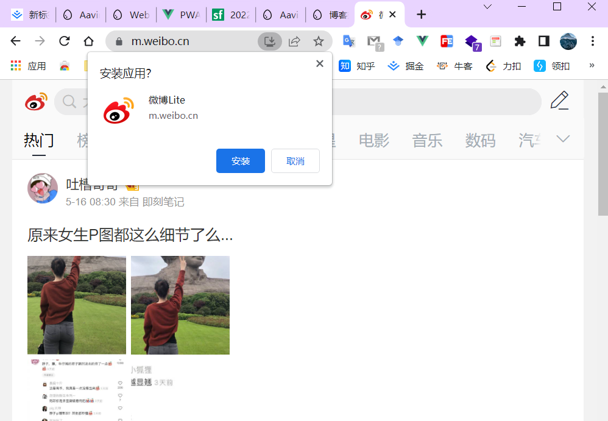
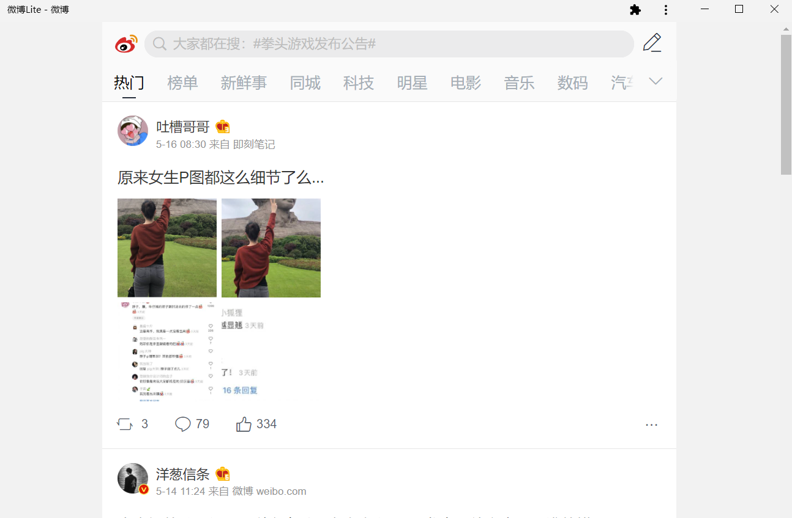
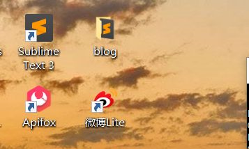
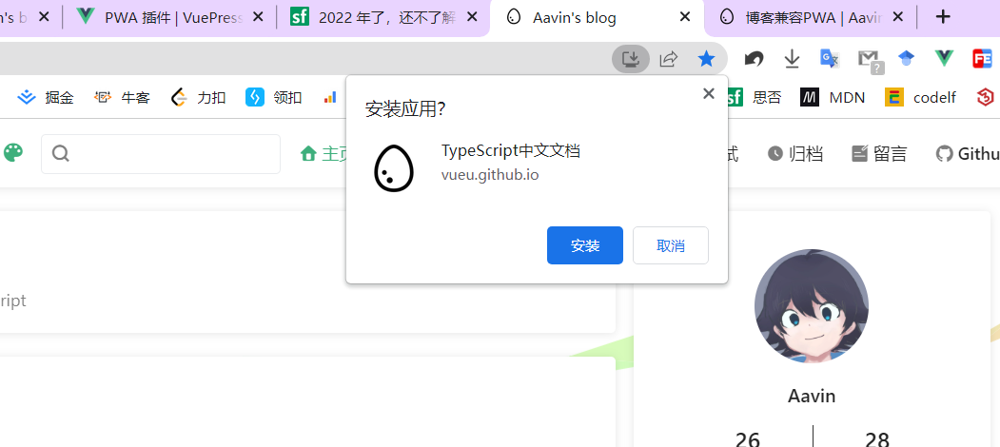

### PWA 

PWA，英文全称：Progressive Web Apps， 中文翻译：**渐进式 Web 应用**。

💯

引用 MDN 的介绍：

> PWA 指的是使用指定技术和标准模式来开发的 Web 应用，这同时赋予它们 Web 应用和原生应用的特性。
>
> 例如一方面，Web 应用更加易于发现：相比于安装应用，访问一个网站显然更加容易和迅速。你还可以通过链接来分享 Web 应用。
>
> 另一方面，原生应用与操作系统可以更加完美的整合，也因此为用户提供了无缝的用户体验。你可以通过安装应用使得它在离线的状态下也可以运行；相较于使用浏览器访问，用户也更喜欢通过点击主页上的图标来访问它们喜爱的应用。
>
> PWA 赋予了我们创建同时拥有以上两种优势的应用的能力。

### 体验

如果你之前没有了解过 PWA，大概率可能也不明白这是个什么效果，我们直接看一个 PWA 应用示例，我们打开 https://m.weibo.cn/，这里是在电脑端打开的：

我们可以看到，在地址栏还有一个**安装图标**，点击一下，就会弹出安装应用的选项框：



我们点击安装后，该页面会自动关闭，然后开启一个应用窗口：



同时，打开桌面，我们会看到已经添加了微博的图标：



点击就会直接打开上面的应用窗口。

简单的来说，我们兼容 PWA，就是想要实现这样的桌面图标的功能，当然了， PWA 其他还有离线缓存、推送通知等功能，这里就不多说了。

### 开启 PWA

开启 PWA，需要注意三个点：

提供一个 manifest.json 文件，描述应用的名称、图标等信息
开启 Service Worker，这个交给现有的 PWA 插件来实现
开启 HTTPS

### 实践

1. 安装

```bash
yarn add -D @vuepress/plugin-pwa
OR npm install -D @vuepress/plugin-pwa
```

2. 修改 config.js

```js
module.exports = {
    head: [
        ['link', { rel: 'icon', href: '/logo.png' }],
        ['link', { rel: 'manifest', href: '/manifest.json' }],
        ['meta', { name: 'theme-color', content: '#3eaf7c' }],
        ['meta', { name: 'apple-mobile-web-app-capable', content: 'yes' }],
        ['meta', { name: 'apple-mobile-web-app-status-bar-style', content: 'black' }],
        ['link', { rel: 'apple-touch-icon', href: '/icons/apple-touch-icon-152x152.png' }],
        ['link', { rel: 'mask-icon', href: '/icons/safari-pinned-tab.svg', color: '#3eaf7c' }],
        ['meta', { name: 'msapplication-TileImage', content: '/icons/msapplication-icon-144x144.png' }],
        ['meta', { name: 'msapplication-TileColor', content: '#000000' }]
    ],
    plugins: [
       [
           '@vuepress/pwa',
           {
               serviceWorker: true,
               updatePopup: {
                   message: "发现新内容可用",
                   buttonText: "刷新"
               }
           }
       ]
    ]
}
```

2. 添加 manifest.json 等资源
   接下来我们添加所需要的资源，在 .vuepress目录下建立 public文件夹，然后添加所需要的文件如 manifest.json文件：

```json
{
    "name": "TypeScript中文文档",
    "short_name": "TypeScriptDocs",
    "display": "standalone",
    "background_color": "#fff",
    "start_url": "/learn-typescript-test/",
    "scope": "/learn-typescript-test/",
    "description": "TypeScript 中文文档 进阶教程",
    "icons": [{
      "src": "logo52.png",
      "sizes": "52x52",
      "type": "image/png"
    },{
       "src": "logo288.png",
       "sizes": "288x288",
       "type": "image/png"
    }]
  }
```

这其中字段的具体含义，可以查看 MDN 的 Manifest 介绍。

**要注意其中的 start_url和scope，如果你使用的是 GitHub 或者 Gitee 仓库的 Pages 服务，并且地址上带了仓库名，你需要将这里的learn-typescript-test替换为你的仓库名，如果是直接的域名，start_url 写成 \，scope写成 . 或者直接不写。**

然后是补齐所需要的图标图片。

4. 部署生产环境测试
   虽然我们在上篇《VuePress 博客如何开启本地 HTTPS 访问》 讲了如何在本地开启 HTTPS，但是因为我们使用的这个插件只有在**生产环境**才会开启 Service Worker，所以呢，我们要**部署到线上**看一下效果，如果顺利的话，你就会看到地址栏上也出现了安装图标：

   

### 常见问题

但如果没有显示该图标，我们可以查看开发者工具里的「应用」 -「清单」，其中会显示出现的错误。

根据这里的报错进行排查。

为检测到任何匹配的 service worker。您可能需要重新加载页面，或者检查当前页面的 service worker 是否也控制了清单错误中的起始 URL。
这也有可能是因为你的 start_url 和 scope 设置的有问题。

正常安装后，如果打开应用发现背景色是 Vue 绿色，比如这种：

这是因为你忘记修改 config.js 里的背景色了。
