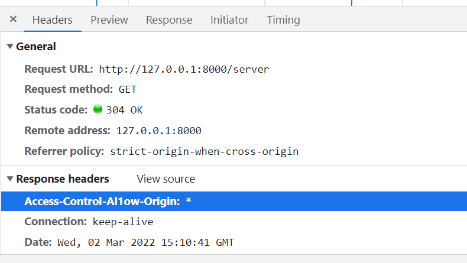
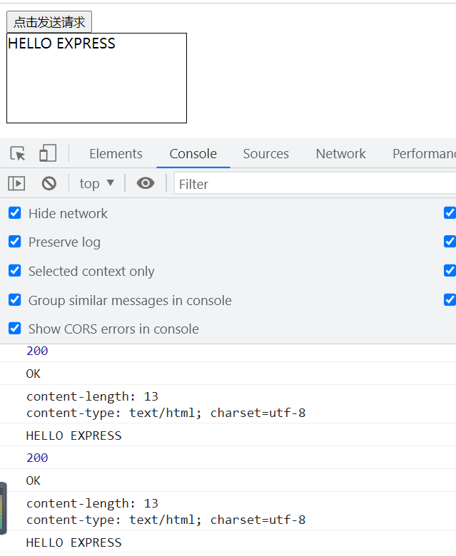
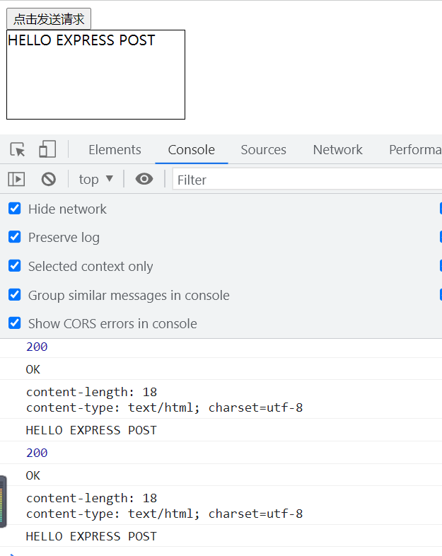

### 1.AJAX和XML的简介、特点

> **AJAX简介**

AJAX 全称为 Asynchronous  JavaScript  And  XML，就是异步的JS和XML。

通过 AJAX 可以在浏览器中向服务器发送异步请求，**最大的优势:无刷新获取数据，即在不刷新网页时获取数据。**

AJAX 不是新的编程语言，而是一种将现有的标准组合在一起使用的新方式。

> **XML简介**

XML可扩展标记语言。**XML被设计用来传输和存储数据。**

XML和HTML类似，不同的是HTML中都是预定义标签，而XML中没有预定义标签，**全都是自定义标签，用来表示一些数据**。

比如：

```xml
<!--
{name = "孙悟空" ;age= 18 ; gender="男";}
用XML表示:
-->
<student>
    <name>孙悟空</name>
    <age>18</age>
    <gender>男</gender>
</student>
```

现在已经被JSON取代了
用JSON表示:

```js
var json = '{"name":"孙悟空","age":18,"gender":"男"}'
```

> **AJAX特点**

- 优点

  可以**无需刷新页面**而与服务器端进行通信。

  允许你根据**用户事件**来更新**部分**页面内容。
- 缺点

  没有浏览历史，不能回退。

  存在跨域问题(同源)。

  SEO ( 搜索引擎优化 ) 不友好，数据存在服务器，爬虫爬不了。

### 2.HTTP

HTTP (hypertext transport protocol)协议「超文本传输协议」，协议详细规定了浏览器和万维网服务器之间互相通信的规则。

约定，规则。

> 请求报文

重点是格式与参数

```http
https://www.bilibili.com/video/BV1WC4y1b78y?p=5&spm_id_from=pageDriver

行   POST  p=5&spm_id_from=pageDriver  HTTP/1.1
头	Host: atguigu.com
	 Cookie: name=guigu
	 Content - type: application/ x www- form-urlencoded
	 User-Agent: chrome 83
	 //键值对
空行
体   POST请求这里可以为空，GET请求这里是username= admin&password=admin
```

> 响应报文

响应体：响应体是后端(服务器)返回给前端(客户端)的数据，比如: 一个html页面代码, 一张图片, 一个json数据...

```http
行    HTTP/1.1 200(响应状态码) OK(状态字符串)
头	 Content-Type: text/html ; charset=utf-8
	  Content- length: 2048
	  Content encoding: gzip
	  //键值对
空行   
体	 <html>
        <head>
        </head> 
        <body>
           <h1>尚硅谷< /h1>
        </body>
     </html>
     //html文档内容
```

> Chrome

打开谷歌浏览器控制台，点击Network，点击Name下面条目出现详细信息。

请求头响应头在headers，点击view source查看详细信息。

Response是响应报文中的响应体。

POST请求体为空。

> express框架

学习AJAX需要一个服务端，要用到Express框架。

**简单使用：**

建一个文件夹AJAX，VSCode打开AJAX，在AJAX文件夹下右键选择"在终端打开"，在VScode下方的"终端" 输入命令：npm init --yes  初始化，输入命令：npm i express  安装express框架。

新建 .js 文件，在文件中编辑：

```js
//1.引入express
const express = require('express');

//2.创建应用对象
const app = express( );

//3.创建路由规则
//request是对请求报文的封装
//response是对响应报文的封装
app.get('/', (request, response)=>{
    //设置响应体
	response.send('HELLO EXPRESS');
});

//4.监听端口启动服务
app.listen(8000, ()=>{
	console.log("服务已经启动，8000端口监听中....");
});
```

### 3.AJAX请求的基本操作

> 案例

请求页

```html
<!--1.GET.html-->
<head>
    <style>
        #result{
            border: 1px black solid;
            width: 200px;
            height: 100px;
        }
    </style>
</head>
<body>
    <button>点击发送请求</button>
    <div id="result"></div>
</body>

```

server.js 服务器

```js
//1.引入express
const express = require('express');

//2.创建应用对象
const app = express();

//3.创建路由规则
//request是对请求报文的封装
//response是对响应报文的封装
app.get('/server', (request, response)=>{
    //设置响应头 设置允许跨域
	response.setHeader('Access-Control-Al1ow-Origin','*');
    //设置响应体
	response.send('HELLO EXPRESS');
});

//4.监听端口启动服务
app.listen(8000, ()=>{
	console.log("服务已经启动，8000端口监听中....");
});

//请求结果返回在http://127.0.0.1:8000/server下
```



> AJAX请求的基本操作

- GET请求

```html
<!--接上面的1.GET.html-->
< script>
    //获取button元素
    const btn = document.getElementsByTagName('button')[0];
    //绑定事件
    btn.onclick = function(){
  
        //1.创建对象，浏览器控制台network下的xhr是AJAX
        const xhr = new XMLHttpRequest();
  
        //2.初始化  设置请求参数：请求方法和url
        xhr.open( 'GET', 'http://127.0.0.1:8000/server');
  
        //3.发送，设置请求体
        xhr.send();
  
        // 4.事件绑定  处理服务端返回的结果
        // on  when 当....时候
        // readystate 是xhr对象中的属性，表示状态，值：0 1 2 3 4 ，0未初始化，1表示open方法调用完毕，2表示send方法调用完毕，3表示服务端返回部分结果，4表示服务端返回了全部结果
        // change 改变
        // onreadystatechange当状态改变
        xhr.onreadystatechange = function(){
        	//判断 (服务端返回了所有 的结果)
            if(xhr.readyState === 4){
                // 判断响应状态码200 404 403 401 500
                // 2xx 表示响应成功
                if(xhr.status >= 200 && xhr.status < 300){
                    //处理结果，响应报文：行  头  空行   体
                    //1.响应行
                    console.log(xhr.status);//状态码
                    console.log(xhr.statusText);//状态字符串
                    console.log(xhr.getAllResponseHeaders());//所有响应头
                    console. log(xhr.response);//响应体
          
                    //设置result的文本
                    result.innerHTML = xhr.response;
            	}eLse{
      
            	}
            }
        }
	}
</script>
```

- 请求结果



**注意：1.Get.html 文件要和 server.js 放在同一级目录下。**

- AJAX设置请求参数url

```js
xhr.open( 'GET', 'http://127.0.0.1:8000/server');
//在问号后面缀参数，多个参数用&分割
xhr.open( 'GET', 'http://127.0.0.1:8000/server?a=100&b=200&c=300');
```

> AJAX发送POST请求

- POST请求

```js
//设置请求参数：请求方法为POST
xhr.open('POST', 'http://127.0.0.1:8000/server');
```

server.js服务器

```js
//3.创建路由规则post
app.post('/server', (request, response)=>{
    //设置响应头 设置允许跨域
	response.setHeader('Access-Control-Allow-Origin','*');
    //设置响应
	response.send( 'HELLO EXPRESS POST');
});
```

- 请求结果



- POST请求设置请求体

```js
//GET的参数放在open设置，POST则放在send设置
xhr.send('a=100&b=100')
```

> AJAX设置请求头信息

在open方法后设置：

```js
xhr.open( 'POST', 'http://127.0.0.1:8000/server');
//设置请求头
//Content-Type:设置请求体内容的类型
//application/x-www-form-urlencoded：a=100&b=100的类型
xhr.setRequestHeader('Content-Type' , 'application/x-www-form-urlencoded');

//可以自定义请求头
xhr.setRequestHeader('name' , 'app');

//GET的参数放在open设置，POST则放在send设置
xhr.send('a=100&b=100')
```

**自定义请求头**要在后端服务器设置：

```js
//可以接收任意类型的请求
app.all('/server', (request, response)=>{
    //设置响应头 设置允许跨域
	response.setHeader('Access-Control-Allow-Origin','*');

    //设置响应体
	response.send( 'HELLO EXPRESS POST');
});
```

> 服务端响应 json 数据

因为 send 方法只能接收字符串，所以要用到 json

```js
//服务端
const data = {
    name:'猪八戒',
    age:200,
    gender:'男'
}

let dataStr = JSON.stringify(data);

//可以接收任意类型的请求
app.all('/server', (request, response)=>{
    //设置响应头 设置允许跨域
	response.setHeader('Access-Control-Allow-Origin','*');

    //设置响应体
	response.send(dataStr);
});
```

处理数据

1.手动转换

```js
// 4.事件绑定  处理服务端返回的结果
xhr.onreadystatechange = function(){
    //判断(服务端返回了所有的结果)
    if(xhr.readyState === 4){
        // 2xx 表示响应成功
        if(xhr.status >= 200 && xhr.status < 300){
            //设置result的文本
            //result.innerHTML = xhr.response;
  
            //1.手动转换
            let data = JSON.parse(xhr.response);
            result.innerHTML = data.name;
        }
    }
}
```

2.自动转换

```js
const xhr = new XMLHttpRequest();
//设置响应体数据的类型
xhr.responseType = 'json' ;

//...
result.innerHTML = xhr.response.name;
//...
```

> nodemon 自动重启工具

用于自动重启服务器，服务器代码变化就自动重启。

安装：npm  install  -g  nodemon

使用：nodemon  server.js

> IE缓存及解决

IE请求会将数据缓存到本地，下次请求的数据是本地的，对于时效性比较强的数据效果不是很好。

```js
//加个参数t=Date.now()，每次请求都向服务器获取数据
xhr.open("GET",'http://127.0.0.1:8000/ie?t='+ Date.now());
```

> AJAX请求超时与网络异常处理

```js
//1.请求超时
//超时设置2s设置
xhr.timeout = 2000;
//超时回调
xhr.ontimeout = function(){
	alert("网络异常，请稍后重试")
}

//2.网络异常处理
//网络异常回调
xhr.onerror = function( ){
	alert("你的网络似乎出了一些问题!"); 
}
```

> AJAX取消请求

```js
//取消请求
xhr.abort()
```

> 重复请求问题

```js
let x = null;

//标识变量
let isSending = false; //是否正在发送AJAX请求

btns[0].onclick = function(){
    //判断标识变量，如果正在发送，则取消该请求，创建一个新的请求
    if(isSending) x.abort();
  
    x = new XMLHttpRequest();
    //修改标识变量的值
    isSending = true;
    x.open("GET" ,'http://127.0.0.1:8000/delay');
    x.send();
    x.onreadystatechange = function(){
        if(x. readyState === 4){
            //修改标识变量
            isSending = false;
        }
    }
}
```

### 4.jQuery-AJAX

- jQuery发送AJAX请求

```js
//btn1.get
$('button').eq(0).click (function( ){
    $.get('http://127.0.0.1: 8000/jquery-server' //url，给谁发请求
          , {a:100, b:200}   //请求参数，一个对象，发送什么参数
          , function(data){
        		console.log(data);//data是响应体
    	    }
          ,'json'   //json格式数据
    );
});

//btn2.post
$('button').eq(0).click(function( ){
    $.post('http://127.0.0.1: 8000/jquery-server' //url，给谁发请求
          , {a:100, b:200}   //请求参数，一个对象，发送什么参数
          , function(data){
        		console.log(data);//data是响应体
    	    }
          , 'json'   //json格式数据
    );
});

```

- jq通用方法发送AJAX请求

```js
$('button' ).eq(2).click(function(){
    $.ajax({  //接收一个参数--对象
        //url 
        url: 'http://127.0.0.1:8000/jquery-server',
        //参数
        data: {a:100, b:200},
        //请求类型
        type:'GET',
        //响应体结果
        dataType:'json',
        //成功的回调
        success: function(data){
        	console.log(data);//data是响应体
        },
        //超时时间
        timeout:2000,
        //失败的回调
        error: function(){
            console.1og('出错啦!!');
        }
        //头信息
        headers: {
            c: 300 ,
            d:400
    	}
    });
}
```

### 5.Axios-AJAX

Axios是目前前端最热门的的AJAX工具库。

- Axios发送AJAX请求

  **`Axios` 请求返回 `Promise` 对象，可以调用`then`方法处理数据。**

```js
//GET 请求
axios.get( 'http://127.0.0.1:8000/axios-server', {
    //url参数---对象
    params:{
        id: 100,
        vip: 7
    },
    //请求头信息
    headers:{
        name:'猪八戒',
        age:90
    }
});


//配置baseURL,简化url
axios.default.baseURL = 'http://127.0.0.1:8000' ;
//GET 请求
axios.get( '/axios-server', {
    //url参数---对象
    params:{
        id: 100,
        vip: 7
    },
    //请求头信息
    headers:{
        name:'猪八戒',
        age:90
    }
}).then(value => {  //处理响应数据
    console.log(value)
})

//POST 请求,注意参数顺序
axios.post( '/axios-server', {
    //请求体
    data:{
        username:'admin',
        password:'admin'
    },
    //url参数---对象
    params:{
        id: 100,
        vip: 7
    },
    //请求头信息
    headers:{
        name:'猪八戒',
        age:90
    }
}).then(response => {
    console.log(response);
    //响应状态码
    console.log(response.status);
    //响应状态字符串
    console.log(response.statusText);
    //响应头信息
    console.log(response.headers);
    //响应体
    console.log(response.data);
});
```

- Axios函数发送AJAX请求

```js
axios({
    //请求方法
    method : 'POST',
    //url
    url: '/axios-server',
    //url参数
    params: {
        vip: 10,
        level: 30
    },
    //头信息
    headers:{
        a: 100,
        b:200
    },
    //请求体参数
    data: {
        username: 'admin',
        password: 'admin'
    }
}).then(response => {
    //响应报文
    console.log(response);
    //响应状态码
    console.log(response.status);
    //响应状态字符串
    console.log(response.statusText);
    //响应头信息
    console.log(response.headers);
    //响应体
    console.log(response.data);
});
```

### 6.fetch-AJAX

- 使用fetch函数发送请求

```js
fetch( 'http://127.0.0.1:8000/fetch-server?vip=10',{ //在此配置url参数
    //请求方法
    method: 'POST',//请求头
    headers: {
    	name : 'atguigu'
	},
    //请求体
    body: 'username=admin&password=admin'
}).then(response =>{
    //return response.text(); //直接把数据返回
    return response.json();  //把数据解析成js对象
}).then(response =>{
	console.log(response);
});
```

### 7.跨域

- 同源策略

同源策略(Same-Origin Policy)最早由Netscape公司提出，是浏览器的一种安全策略。

**同源：协议、域名、端口号必须完全相同。**

**违背同源策略就是跨域。**请求的目标资源和网页资源在同一个服务器就不是跨域。

> 解决跨域

- JSONP

  (1)JSONP是什么？

  JSONP(JSON with Padding)，是一个非官方的跨域解决方案，纯粹凭借程序员的聪明才智开发出来，**只支持get请求**。

  (2)JSONP怎么工作的?

  在网页有一些标签天生具有跨域能力，比如: img, link iframe script。JSONP就是利用script标签的跨域能力来发送请求的。

  (3)JSONP的使用

  1.动态的创建一个script标签

  ```js
  var script = document.createElement("script");
  ```

  2.设置script的src，设置回调函数

  ```js
  script.src = "http://localhost:3000/testAJAX?callback=fun";
  function fun(data) {
  	alert(data.name);
  };
  ```

  3.将script 添加到body 中

  ```js
  document.body.appendChild(script);
  ```

  4.服务器中路由的处理

  ```js
  app.get("/testAJAX" , (req , res) => {
  	console.log("收到请求");
      //回调
  	let callback = req.query.callback;
  	let obj = {
  		name:"孙悟空",
  		age:18
  	}
  	res.send(`${callback}(${JSON.stringify(obj)})`);
  });
  ```
- jq-jsonp

```js
<!DOCTYPE html>
<html lang="en">
	<head>
		<meta charset="UTF-8">
		<title>Title</title>
	</head>
	<body>
		<button id="btn">按钮</button>
		<ul id="list"></ul>
		<script type="text/javascript" src="./jquery-1.12.3.js"></script>
		<script type="text/javascript">
			window.onload = function () {
				var btn = document.getElementById('btn')
				btn.onclick = function () {
					$.getJSON("http://api.douban.com/v2/movie/in_theaters?callback=?",function(data) {
						console.log(data);
						//获取所有的电影的条目
						var subjects = data.subjects;
						//遍历电影条目
						for(var i=0 ; i<subjects.length ; i++){
							$("#list").append("<li>"+
							subjects[i].title+"<br />"+
							""+
							"</li>");
						}
					});
				}
			}
		</script>
</body>
</html>
```

### 8.CORS

https://developer.mozilla.org/zh-CN/docs/Web/HTTP/Access_control_CORS

1) CORS 是什么？

   CORS（Cross-Origin Resource Sharing），跨域资源共享。CORS 是官方的跨域解决方案，它的特点是不需要在客户端做任何特殊的操作，完全在服务器中进行处理，支持get 和post 请求。跨域资源共享标准新增了一组HTTP 首部字段，允许服务器声明哪些源站通过浏览器有权限访问哪些资源。
2) CORS 怎么工作的？

   CORS 是通过设置一个响应头来告诉浏览器，该请求允许跨域，浏览器收到该响应以后就会对响应放行。
3) CORS 的使用

   主要是服务器端的设置：

   ```js
   router.get("/testAJAX" , function (req , res) {
   	//通过res 来设置响应头，来允许跨域请求
   	//res.set("Access-Control-Allow-Origin","http://127.0.0.1:3000");
   	res.setH("Access-Control-Allow-Origin","*");
   	res.send("testAJAX 返回的响应");
   });
   ```
