### 1.数据类型

> 分类

基本(值)类型：

String:任意字符串，Number:任意的数字，boolean : true/false，undefined : undefined，null: null 。

对象(引用)类型：

Object:任意对象，Function:—种特别的对象(可以执行)，Array:—种特别的对象(数值下标，内部数据是有序的)。

> 判断

typeof ，可以判断: undefined / 数值 / 字符串 / 布尔值 /function。typeof 返回数据类型的**字符串表达**。不能判断：不能区分null和object ，object和array，要用instanceof 区分。

```js
var a = 0;
console.log(typeof a === "number");//true

var c = new Object();
console.log(c,typeof c);//{} 'object'

var b = {}, c = null, d = [];
console.log(typeof b, typeof c, typeof d);//三个object
```

```
instanceof 判断对象的具体类型
```

```js
var obj = {};
//判断实例对象
console.log(obj instanceof Object);
```

```
=== 可以判断: undefined，null
```

```js
var a = 0;
console.log(typeof a === "number");//true

var b;
console.log(b === undefined, typeof b);//true undefined
```

### 2.相关问题

> undefined 与null的区别?

undefined代表定义未赋值；null 定义并赋值了，只是值为null。

```js
//undefined 与nulL的区别?
var a;
console.log(a);// undefined 
a = null
console.log(a);// null
```

> 什么时候给变量赋值为null呢?

初始赋值，表明将要赋值为对象；结束前，让变量指向的对象成为垃圾对象(被垃圾回收器回收)。

```js
//起始
var b = null;//初始赋值为null，表明将要赋值为对象
//确定对象就赋值
b= ['atguigu', 12];
//最后
b= null;//让b指向的对象成为垃圾对象(被垃圾回收器回收)
```

> 严格区别变量类型与数据类型?

数据的类型：基本类型，对象类型；变量的类型(变量内存值的类型)：基本类型，保存就是基本类型的数据；引用类型，保存的是地址值。

```js
//将{}的地址值赋给obj
var obj = {};
//obj存于栈，存储了{}的地址，{}存于堆，obj --> {};

//将function(){}的地址值赋给of报存
var of = function(){};
```

> 内存分类 ?

栈，存全局变量/局部变量；堆，存对象。

```js
//obj存于栈，{name:"obj"}存于堆
var obj = {name:"obj"};

//f存于栈，function(){alert("ff")}存于堆
var f = function(){alert("ff");};
```

> var a = X，a内存中到底保存的是什么?

X 是基本数据，a 保存的就是这个数据；X是对象，a 保存的是对象的地址值。X 是个变量，保存的 X 的内存内容(可能是基本数据，也可能是地址值)。

> 在js调用函数时传递变量参数时，是值传递还是引用传递？

理解1∶都是值(基本/地址值)传递。

理解2 : 可能是值传无递弟，也可能是引用传递（地址值）。

> JS引擎如何管理内存?

- 内存生命周期

分配小内存空间，得到它的使用权

存储数据，可以反复进行操作

释放小内存空间

- 释放内存

局部变量：函数执行完自动释放

对象：成为垃圾对象  =>  垃圾回收器回收

> **如何访问对象内部数据?**

object.属性名：编码简单，有时不能用

object\[ '属性名' ]：编码麻烦，能通用

```js
var obj = {name:"猪八戒"};
console.log(obj.name, obj[name]);//猪八戒 猪八戒
```

> **访问对象内部数据什么时候必须使用  [ '属性名' ]  的方式?**

**(1) 属性名包含特殊字符：-  和  空格**

```js
var o = {};
o[content-type] = 'text/json';
console.log(o[content-type]);
```

**(2) 属性名不确定（属性名用变量保存）**

```js
var o = {}, type = "type";
o[type] = 'json';
console.log(o[type]);
```

> 如何定义及调用(执行)函数?

定义函数

```js
//函数声明
function fn(a, b, c, ...){}
//表达式
var fn = function(a, b, c, ...){};
```

调用函数

```js
//直接调用
test();

//通过对象调用
obj.test();

//作为构造函数由 new 调用
new test();

//临时让test成为obj的方法进行调用
test.call/apply(obj);
```

> JavaScript 要不要加分号

一行开头是小括号 () 或者方括号 [] 的时候，在括号前面加上分号就可以了，其他时候全部不需要。

```js
//小括号
var a = 0
;(function(){
    alert("aaa")
})()

//方括号
var b = 0
;[1, "ooo", 7].forEach(function(e){
    console.log(e) //1  "ooo"  7
})
```

### 3.函数及this

> **回调函数**

将函数 A 作为参数传递给函数 B 执行，A 就是回调函数。

(1) 你定义的； (2) 你没有调；(3)但最终它执行了。

```js
var box = document.getElementById("box");
box.onclick = function(){
    alert("我是dom事件回调函数！");
};
```

> **常见的回调函数**

DOM 事件回调函数，定时器回调函数，Ajax请求回调函数，生命周期回调函数。

```js
var box = document.getElementById("box");
box.onclick = function(){
    alert("我是dom事件回调函数！");
};

setTimeout(function(){
    alert("我是定时器回调函数！");
}, 2000);
```

> **回调函数的 this 指谁？**

DOM事件回调函数 ==> 发生事件的DOM元素

定时器回调函数 ==> window

> **IIFE，立即执行函数**

全称：Immediately-Invoked Function Expression

```js
//匿名函数自调用
(function(){
    alert("我是立即执行函数！");
})();
```

**作用：隐藏实现，不会污染全局命名空间**

```js
//隐藏实现
(function(){
    var a = 90; //局部变量
    alert(a);
})();

//外部实现
var a = 90;
alert(a);
```

IIFE最终用来写模块

```js
(function(){
    var a = 1;
    function test(){
        console.log(++a);
    };
    function test2(){
        console.log('test2()')
    };
    //向外暴露一个全局函数test
    window.$ = function(){ 
        //返回一个对象{test: test}
        return {test: test}; 
	}
})()

//$().test();
var obj = $(); //obj === {test: test}
obj.test();
```

```js
(function(i){
   console.log(i) 
})(7) //7
```

> **函数中的 this**

任何函数本质上都是通过某个对象来调用的，如果没有直接指定就是window。所有函数内部都有一个变量this，它的值是调用函数的当前对象。this的情况：

```js
test(); //window
p.test();//p
new test();//新创建的对象
p.call/apply(obj);//obj
```

### 4.原型及原型链

> 函数的prototype属性

每个函数都有一个 **prototype** 属性，它默认指向一个 Object 空对象(没有我们的属性)，该对象称为：**原型对象**。原型对象中有一个属性 **constructor**，它**指向函数对象**。

```js
function fun(){
    alert("gg")
}
//fun的prototype属性
console.log(fun.prototype) //包含constructor属性

//原型对象中有一个属性constructor,它指向函数对象
console.log(fun.prototype.constructor === fun) //true
```

> 原型与原型对象

**原型**(prototype)是函数的一个属性，这个属性是个指针指向原型对象。

**原型对象**(prototype object)是一个属于其所在函数的空对象，可以通过它给函数添加属性和方法。值得注意的是原型对象也拥有一个属性——constructor指向其函数。

> 给原型对象添加属性(一般都是方法)

作用：函数的所有实例对象自动拥有原型中的属性(方法)

```js
//给原型对象添加属性(一般是方法)===>实例对象可以访问
fun.prototype.test = function(){
	console. log('test()')
}
```

> 显式原型和隐式原型

每个函数 function 都有一个 **prototype** 属性，即显式原型属性，默认指向一个空的Object对象，即**指向原型对象**。

每个实例对象都有一个 **\__proto__**，可称为隐式原型(属性)，也指向**指向原型对象**。

对象的隐式原型的值为其对应构造函数的显式原型的值，两者都是**引用变量**，**保存同一个原型对象的地址值**。

```js
//【1. 定义构造函数】
function P(){ //内部语句: this.prototype = {}

} 

//内部语句: this._proto__ = Fn.prototype ，this 指向实例对象
//【2. 创建实例对象】
var p = new P()

//显式原型
console.log(P.prototype)

//隐式原型
console.log(p.__proto__) 

//两者指向同一个原型对象
console.log(P.prototype === p.__proto__) //true

//【3.给原型对象添加方法】
P.prototype.test = function(){
  
}

//【4. 通过实例调用原型对象的方法】
p.test();
```

**ES6之前**，程序员能直接操作显式原型，但不能直接操作隐式原型。

内存结构：左栈右堆

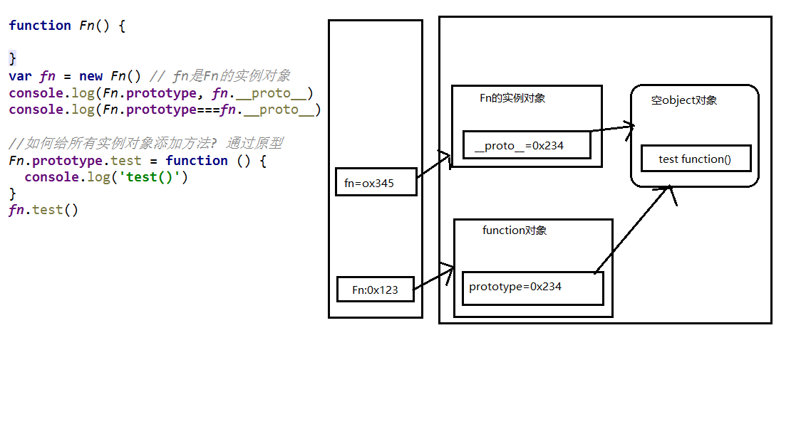

> **原型链**

访问一个**对象**的属性时，先在自身属性中查找，找到返回；如果没有，再**沿着\__proto__这条链**向上查找，找到返回；直到找到 **Object.prototype(null，Object的原型，原型链尽头)** ，如果最终没找到，返回 undefined  。

别名：**隐式原型链**，沿着隐式原型链查找。

作用：查找对象的属性(方法)。

> **图解原型链**

原型链图示：左栈右堆

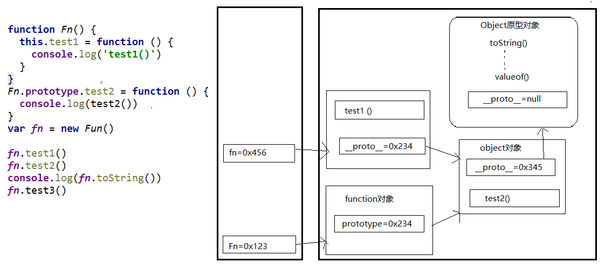

构造函数/原型/实例对象的关系1：

```js
var o1 = new Object()
var o2 = {}
```

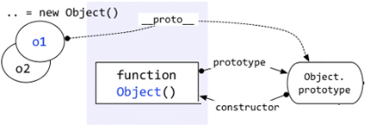

构造函数/原型/实例对象的关系2：

```js
function Foo(){}
var Foo = new Function()
//所有函数的__proto__都是一样的
```

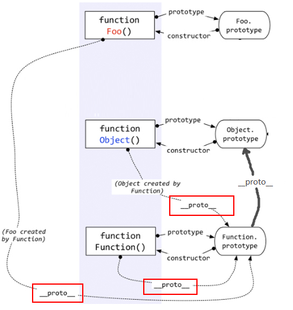

> 各种原型链

函数的显式原型指向的对象默认是空Object实例对象(但Object不满足)。

```js
function Fn(){}
console.log(Fn.prototype instanceof Object) //true
console.log(Object.prototype instanceof Object)//false
console.log(Function.prototype instanceof Object)//true
console.log(Object.prototype) //null
```

**所有函数都是Function的实例 ( 包括Function() )。**

```js
//内部语句
//Function = new Function()

function f(){}
console.log(f.__proto__ === Function.prototype)  //true
```

**Object的原型对象是原型链尽头**

```js
console.log(Object.prototype.__proto__) //null 
```

对象原型链(隐式原型链)

```js
//原型链上各个节点都是对象，有__proto__属性
o --__Proto__--> Object.prototype --__Proto__--> null
```

数组原型链(隐式原型链)

```js
//原型链上各个节点都是对象
arr --__Proto__--> Array.prototype --__Proto__--> Object.prototype --__Proto__--> null
```

函数原型链(隐式原型链)

```js
//原型链上各个节点都是对象
func --__Proto__--> Function.prototype --__Proto__--> Object.prototype --__Proto__--> null
```

> 原型继承

构造函数的实例对象自动拥有构造函数原型对象的属性(方法)，利用的就是原型链。

**读取**对象的属性值时：会自动到原型链中查找。

**设置**对象的属性值时：不会查找原型链，如果当前对象中没有此属性，直接添加此属性并设置其值。

**方法一般定义在原型中，属性一般通过构造函数定义在对象本身上。**

```js
function Fn(){}
//创建实例
o = new Fn()

//给原型对象添加方法，推荐
Fn.prototype.setAge = function(age){this.age = age}
//调用原型对象的方法
o.setAge(18)
console.log(o.age) //18

//给原型对象添加属性，不推荐
Fn.prototype.age = 10
//推荐
o.name = "ooo"
```

> **探索 instanceof**

**问题：**instanceof 是如何判断的?

**表达式：A  instanceof  B，如果 B 函数的显式原型对象在A对象的原型链(隐式原型链)上，返回true，否则返回false 。**

- 案例1：

```js
//表达式：A  instanceof  B
//如果 B 函数的显式原型对象在A对象的原型链(隐式原型链)上，返回true，否则返回false 
function Foo() {  }
var f1 = new Foo();
console.log(f1 instanceof Foo); //true
console.log(f1 instanceof Object); //true
```

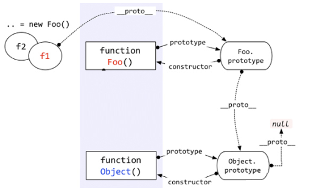

- 案例2：

Function是通过  new自己  产生的实例。所有函数都是Function的实例 ( 包括Function() )。函数的显式原型指向的对象默认是空Object实例对象(但Object()不满足)。

```js
//表达式：A  instanceof  B
//如果 B 函数的显式原型对象在A对象的原型链(原型链==隐式原型链)上，返回true，否则返回false 
console.log(Object instanceof Function); //true
console.log(Object instanceof Object); //true
console.log(Function instanceof Function);//true
console.log(Function instanceof Object); //true

function Foo() {}
console.log(Object instanceof Foo); //false
```

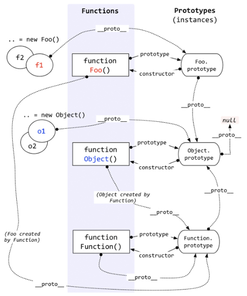

> 测试题

```js
function A(){
  
}
A.prototype.n = 1
var b = new A()
A.prototype = {
	n: 2,
	m: 3
}
var c = new A()
console.log(b.n, b.m, c.n, c.m)  //1 undefined 2 3
```

**显式原型(prototype)和隐式原型(__proto__)都是引用变量，保存同一个原型对象的地址值**。

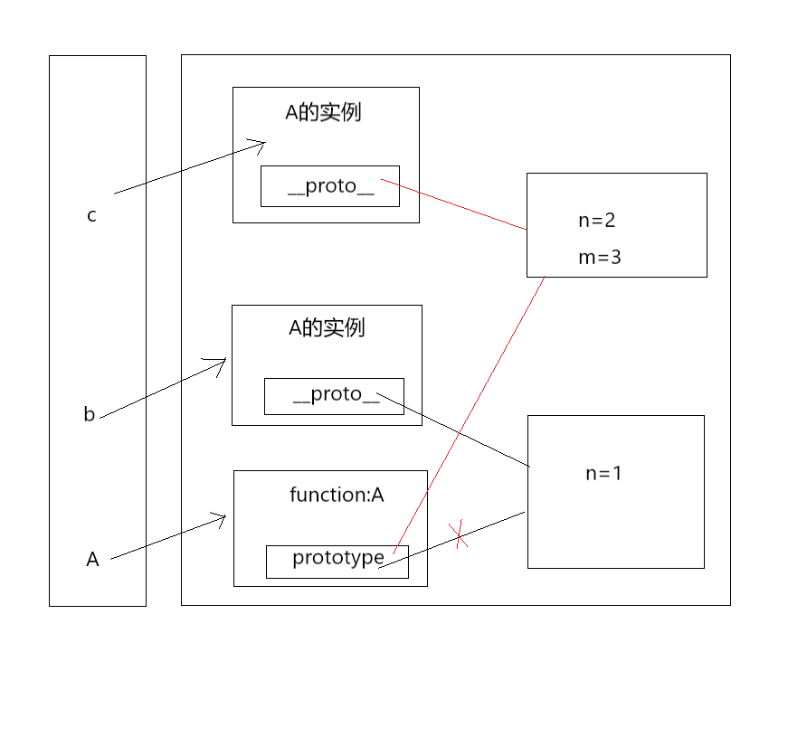

```js
var F = function(){}
Object.prototype.a = function(){
    console.log('a()')
}
Function.prototype.b = function(){
    console.log('b()')
}
var f = new F()
f.a()  //a()
f.b()  //error
F.a()  //a()
F.b()  //b()

```

运用原型链解决。

### 5.执行上下文与执行上下文栈

> 变量提升和函数提升

变量声明提升：通过 **var定义(声明)** 的变量，在定义语句之前就可以访问到，值：undefined，**相当于定义未赋值就使用**。

函数声明提升：通过**function声明**的函数，在之前就可以直接调用，值：函数定义(对象)。**通过var声明的函数不会提升，这相当于变量提升，使用前还没有赋值，无法调用**。

问题：变量提升和函数提升是如何产生的?

因为：执行代码前要做数据预处理。

> 执行上下文

- 代码分类(位置)

  全局代码

  函数(局部)代码
- 全局执行上下文

  在执行全局代码前将window确定为全局执行上下文。

  对全局数据进斯预处理：

  ```
  var定义的全局变量 ==> undefined，添加为window的属性；

  function声明的全局函数 ==> 赋值(fun)，添加为window的方法；

  this ==> 赋值(window)；
  ```

  开始执行全局代码。
- 函数执行上下文

  在**调用函数**，准备执行函数体之前，创建对应的**函数执行上下文对象（虚拟对象，存于栈中）**。

  对局部数据进行**预处理**：

  ```
  形参变量 ==> 赋值(实参) ==> 添加为函数执行上下文的属性；

  arguments ==> 赋值(实参列表)，添加为函数执行上下文的属性；

  var定义的局部变量 ==> undefined，添加为函数执行上下文的属性；

  function声明的函数 ==> 赋值(fun)，添加为函数执行上下文的方法

  this ==> 赋值(调用函数的对象)
  ```

  开始执行函数体代码。

> 执行上下文栈

在全局代码执行前，JS引擎就会创建一个栈来存储管理所有的执行上下文对象；

在全局执行上下文(window)确定后，将其添加到栈中(压栈)；

在函数执行上下文创建后，将其添加到栈中(压栈)；

在当前函数执行完后，将栈顶的对象移除(出栈)；

当所有的代码执行完后，栈中只剩下window。

```html
<!--
	调用一次函数创建一次函数执行上下文
-->

<script type="text/javascript">
								//1．进入全局执行上下文
var a = 10
var bar = function(x){
    var b = 5
    foo(x + b)				 //3．进入foo函数执行上下文
}
var foo = function(y){
    var c = 5
    console.log(a + c + y)
}
bar(10)						//2.进入bar函数执行上下文
</script>
```

执行流程分析：


> 测试题

```js
//测试题1∶先执行变量提升，再执行函数提升
function a(){}
var a
console.log(typeof a) //'function'

//测试题2
if (!(b in window)) {
	var b = 1
}
console.log(b) //undefined

//测试题3
var c = 1
function c(c){
	console.log(c) 
}
c(2) //报错
//相当于
var c
function c(c){
	console.log(c) 
}
c = 1 //c是变量了
c(2) //报错
```

测试题3解析：**函数提升优先级高于变量提升，且不会被同名变量声明覆盖，但是会被变量赋值后覆盖。而且存在同名函数与同名变量时，优先执行函数。**

```js
console.log(a);      //f a()
console.log(a());      //1  
var a=1;
function a(){
    console.log(1);
}
console.log(a);       //1   
a=3
console.log(a())      //a not a function
```

它的过程就相当于

```js
var a=function (){   //声明一个变量a指向
    console.log(1)
}
var a;
console.log(a)  	//如果a不优先执行含函数，这里是返回undefined;
console.log(a())
a=1    				//这里函数与变量
console.log(a)
a=3
console.log(a())
```

函数提升优先级高于变量提升，且不会被同名变量声明覆盖，**但是会被变量赋值后覆盖。**

```js
function a(){}
var a
console.log(typeof a)//function

var b
function b(){}
console.log(typeof b)//function

console.log(typeof a)//function
function a(){}
var a = 1
console.log(typeof a) //number

console.log(typeof b)//function
var b=1
function b(){}
console.log(typeof b) //number
```

### 6.作用域与作用域链

> 作用域分类

全局作用域

函数作用域

没有块作用域(ES6有了)

```html
<script>
	var a = 0  //全局
	function fun(){
        var b = 0  //局部
    }
    if(1){
        var c = 10 //没有块作用域
    }
    console.log(c) //10
</script>
```

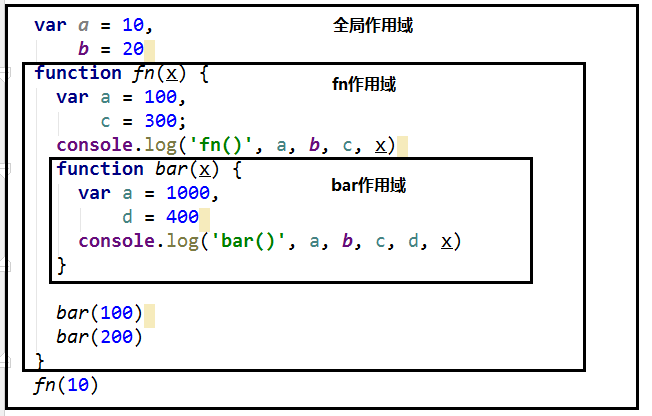

> 作用域与执行上下文

- 区别1

全局作用域之外，每个函数都会创建自己的作用艰，作用域在函数定义时就已经确定了。而不是在函数调用时；

全局执行上下文环境是在全局作用域确定之后，js代码马上执行之前创建；

函数执行上下文环境是在调用函数时，函数体代码执行之前创建。

- 区别2

作用域是静态的，只要函数定义好了就一直存在，且不会再变化；

执行上下文是动态的，调用函数时创建，函数调用结束时执行上下文就会被释放。

- 联系

执行上下文(对象)是从属于所在的作用域

全局执行上下文 ==> 全局作用域

函数执行上下文 ==> 对应的函数使用域

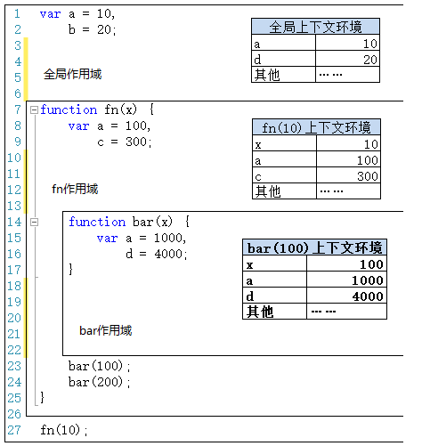

> 作用域链

- 理解

多个上下级关系的作用域形成的链，它的方向是从下向上的(从内到外)。**查找变量时**就是沿着**作用域链**来查找的。**查找对象属性**沿着**原型链**找。

- 查找一个变量的查找规则

在当前作用域下的执行上下文中查找对应的属性，如果有直接返回， 否则进入2

在上一级作用域的执行上下文中查找对应的属性，如果有直接返回，否则进入3

再次执行2的相同操作，直到全局作用域，如果还找不到就抛出找不到的异常。

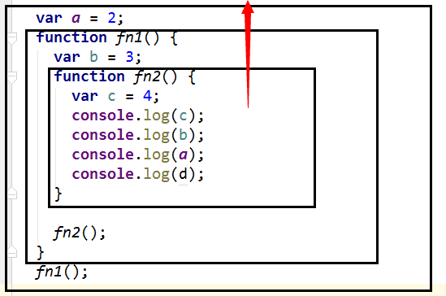

> 测试题

**作用域是静态的，定义函数时就已经确定，不会因为在别的作用域调用函数发生改变。**

```js
//1. 作用域是静态的，定义函数时就已经确定，不会发生改变
var x = 10;
function fn() {
  	console.log(x);
}
function show(f) {
    var x = 20;
    f()  //f()有自己的作用域，不在show里面
}
show(fn) //10

//2.修改1
		//修改
function fn() {
  	console.log(y);
}
function show(f) {
    var x = 20;
    f()  //f()有自己的作用域，不在show里面
}
show(fn) //报错
```

```js
//3.
var fn = function () {
    console.log(fn)
}
fn()  //function () {console.log(fn)}
var obj = {
    fn2: function () {
      	console.log(fn2)
    }
}
obj.fn2()  //报错，先在自己的作用域找，再到全局作用域

//4.修改3
var fn = function () {
    console.log(fn)
}
fn()  //function () {console.log(fn)}
var obj = {
    fn2: function () {
      	console.log(this.fn2) //修改
    }
}
obj.fn2()  //报错，先在自己的作用域找，再到全局作用域
```

### 7.闭包

> 循环遍历加监听

```html
<script type="text/javascript">
    window.onload = function(){
        //需求: 点击某个按钮, 提示"点击的是第n个按钮"
    
        var btns = document.getElementsByTagName("button")
        /*
        for(var i=0, len = btns.length;i<len;i++){
            btns[i].onclick = function(){
                alert("第"+(i+1)+"个按钮")
            }
        }
        */
        //上面点击每个按钮都是输出4，因为触发点击响应函数之前for循环早已执行完，i==3
    
        //这样修改，利用属性
        /*
        for(var i=0, len = btns.length;i<len;i++){
            btns[i].num = i
            btns[i].onclick = function(){
                alert("第"+(this.num+1)+"个按钮")
            }
        }
        */
    
        //利用闭包
        for(var i=0, len = btns.length;i<len;i++){
            (function(i){
                btns[i].onclick = function(){
                    alert("第"+(i+1)+"个按钮")
                }
            })(i)
        }
    }
  
</script>
<body>
    <button>测试1</button>
    <button>测试2</button>
    <button>测试3</button>
</body>
```

> 理解闭包

1. 什么是闭包？

   **闭包**是指有权访问另一个函数作用域中的变量的函数。
2. 如何产生闭包?

当一个嵌套的内部(子)函数引用了嵌套的外部(父)函数的变量(函数)时，就产生了闭包。

3. 闭包到底是什么?

使用chrome调试在sources查看

- 理解一：闭包是嵌套的内部函数(绝大部分人)，如f2
- 理解二：包含被引用变量(函数)的对象(极少数人)

注意：闭包存在于嵌套的**内部函数**中

```js
function f1(){
    var b=9
    function f2(){   ///执行函数定义就会产生闭包(不用调用内部函数)
        console.log(b)
    }
}
f1()  //产生闭包f2
```

4. 产生闭包的条件?

- **函数嵌套**
- **内部函数引用了外部函数的数据(变量)**

> 常见的闭包

- 将函数作为另一个函数的返回值（**产生闭包的条件要满足**）

```js
function fn1( ){
    var a = 2
    return function(){
        a++
        console.log(a)
    }
}
var f = fn1()  //整个过程只创建一个闭包
f() // 3
f() // 4
```

- 将函数作为实参传递给另一个函数调用（**产生闭包的条件要满足**）

```js
function showDelay(msg, time) {
 
    setTimeout(function() {  
        alert(msg)  //内部函数function() {alert(msg)}引用外部函数变量
    }, time)
}
showDelay('atguigu'，2000)
```

> 闭包的作用

- 使用函数内部的变量在函数执行完后, 仍然存活在内存中(延长了局部变量的生命周期)
- 让函数外部可以操作(读写)到函数内部的数据(变量/函数)
- 问题:

1. 函数执行完后，函数内部声明的局部变量是否还存在?

   一般是不存在，存在于闭包中的变量才可能存在。
2. 在函数外部能直接访问函数内部的局部变量吗?

   不能，但通过闭包让外部操作它。

```js
function fn1() {
    var a=2
    function fn2() {
        a++
        console.1og(a)
    }
}
var f=fn1
f()//3
f()//4
```

> 闭包生命周期

产生：在嵌套内部函数定义执行完时就产生了(不是在调用)

死亡：在嵌套的内部函数成为垃圾对象时

```js
function fn1() {
    //此时闭包就已经产生了(函数提升，内部函数对象已经创建)
    var a=2
    function fn2() {
        a++
        console.1og(a)
    }
}
var f=fn1()
f()    //3
f()    //4
f=null //闭包死亡(包含闭包的函数对象成为垃圾对象)
```

> 闭包的应用 --- 定义JS模块

JS模块：具有特定功能的js文件；**将所有的数据和功能都封装在一个函数内部(私有的)；只向外暴露一个包含 n 个方法的对象或函数；模块的使用者, 只需要通过模块暴露的对象调用方法来实现对应的功能。**

```js
function myModule(){
    //私有数据
    var msg = "hhhh"
    //操作数据的函数
    function doSomething(){
        cosole.log(msg + "ooo")
    }
    function doOtherthing(){
        cosole.log(msg + "bbb")
    }
    //向外暴露对象(给外部使用的方法)
    return {
        doSomething:doSomething,
        doOtherthing:doOtherthing
    }
}

var obj = myModule()
obj.doSomething()   //hhhooo
obj.doOtherthing()  //hhhbbb
```

匿名函数自调用怎么样向外暴露对象？

在函数内部把要暴露的对象或函数添加为 window 的属性。不需要执行外部函数。

```js
(function myModule(){
    //私有数据
    var msg = "hhhh"
    //操作数据的函数
    function doSomething(){
        cosole.log(msg + "ooo")
    }
    function doOtherthing(){
        cosole.log(msg + "bbb")
    }
    //向外暴露对象(给外部使用的方法)
    window.myModule{
        doSomething:doSomething,
        doOtherthing:doOtherthing
    }
})();
```

> 闭包的缺点及解决

- 缺点

函数执行完后，函数内的局部变量没有释放，占用内存时间会变长；容易造成内存泄露。

- 解决

能不用闭包就不用；及时释放。

```js
function f1(){
    var arr = new Array(100000)
    function f2(){
        console.log(arr.length)
    }
    return f2
}
var f = f1()
f()

f=null //让内部函数成为垃圾对象-->回收闭包
```

> 内存溢出与内存泄漏

- 内存溢出

一种程序运行出现的错误，当程序运行需要的内存超过了剩余的内存时，就出抛出内存溢出的错误。

```js
var obj = {}
for(var i=0;i<10000;i++){
    obj[i] = new Array(10000000000)
    console.log("----------------------------")
}
```


- 内存泄露(程序还能运行)

占用的内存没有及时释放，内存泄露积累多了就容易**导致内存溢出**，常见的内存泄露：**意外的全局变量、没有及时清理的计时器或回调函数、闭包没有回收等。**

```js
//意外的全局变量
function fn(){
	a=0  //全局变量
}

//没有及时清理的计时器或回调函数
var timer = setInterval(function(){ //启动循环定时器后不清理
    console.log("0000000")
},10000);
//clearInterval (timer) //清除定时器

//闭包没有回收
function fn1() {
    var a = 4
    function fn2() {
        console.1og(++a)
    }
    return fn2
var f = fn1()
f()
//f=null //让内部函数成为垃圾对象-->回收闭包
```

> 测试题

```js
//代码片段一
var name = "The Window";
var object = {
    name : "My Object",
    getNameFunc : function(){
        return function(){
            return this.name;
        };
    }
};
alert(object.getNameFunc()());  //The Window
//解释：调用object.getNameFunc()得到函数，直接调用，this是window；没有产生闭包，因为没有引用外部函数变量


//代码片段二
var name = "The Window";
var object = {
    name : "My Object",
    getNameFunc : function(){
        var that = this   //this指向object
        return function(){
            return that.name;  //that是外部函数的变量，指向object
        };
    }
};
alert(object.getNameFunc()());  //My Object

//代码片段三
function fun(n,o) {
    console.log(o)
    return {
        fun:function(m){  
            return fun(m,n);  //调用第一层函数
        }
    };
}
var a = fun(0); //undefined
a.fun(1); //0
a.fun(2); //0
a.fun(3); //0
var b = fun(0).fun(1).fun(2).fun(3);//undefined,0,1,2
var c = fun(0).fun(1); //undefined,0
c.fun(2); //1
c.fun(3); //1
```

> 闭包与变量

作用域链的这种配置机制引出了一个值得注意的副作用，即闭包只能取得包含函数中任何变量的最后一个值。别忘了闭包所保存的是整个变量对象，而不是某个特殊的变量。下面这个例子可以清晰地说明这个问题。

```js
function createFunctions(){ 
    var result = new Array(); 
    for (var i=0; i < 10; i++){ 
        result[i] = function(){ return i; }; 
 	} 
 	return result; 
}
```

这个函数会返回一个函数数组。表面上看，似乎每个函数都应该返自己的索引值，即位置 0 的函数返回 0，位置 1 的函数返回 1，以此类推。但实际上，每个函数都返回 10。因为每个函数的作用域链中都保存着 createFunctions() 函数的活动对象，所以它们引用的都是同一个变量 i 。 当createFunctions()函数返回后，变量 i 的值是 10，此时每个函数都引用着保存变量 i 的同一个变量对象，所以在每个函数内部 i 的值都是 10。但是，我们可以通过创建另一个匿名函数强制让闭包的行为符合预期，如下所示。

```js
function createFunctions(){ 
    var result = new Array(); 
    for (var i=0; i < 10; i++){ 
        result[i] = (function(num){  //立即执行函数
            return function(){    //闭包，引用num
                return num;
            }; 
        })(i);//立即执行函数，i传给num
 	} 
 	return result;
}
```

在重写了前面的 createFunctions()函数后，每个函数就会返回各自不同的索引值了。在这个版本中，我们没有直接把闭包赋值给数组，而是定义了一个匿名函数，并将立即执行该匿名函数的结果赋给数组。这里的匿名函数有一个参数 num，也就是最终的函数要返回的值。在调用每个匿名函数时，我们传入了变量 i。由于函数参数是按值传递的，所以就会将变量 i 的当前值复制给参数 num。而在这个匿名函数内部，又创建并返回了一个访问 num 的闭包。这样一来，result 数组中的每个函数都有自己 num 变量的一个副本，因此就可以返回各自不同的数值了。

### 8.对象创建模式

> Object构造函数模式

创建方法：先创建空Object对象，再动态添加属性/方法。

适用场景：起始时不确定对象内部数据。

引出问题：语句太多。

```js
var obj = new Object()
obj.name = "lll"
obj.age = 0
obj.setName = function(name){
    this.name = name
}
```

> 对象字面量模式

创建方法：使用{}创建对象，同时指定属性/方法。

适用场景：起始时对象内部数据是确定的。

引出问题：如果创建多个对象，有重复代码。

```js
var obj = {
	name : "lll",
	age : 0,
 	setName : function(name){
    	this.name = name
}
```

> 工厂模式

创建方法：通过工厂函数动态创建对象并返回。

适用场景：需要创建多个对象。

引出问题：对象没有一个**具体的类型**，都是Object类型。

```js
//返回一个对象的函数===>工厂函数
function createPerson(name, age, fun){
    var obj = {
        name:name,
        age:age,
        sayName:fun
    }
    return obj
}
var obj1 = createPerson("lll", 19, function(){
    alert(this.name)
});
var obj2 = createPerson("hhh", 10, function(){
    alert(this.name)
});
```

> 自定义构造函数模式

创建方法：自定义构造函数，通过new创建对象。

适用场景：需要创建多个类型确定的对象。

引出问题：每个对象都有相同的数据，浪费内存。

```js
//构造函数1
function Person(name, age, gender){
    this.name = name;
    this.age = age;
    this.gender = gender;
    this.sayName = function(){
        alert(this.name);
    }
}
/*
所有实例的sayName方法都是唯一的;
上面构造函数有问题，调用一次构造函数就创建一个新的方法，调1000000次建1000000次，占用内存;
*/
var p1 = new Person("ppp", 10, "男")
console.log(p1 instanceof Person) //true


//构造函数2
function Student(name, age, gender){
    this.name = name;
    this.age = age;
    this.gender = gender;
    this.sayName = function(){
        alert(this.name);
    }
}
var p2 = new Student("ppp", 10, "男")
console.log(p2 instanceof Student) //true
```

> 构造函数+原型的组合模式

创建方法：自定义构造函数，属性在函数中初始化，方法添加到原型上。

适用场景：需要创建多个类型确定的对象。

```js
function Person(name, gender){
    this.name = name;
    this.gender = gender;
}

var per1 = new Person('zz', 'male');
var per2 = new Person('zzi', 'male');

Person.prototype.sayName = function(){
    console.log(this.name);
};

//去原型找
per1.sayName();//zz
per2.sayName();//zzi
```

### 9.继承模式

> 原型链继承

- 方法

  （1）定义父类型构造函数

  （2）给父类型的原型添加方法

  （3）定义子类型的构造函数

  （4）**创建父类型的对象赋值给子类型的原型**

  （5）**将子类型原型的构造属性 constructor 设置为子类型**

  （6）给子类型原型添加方法

  （7）创建子类型的对象：可以调用父类型的方法
- 关键

  **子类型的原型为父类型的一个实例对象**

```js
//父类型
function Supper(){
    this.supProp = "Supper"
}
//给父类型原型添加方法
Supper.prototype.showSupperProp = function () {
	console.1og(this.supProp)
}

//子类型
function Sub() {
    this.subProp ='Sub'
}

//子类型的原型为父类型的一个实例对象
Sub.prototype = new Supper()

//让子类型的原型的constructor指向子类型
Sub.prototype.constructor = Sub


//给子类型原型添加方法
Sub.prototype.showSubProp = function () {
	console.log(this.subProp)
}
var sub = new Sub()

//尝试使用Supper原型的方法
sub.showSupperProp()  
```

- 图解

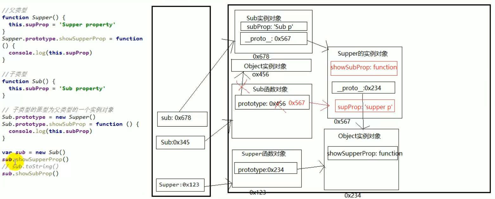

> 借用构造函数继承(假的)

- 方法

  （1） 定义父类型构造函数

  （2）定义子类型构造函数

  （3）在子类型构造函数中调用父类型构造
- 关键

在子类型构造函数中通用 Super() 调用父类型构造函数

```js
function Person(name，age) {
    this.name = name
    this.age = age
}
function Student(name, age, price) {
    Person.call(this, name, age) // 相当于: this. Person(name, age)
    this.price = price
}
var s=new Student('Tom', 20, 1400)
console.log(s.name, s.age, s.price)
```

> 组合继承

- 原型链+借用构造函数的组合继承(假继承)：

  利用原型链实现对父类型对象的方法继承；

  利用call()借用父类型构建函数初始化相同属性。

```js
function Person(name，age) {
    this.name = name
    this.age = age
}

Person. prototype. setName = function (name) {
	this. name = name
}

function Student(name, age, price) {
    Person.call(this, name, age) // 相当于: this. Person(name, age)，为了得到属性
    this.price = price
}
Student.prototype = new Person() //为了能看到父类型的方法
Student.prototype.constructor = Student //修正constructor属性
Student.prototype.setPrice = function (price) {
	this.price = price
}

var s=new Student('Tom', 20, 1400)
console.log(s.name, s.age, s.price)
```

### 10.线程机制与事件机制

> 进程与线程

- 进程(process)

  程序的一次执行，它占有一片独有的内存空间。可以通过windows任务管理器查看进程。
- 线程(thread)

  是进程内的一个独立执行单元，是程序执行的一个完整流程，是CPU的最小的调度单元。
- 图解

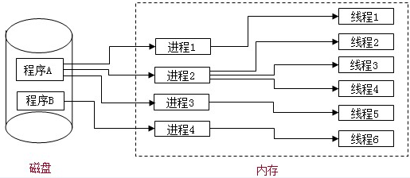

- 相关知识

  应用程序必须运行在某个进程的某个线程上；

  一个进程中至少有一个运行的线程：主线程，进程启动后自动创建；

  一个进程中也可以同时运行多个线程，我们会说程序是多线程运行的；

  一个进程内的数据可以供其中的多个线程直接共享；

  多个进程之间的数据是不能直接共享的；

  线程池(thread pool)：保存多个线程对象的容器，实现线程对象的反复利用。
- 相关问题

  - 何为多进程与多线程?

    多进程运行：一应用程序可以同时启动多个实例运行。

    多线程：在同一个进程内，同时有多个线程运行。
  - 比较单线程与多线程?

    多线程：优点：能有效提升CPU的利用率。缺点：创建多线程开销、线程间切换开销、死锁与状态同步问题。

    单线程：优点：顺序编程简单易懂。缺点：效率低。
  - JS是单线程还是多线程?

    js是单线程运行的，但使用H5中的 Web Workers可以多线程运行。
  - 浏览器运行是单线程还是多线程?

    都是多线程运行的。
  - 浏览器运行是单进程还是多进程?

    有的是单进程，firefox、老版IE。有的是多进程，chrome、新版IE。
  - 如何查看浏览器是否是多进程运行的呢?

    任务管理器  ==> 进程

> 浏览器内核

- 支撑浏览器运行的最核心的程序
- 不同的浏览器可能不一样，Chrome, Safari : webkit，firefox : Gecko，IE	: Trident，360,搜狗等国内浏览器: Trident + webkit
- 内核由很多模块组成

  - 主线程

    js引擎模块 : 负责js程序的编译与运行

    html,css文档解析模块 : 负责页面文本的解析

    DOM/CSS模块 : 负责dom/css在内存中的相关处理

    布局和渲染模块 : 负责页面的布局和效果的绘制(内存中的对象)
    ......
  - 分线程

    定时器模块 : 负责定时器的管理

    DOM事件响应模块 : 负责事件的管理

    网络请求模块 : 负责ajax请求

> 定时器引发的思考

- 定时器真是定时执行的吗?

  定时器并不能保证真正定时执行，一般会延迟一丁点(可以接受)，也有可能延迟很长时间(不能接受)。
- 定时器回调函数是在哪个线程执行的?

  在主线程执行的，js是单线程的。
- 定时器是如何实现的?

  事件循环模型。

> JS是单线程执行的

- 如何证明js执行是单线程的?

  setTimeout()的回调函数是在主线程执行的，**定时器回调函数只有在运行栈中的代码全部执行完后才有可能执行**。
- 为什么js要用单线程模式, 而不用多线程模式?

  JavaScript的单线程，与它的用途有关。作为浏览器脚本语言，JavaScript的主要用途是与用户互动，以及操作DOM。这决定了它只能是单线程，否则会带来很复杂的同步问题。
- 代码的分类

  初始化代码、回调代码。
- js引擎执行代码的基本流程

  （1）**先执行初始化代码**，包含一些特别的代码  回调函数（异步执行）

  设置定时器、绑定监听、发送ajax请求。

  （2）**后面在某个时刻**才会执行回调代码（要保证初始化代码执行完）。

```js
setTimeout(function () {
	console.log('timeout 2222')
},2000)
setTimeout(function () {
	console.log( 'timeout 1111' )
},1000)
function fn() {
	console.log('fn()')
}
fn()
console.log('alert()之前')

//暂停当前主线程的执行，同时暂停计时，点击确定后，恢复程序执行和计时
aler('-------') 
console.log('alert()之后')
```

**后面在某个时刻**才会执行回调代码（要保证初始化代码执行完才会执行回调代码）。

```js
setTimeout(function () {  
	console.log(3)
},0)
console.log(1)
console.log(2)
//1 2 3
```

> 浏览器的事件循环(轮询)模型

- 所有代码分类

  初始化执行代码(同步代码): 包含綁定dom事件监听， 设置定时器， 发送ajax请求的代码；

  回调执行代码(异步代码): 处理回调逻辑。
- js引擎执行代码的基本流程: 初始化代码===>回调代码
- 模型的2个重要组成部分: 事件管理模块、回调队列
- 模型的运转流程：

  执行初始化代码，将事件回调函数交给对应模块管理；

  当事件发生时，管理模块会将回 调函数及其数据添加到回调列队中；

  只有当初始化代码执行完后(可能要一定时间)， 才会遍历读取回调队列中的回调函数执行。
- 模型原理图


- 相关重要概念

  - 执行栈：execution stack，所有的代码都是在此空间中执行的
  - 浏览器内核：browser core，js引擎模块(在主线程处理)、其它模块(在主/分线程处理)
  - 同一个: callback queue

    任务队列：task queue

    消息队列：message queue

    事件队列：event queue
  - 事件轮询：event loop，从任务队列中循环取出回调函数放入执行栈中处理(一个接一个)。
  - 事件驱动模型：event-driven interaction model
  - 请求响应模型：request-response model

> H5 Web Workers(多线程)

- 介绍
  Web Workers 是 HTML5 提供的一个javascript多线程解决方案，我们可以将一些大计算量的代码交由web Worker运行而不冻结用户界面，但是子线程完全受主线程控制，且不得操作DOM。所以，这个新标准并没有改变JavaScript单线程的本质
- 使用
  创建在分线程执行的js文件

  ```js
  var onmessage =function (event){ //不能用函数声明
      console.log('onMessage()22');
      var upper = event.data.toUpperCase();//通过event.data获得发送来的数据
      postMessage(upper);//将获取到的数据发送会主线程
  }
  ```

  在主线程中的js中发消息并设置回调。

  ```js
  //创建一个Worker对象并向它传递将在新线程中执行的脚本的URL
  var worker = new Worker("worker.js");  
  //接收worker传过来的数据函数
  worker.onmessage = function (event) {   
      console.log(event.data);         
  };
  //向worker发送数据
  worker.postMessage("hello world");  
  ```
- 图解
  
- 相关API

  Worker: 构造函数，加载分线程执行的js文件；

  Worker.prototype.onmessage: 用于接收另-一个线程的回调函数；

  Worker.prototype.postMessage: 向另一个线程发送消息。
- 不足

  worker 内代码不能操作DOM(更新UI)；

  不能跨域加载JS；

  不是每个浏览器都支持这个新特性。

### 启动服务

cd C:\Users\Lct\Desktop\Aaving.github.io\docs

docsify serve
