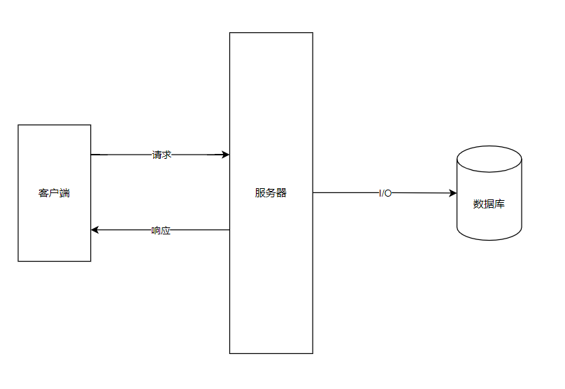

### 1.命令行窗口

别名：小黑屏、CMD窗口、终端、shell

进入：win + R   -->  cmd + enter

- **指令：**

```
dir : 列出当前目录下的所有文件
cd 目录名 : 进入到指定的目录
md 目录名 : 创建一个文件夹
rd 目录名 : 删除一个文件夹
```

- 目录：

```
.  表示当前目录
.. 表示上一级目录
cd ..  返回上一层目录
```

- 环境变量(window系统中的变量)

```
path  路径
	%USERPROFILE%\AppData\Local\Microsoft\WindowsApps;
	C:\Users\Lct\AppData\Local\Programs\Microsoft VS Code\bin;

- 当我们在命令行窗口打开一个文件，或调用一个程序时，
系统会首先在当前目录下寻找文件程序，如果找到了则直接打开。
如果没有找到则会依次到环境变量path的路径中寻找，直到找到为止。
如果没找到则报错。

- 所以我们可以将一些经常需要访问的程序和文件的路径添加到path中，
这样我们就可以在任意位置来访问这些文件和程序了
```

### 2.进程和线程

- 进程

  **进程是CPU进行资源分配的基本单位**，

  进程负责为程序的运行提供必备的环境，

  进程就相当于工厂中的车间。
- 线程

  线程是CPU调度的最小单位，是建立在进程的基础上运行的单位，共享进程的内存空间。

  线程计算机中的最小的计算单位，线程负责执行进程中的程序，

  线程就相当于工厂中的工人。
- 单线程和多线程

  js是单线程的。

### 3.Node.js简介

Node.js是一个能够在服务器端运行JavaScript的开放源代码、跨平台**JavaScript运行环境**。

Node采用Google开发的V8引擎运行js代码，使用**事件驱动**、**非阻塞和异步I/O模型**等技术来提高性能，可优化应用程序的传输量和规模。

项目架构：



- Node的用途：

  Web服务API，比如REST；

  实时多人游戏；

  后端的Web服务，例如跨域、服务器端的请求；

  基于Web的应用；

  多客户端的通信，如即时通信。

Node是对ES标准一个实现，Node也是一个JS引擎。

通过Node可以使js代码在服务器端执行。

Node仅仅对ES标准进行了实现，所以在Node中不包含DOM 和BOM。

Node中可以使用所有的内建对象string Number Boolean Math Date RegExp Function object Array，而BoM和DOM都不能使用，但是可以使用console也可以使用定时器（setTimeout () setInterval() )

Node可以在后台来编写服务器。

Node编写服务器都是单线程的服务器

进程：进程就是一个一个的工作计划(工厂中的车间)

线程：线程是计算机最小的运算单位(工厂中的工人)，线程是千活的

传统的服务器都是多线程的，每进来一个请求，就创建一个线程去处理请求

Node的服务器单线程的，Node处理请求时是单线程，但是在后台拥有一个I/O线程池。

**小技巧：在文件管理器直接点上面目录，输入cmd，回车，直接打开命令行窗口并进入该目录。**

**node运行js，进入js文件目录，node js文件 + 回车。**

**VSCode-node提示，只需在项目的根目录中打开terminal(命令行窗口)运行 npm i --save--dev @types/node 。**

### 4.模块化

- ECMAScript标准的缺陷

  没有模块系统

  标准库较少

  没有标准接口

  缺乏管理系统
- 模块化

  如果程序设计的规模达到了一定程度，则必须对其进行模块化。

  模块化可以有多种形式，但至少应该提供能够将代码分割为多个源文件的机制。

  CommonJS的模块功能可以帮我们解决该问题。
- CommonJS规范

  CommonJS规范的提出，主要是为了弥补当前JavaScript没有标准的缺陷。
  CommonJS规范为JS指定了一个美好的愿景，希望JS能够在任何地方运行。

  **CommonJS对模块的定义十分简单：**

  - 模块引用
  - 模块定义
  - 模块标识
- **模块化**

  定义模块：

```js
//module2.js

/*
模块化
	在Node中，一个js文件就是一个模块。
	在Node中，每一个js文件中的js代码都是独立运行在一个函数中，
	而不是全局作用域，所以一个模块的中的变量和函数在其他模块中无法访间。
*/
console.log("I am module1")
var val = 90;
```

```
引入其他模块：
```

```js
//module1.js

//引入其他的模块

/*
在node中，通过require()函数来引入外部的模块。
require()可以传递一个文件的路径作为参数，node将会自动根据该路径来引入外部模块。
这里的路径，如果使用相对路径，必须以.或..开头。
*/
require("./module2.js" );
require("./module2");//.js可以省略


/*
使用require()引入模块以后，该函数会返回一个对象，这个对象代表的是引入的模块
*/
var md = require("./module2.js");//返回一个对象
alert(val) //报错
alert(md.val) //undefined


/*
我们使用require()引入外部模块时，使用的就是模块标识，我们可以通过模块标识(模块路径或模块名字)来找到指定的模块
模块分成两大类
	核心模块(npm中下载的模块)：由node引擎提供的模块，核心模块的标识就是模块的名字
	文件模块(用户自己写的模块)：由用户自己创建的模块，文件模块的标识就是文件的路径(绝对路径，相对路径)，相对路径必须使用.(当前目录)或..(上一级目录)开头。
*/
var md =require( "./module" ) ;//文件模块
var math = require("./math");//文件模块
var fs =require("fs") ;//核心模块
```

```
向外暴露模块的变量或方法：
```

```js
//module2.js

/*
我们可以通过exports来向外部暴露变量和方法
只需要将需要暴露给外部的变量或方法设置为exports的属性即可
*/

//向外部暴露属性或方法
exports.x = 'def'
var y = 'y'
exports.f = function(){
  
}
```

```js
//module1.js
var md = require("./module2");//返回一个对象
console.log(md); //{x:'def',f:function(){}}，没有y
```

- **模块化详解**

```js
/*
在node中有一个全局对象global，它的作用和网页中window类似
	在全局中创建的变量都会作为global的属性保存
	在全局中创建的函数都会作为global的方法保存

在模块中用 var/let 定义的变量是局部变量，不用var/let定义的是全局变量.

实际上模块中的代码都是包装在一个函数中执行的，并且在函数执行时，同时传递进了5个实参exports, require, module, __filename, __dirname

exports  {}对象，用来将变量或函数暴露到外部

require  函数，用来引入外部的模块

module   module代表的是当前模块本身
		exports就是module的属性，exports===module.exports
		既可以使用exports 导出，也可以使用module.exports

__filename 当前模块的完整路径

__dirname  当前模块所在文件夹的完整路径
*/

var a = 'a';//局部变量
b = 'b';//全局变量
console.log(global.a) ; //undefined
console.log(global.b) ; //b
console.log(arguments.length); //5
console.log(exports);
console.log(exports===module.exports);//true
console.log(__filename);//C:\Users\Lct\Desktop\Web\NodeJS\js\m2.js
console.log(__dirname);//C:\Users\Lct\Desktop\Web\NodeJS\js
```

**证明模块运行在函数内：**

```js
console.log(arguments); //有5个参数

/******
arguments.callee
	这个属性保存的是当前执行的函数对象
******/

console.log(arguments.callee + '' );//得到函数结构


/*********************************
function (exports, require, module, __filename, __dirname) {  
    console.log(arguments); //有5个参数
    /*
    arguments.callee
    	这个属性保存的是当前执行的函数对象
    */
    console.log(arguments.callee + ''); //得到函数结构
}
**********************************/


/*********************************
当node在执行模块中的代码时，它会首先在代码的最顶部，添加如下代码:
function (exports, require, module, __filename, __dirname) {   
在代码的最底部，添加如下代码
	}
**********************************/
```

> **exports 和 module.exports**

定义两个模块

```js
//m1.js
module.exports = {
    name:'zhu',
    age:10
}
```

```js
//m2.js
exports = {
    name:'zha',
    age:12
}
```

引入上面两个模块

```js
//m3.js
var m1 = require('./m1');
var m2 = reqiure('./m2');

console.log(m1.name);//zhu
console.log(m2.name);//报错
```

- **解释：引用变量保存的是地址值。**

```js
//相当于这样
exports = module.exports;

exports = {}//此时exports指向{}，不再是module.exports

//错误
exports = {
    name:'zha',
    age:12
}

//正确
module.exports = {
    name:'zha',
    age:12
}
```

- **总结：**

**通过 `exports` 只能使用 `exports.变量名 = 变量值` 的方式来向外暴露内部变量或方法**

**而 module.exports 既可以通过 `module.exports.变量名=变量值` 的形式，也可以直接赋值(对象)：`module.exports = {name:'ff'}`**

### 5.包 package

- 包 package

  CommonJS的包规范允许我们将一组相关的模块组合到一起，形成一组完整的工具。

  CommonJS的包规范由**包结构和包描述文件**两个部分组成。

  包结构：用于组织包中的各种文件

  包描述文件：抽述包的相关信息，以供外部读取分析

  - 包实际上就是一个压缩文件，解压以后还原为目录。符合规范的目录，应该包含如下文件∶

    - **package.json	json文件，描述文件(必须有)**
    - bin	文件夹，可执行二进制文件(一般没有)
    - lib	 文件夹，放js代码
    - doc	文件夹，文档
    - test	文件夹，单元测试
  - 包描述文件用于表达非代码相关的信息，它是一个JSON格式的文件
  - package.json位于包的根目录下，是包的重要组成部分。

    package.json中的字段：name、description、version、keywords、maintainers、contributors、bugs、licenses、repositories、dependencies、homepage、os、cpu、engine、builtin、directories、implements、scripts、author、bin、main、devDependencies。
  - **json文件不能写注释**
  - 包简单理解是模块的增强版。

### 6.npm

**NPM(Node Package Manager) 包管理器**

CommonJS包规范是理论，NPM 是其中一种实践。

对于Node而言，NPM帮助其完成了第三方模块的发布、安装和依赖等。借助NPM，Node与第三方模块之间形成了很好的一个生态系统。

- **npm命令**

```
npm -v  		      => 查看版本
npm init			 => 初始化项目，填写项目的 package.json 文件
npm version  		 => 查看所有模块的版本
npm                   => 帮助说明
npm search 包名  	  => 搜索模块包
npm install/i 包名     => install可以简写为i，在当前目录安装包
npm remove/r 包名      => remove可以简写为r，删除包，依赖也会删除
npm remove/r 包名 --save => 删除包，依赖也会删除
npm install/i 包名 -g  => 全局模式安装包
npm install/i 包名 --save => 1.安装包并添加到依赖中(重要，主要使用)，
						    2.安装包时把包设为项目依赖，即在 package.json 
						    文件中的dependences字段添加 "包名":"版本号"，
					        3.一般Node项目不会上传node_modules，因为包太多会影响上传下载速度，
					        且不能保证最新版本的包，那么怎么用到这些包？
					        就要在项目根目录下运行 npm install/i 来下载所有包。
npm install/i          => 下载当前项目所依赖的包，根据依赖下载
npm install 包名 -g    => 全局安装包(全局安装的包一般都是一些工具)
npm install 文件路径    => 从本地安装
npm install 包名 -registry=地址  =>从镜像源安装
npm config set registry 地址    =>设置镜像源
```

**注意**：安装包时，`npm` 根据 `package.json` 文件识别，文件夹下没有 `package.json` 时可能会安装出错，安装包不在当前文件夹。

所以**安装包前**要初始化文件夹：`npm init` ，然后配置相关字段，其中 `entery point` 是运行入口，默认是 `index.js` 。然后运行 `npm install 包名` 命令安装需要的包，包安装在当前文件夹的`node_modules文件夹` 下面。

安装包：

```
C:\Users\Lct\Desktop\Web\NodeJS> npm install math
```

包所在文件夹：

```
C:\Users\Lct\Desktop\Web\NodeJS\node_modules
```

**引入包：**

```js
//引入 node_modules 下的模块(npm下载的)不需要写相对路径，只需写包名。
var math = require("math");

//使用包
console.log(math.sum([30,90])) //-> 120
```

### 7.cnpm

**npm 镜像**：很多包都在国外服务器，下载速度慢，所以需要在国内建一个服务器，把 npm 国外包下载当国内服务器，用户再从国内服务器下载包，国内服务器的包更新速度比国外慢。

淘宝镜像：用 cnpm 替代 npm，cnpm 连接国内服务器，npm 连接国外服务器。**安装 cnpm ：**

```
npm install -g cnpm --registry=https://registry.npmmirror.com
```

这时候就可以用 cnpm 替代命令中 npm 的位置，cnpm和npm用法一模一样，**用 npm 下载包很慢时，可以换 cnpm 下载包，两者可以互补使用。**如：`cnpm install [name]`

### 8.node搜索包流程

通过 npm 下载的包**(核心模块)**，都放到 node_modules 文件夹中，我们通过npm下载的包，**直接通过包名引入即可** 。

- **node搜索包流程：**

  node在使用模块名字来引入模块时，它会首先在当前目录的node_modules 中寻找是否含有该模块；

  如果有则直接使用，如果没有则去上一级目录的 node_modules 中寻找；
  如果有则直接使用，如果没有则再去上一级目录的 node_modules 中寻找，直到找到为止直到找到磁盘的根目录，如果依然没有，则报错。

```js
//删除math包后
var math = reqiure("math");
console.log(math.add(90,100));//190
```

上面程序不会报错，为什么？因为 node_modules 文件缓存到了项目的上级路径中。

### 9.Buffer缓冲区

- **Buffer(缓冲区)**

  Buffer的结构和数组很像，操作的方法也和数组类似。

  数组中不能存储二进制的文件，而buffer就是专门用来存储二进制数揖。

  使用buffer不需要引入模块，直接使用即可。

  在buffer中存储的都是二进制数据，但是在显示时都是以16进制的形式显示(因为二进制太长了)。

  buffer 中每一个元素的范围是从 00 - ff  (16进制)  -> 0000000 - 11111111 (2进制，一个字节)  ->  0 - 255 (十进制)

  **Buffer的大小一旦确定，则不能修改，Buffer实际上是对底层内存的直接操作，而数组可以修改。**
- Buffer 操作

```js
var str ="Hello Atguigu" ;

//1.将一个字符串保存到buffer中
var buf = Buffer.from(str);
console.log(buf); //<Buffer 48 65 6c 6c 6f 20 41 74 67 75 69 67 75>  => unicode 编码
console.log(buf.length);//13  -> 占用内存的大小
console.log(str.length);//13  -> 字符串的长度

var str_ = "Hello 尚硅谷";
var buf_ = Buffer.from(str_);
console.log(buf_.length);//15  -> 一个汉字占3个字节
console.log(str_.length);//9

//2.创建一个指定大小的buffer
//buffer构造函数都是不推荐使用的
//var buf2 = new Buffer(10); //10个字节的buffer

//创建一个10个字节的buffer
var buf2 =Buffer.alloc(10);
console.log (buf2);//<Buffer 00 00 00 00 00 00 00 00 00 00>
buf2[0] = 90;
buf2[1] = 0xaa;//16进制数
buf2[2] = 256; //超出范围，会截取后8位二进制保存起来
console.log(buf2[2]);//0
buf2[10] = 8; //不报错，不会改变Buffer的大小

//只要数字在控制台或页面中输出一定是10进制
console.log(buf2[0]);//90
console.log(buf2[1].toString(16));//aa  转为16进制字符串

//3.Buffer.allocUnsafe(size)创建一个指定大小的buffer，但是buffer中可能含有敏感数据，即该创建方法不会清空原有数据，只分配空间，而alloc会清空原有数据，性能差一点。
var buf3 = Buffer.allocUnsafe(10);
console.log(buf3);//<Buffer f0 0c 00 00 00 00 00 00 00 00>


/****************************************
4.总结：
	Buffer.from(str)将一个字符串转换为buffer;
	Buffer.alloc(size)创建一个指定大小的Buffer;
	Buffer.alloUnsafe(size)创建一个指定大小的Buffer，但是可能包含敏感数据;
	buf.toString()将缓冲区中的教据转换为字符串.

buffer用途：用来存二进制数据
	用户请求的数据都是二进制数据，可以先把数据存到buffer中转为二进制数据，再响应给用户。
****************************************/

var buf4 = Buffer.from("我是一段文本数据");
console.log(buf4.tostring());//我是一段文本数据
```

### 10.文件操作

- [**文件系统 fs (File System)**](http://nodejs.cn/api/fs.html)

  文件系统简单来说就是通过 Node 来操作系统中的文件，增删改查。

  在Node中，与文件系统的交互是非常重要的，服务器的本质就将本地的文件发送给远程的客户端。

  Node通过 **`fs` 模块**来和文件系统进行交互该模块提供了一些**标准文件访问 API** 来打开、读取、写入文件，以及与其交互。

  要使用 `fs` 模块，首先需要对其进行加载 `const fs = require("fs")` ，即引入 fs 模块。

  **使用文件系统，需要先引入 `fs` 模块，`fs` 是核心模块，直接引入不需要下载。**

  fs 模块中所有的操作都有两种形式可供选择**同步和异步**，**带`Sync`的方法是同步的方法，不带`Sync`的是异步方法。**

  同步文件系统会**阻塞程序的执行**，也就是除非操作完毕，否则不会向下执行代码。异步文件系统**不会阻塞程序**的执行，而是在操作完成时，**通过回调函数将结果返回**。
- **同步文件的写入**

  0.引入fs模块

  ```js
  var fs = require("fs");
  ```

  1.打开文件

  `fs.openSync(path,flags[,mode])`

  - path：要打开文件的路径，字符串
  - flags：打开文件要做的操作的类型，字符串
    - r   只读的
    - w  可写的
  - mode：设置文件的操作权限，一般不传
  - 返回值：该方法会返回一个文件的描述符作为结果，我们可以通过该描述符来对文件进行各种操作

  ```js
  //打开文件
  var fd = fs.openSync("hello.txt","w");
  console.log(fd);//3
  ```

  2.向文件中写入内容

  `fs.writeSync(fd, string [ , position [ , encoding ] ])`

  - fd  文件的描述符，需要传递要写入的文件的描述符
  - string  要写入的内容
  - position  文件写入的起始位置，可选
  - encoding  写入的编码，默认utf-8

  ```js
  //向文件中写入内容
  fs.writeSync(fd , "今天天气真不错~~~" );
  ```

  3.保存并关闭文件

  `fs.closeSync(fd)`

  - fd  文件的描述符，需要传递要关闭的文件的描述符

  ```js
  //关闭文件
  fs.closeSync(fd);
  ```
- **异步文件的写入**

  1.打开文件

  `fs.open(path, flags [ , mode] , callback)`

  - path：要打开文件的路径，字符串
  - flags：打开文件要做的操作的类型，字符串
    - r   只读的
    - w  可写的
  - mode：设置文件的操作权限，一般不传
  - callback：回调函数，不能缺，**异步调用的方法，结果都是通过回调函数的参数返回的，回调函数两个参数：**
    - err  错误对象，如果没有错误则为null
    - fd  文件的描述符

  2.向文件中写入内容

  `fs.write(fd, string [ , position [ , encoding ]],callback)`

  - fd  文件的描述符，需要传递要写入的文件的描述符
  - string  要写入的内容
  - position  文件写入的起始位置，可选
  - encoding  写入的编码，默认utf-8
  - callback 回调函数

  3.关闭文件

  `fs.close(fd, callback)`

  4.完整操作

```js
//引入fs模块
var fs = require("fs") ;
//打开文件
fs.open( "hello2.txt","w", function (err , fd){
    //判断是否出错
    if (!err){
        console.log(fd);
    }else{
        console.log(err);
    }
    console.log("0");
});
console.log("1");

//异步文件不会阻塞程序执行，先输出1，再输出0，故不能在open外写入文件

//打开文件
fs.open( "hello2.txt","w", function (err , fd){
  
    //判断是否出错
    if (!err){
        //console.log(fd);
        //如果没有出错，则对文件进行写入操作
        fs.write(fd,"这是异步写入的内容", function(err){
            if(!err){
                console.log("写入成功");
            }
        });
    
        //关闭文件
        fs.close(fd,(err)=>{
            if(!err){
                console.log("关闭成功");
            }
        });

    }else{
        console.log(err);
    }
    //console.log("0");
});
//console.log("1");
```

上面的写入方法都是不常用的，下面的方法是常用的。

- **简单文件写入**

  `fs.writeFile(file,data[,options],callback)fs.writeFilesync(file, data[ , options])` ，参数：

  - file要操作的文件的路径
  - data要写入的数据
  - options选项，可以对写入进行一些设置

    - encoding \<string> | \<null>默认='utf8'
    - mode \<integer>默认=0o666
    - flag \<string>默认='w'  r 只读 w 可写
    - flag 值

      ```
      r   读取文件，文件不存在则出现异常
      r+  读写文件，文件不存在则出现异常
      rs  在同步模式下打开文件用于读取
      rs+ 在同步模式下打开文件用于读写
      w   打开文件用于写操作，如果不存在则创建，如果存在则截断(把文件原来内容全部干掉，再写入当前内容)
      wx  打开文件用于写操作,如果存在则打开失败
      w+  打开文件用于读写操作,如果不存在则创建,如果存在则截断(把文件原来内容全部干掉，再写入当前内容)
      wx+ 打开文件用于读写,如果存在则打开失败
      a   打开文件用于追加(在原本内容的最后开始写入),如果不存在则创建
      ax  打开文件用于追加,如果路径存在则失败
      a+  打开文件进行读取和追加如果不存在则创建该文件
      ax+ 打开文件进行读取和追加,如果路径存在则失败

      //r w a 常用
      ```
    - options 是个对象，`{encoding:'utf-8',mode:"0o666",flag:'w'}`
    - options 一般不传
  - callback当写入完成以后执行的函数

  **writeFile 将上面的写入方法封装起来了，可以Ctrl + 点击 api 查看源码。**

  ```js
  //引入fs模块
  var fs = require("fs") ;

  //写入文件
  fs.writeFile("hello3.txt", "这是通过writeFile写入的内容" , function (err){
      if (!err){
          console. log ( "写入成功~~~" ) ;
      }
  });
  ```
- **流式文件写入**

  同步、异步、简单文件的写入都**不适合大文件**的写入，性能较差，容易导致内存溢出。

  **流式文件写入：**

  ```js
  //流式文件写入
  /*
  fs.createWriteStream(path [ , options])
  	-可以用来创建一个可写流
  	- path，文件路径
  	- options 配置的参数
  */

  //创建一个可写流
  var ws =fs.createwritestream ( "hello3.txt");//ws与hello3.txt建立管道

  //可以通过监听流的open和close事件来监听流的打开和关闭
  /*
  on(事件字符串，回调函数)
  	-可以为对象绑定一个事件
  once(事件字符串，回调函数)
  	-可以为对象绑定一个一次性的事件，该事件将会在触发一次以后自动失效
  */

  //绑定open事件，ws打开时触发，不用on绑定浪费内存
  ws.once ( "open" , function (){
  	console.log ("流打开了~~~" ) ;
  }
  //绑定close事件，ws关闭时触发
  ws.once ( "close" , function (){
  	console.log ("流打开了~~~" ) ;
  }

  //通过ws向文件中输出内容，可以分多次写入
  ws.write("通过可写流写入文件的内容");
  ws.write("通过可写流写入文件的内容");
  ws.write("通过可写流写入文件的内容");

  //关闭可写流，不要用close()，因为这样会导致文件没写完就拔掉管道
  ws.end();
  ```
- **简单文件读取**

  同步：`fs.readFileSync(path [ , options])`

  异步：`fs.readFile(path [ , optionsj , callback)`

  - path要读取的文件的路径
  - options读取的选项
  - callback回调函数，通过回调函数将读取到内容返回(err , data)
    - err  错误对象
    - data  读取到的数据，会返回一个Buffer，因为读到的文件可能不是纯文本文件，纯文本文件通过 buf.toString() 转为字符串文本

  ```js
  var fs = require("fs")

  //readFile
  fs.readFile("hello.txt",(err,data)=>{
      if(!err){
          //将data写入hello2.txt
          fs.writeFile("hello2.txt",data,(err)=>{
              if(!err){
                  console.log("写入成功");
              }
          })
      }
  });
  ```
- **流式文件读取**

  流式文件读取也适用于一些**比较大**的文件，可以**分多次**将文件读取到内存中。

  ```js
  //创建一个可读流
  var rs = fs.createReadStream ("an.mp3");

  //创建一个可写流
  var ws =fs.createwritestream ( "a.mp3" );

  //监听可读流的开启和关闭
  rs.once ("open" , (){
  	console.log ("可读流打开了~~" );
  });
  rs.once ("close" , (){
  	console.log ("可读流关闭了~~" );
  	//数据读取完毕，关闭可写流
  	ws.end();

  });

  //监听可写流的开启和关闭
  ws.once( "open" , function (){
  	console.log ("流打开了~~~" ) ;
  }
  //绑定close事件，ws关闭时触发
  ws.once("close" , function (){
  	console.log ("流打开了~~~" ) ;
  }

  //如果要读取一个可读流中的数据，必须要为可读流绑定一个data事件，data事件绑定完毕，它会自动开始读取数据，读到的数据作为回调函数的参数返回一个buffer

  rs.on("data" ,function (data){
      //data为每次读到的文件
  	console.log(data);

      //每次读的文件大小
      console.log(data.length);

      //将读取到的数据写入到可写流中
      ws.write (data) ;
  });
  ```
  **`pipe()`可以将可读流中的内容，直接输出到可写流中**

  ```js
  //创建一个可读流
  var rs = fs.createReadStream ("an.mp3");

  //创建一个可写流
  var ws =fs.createwritestream ( "a.mp3" );

  //监听可读流的开启和关闭
  rs.once ("open" , (){
  	console.log ("可读流打开了~~" );
  });
  rs.once ("close" , (){
  	console.log ("可读流关闭了~~" );
  });

  //监听可写流的开启和关闭
  ws.once( "open" , function (){
  	console.log ("流打开了~~~" ) ;
  }
  //绑定close事件，ws关闭时触发
  ws.once("close" , function (){
  	console.log ("流打开了~~~" ) ;
  }

  //pipe()可以将可读流中的内容，直接输出到可写流中
  rs.pipe(ws);  //rs 与 ws建立管道
  ```
  可以不监听，pipe 自动完成

  ```js
  //创建一个可读流
  var rs = fs.createReadStream ("an.mp3");

  //创建一个可写流
  var ws =fs.createwritestream ( "a.mp3" );

  //pipe()可以将可读流中的内容，直接输出到可写流中
  rs.pipe(ws);  //rs 与 ws建立管道
  ```
- fs 模块其他方法

  - 验证文件是否存在

    ~~`fs.exists(path , callback) `~~废弃了

    `fs.existsSync(path)`
  - 获取文件信息

    `fs.stat(path, callback)`

    `fs.statSync(path)`

    获取文件的状态，它会给我们返回一个对象，这个对象中保存了当前对象状态的相关信息

    ```js
    fs.stat ( "a.mp3" , function (err , stat) {
        /*
        size 文件的大小
        isFile()是否是一个文件
        isDirectory()是否是一个文件夹(目录)
        */
        console.log (stat.isFile()); 
    });
    ```
  - 删除文件

    `fs.unlink(path, callback)`

    `fs.unlinkSync(path)`
  - 列出文件

    `fs.readdir(path[,options],callback)`

    `fs.readdirSync(path[, options])`

    ```js
    //files是数组
    fs.readdir ("." ,function (err, files) {
        if (!err){
        	console.log (files) ;
        }
    });
    ```
  - 截断文件

    `fs.truncate(path, len, callback)`

    `fs.truncateSync(path, len)`

    将文件修改为指定的大小，截中文可能有意外。
  - 建立目录

    `fs.mkdir(path[, mode], callback)`

    `fs.mkdirSync(path[, mode])`
  - 删除目录

    `fs.rmdir(path, callback)`

    `fs.rmdirSync(path)`
  - 重命名文件和目录

    `fs.rename(oldPath, newPath, callback)`

    `fs.renameSync(oldPath, newPath)`

    - oldPath 旧的路径
    - newPath新的路径
    - cailback回调函数

    ```js
    fs.rename( "a.mp3","笔记.mp3", function(err){
        if(!err){
        	console. log("修改成功~~~");
        }
    });

    //路径不一样可以实现剪切功能
    ```
  - 监视文件修改

    `fs.watchFile(filename[, options], listener)`

    - filename  要监视的文件的名字
    - options 配置选项
      - interval 监听定时器的时间间隔
    - listener 回调函数，当文件发生变化时，回调函数会执行
      - curr 当前文件的状态
      - prev 修改前文件的状态
      - 这两个对象都是 stat 对象

    ```js
    //每隔1000ms监听一次
    fs.watchFile ( "hello2.txt" ,{interval:1000},function(){
        console.log ("文件发生变化了~~~" );
        console.log ("修改前文件大小:"+prev.size);
        console.log ("修改后文件大小:"+curr.size);
    });
    ```
    回调函数有定时器，每隔一段时间监听一次，程序一直在运行，一直在监听文件变化。
