<Boxx/>

::: danger

Test Vue! 😕

:::

### 0.Vue相关文档

* [Vue教程](https://vuejs.bootcss.com/guide/)
* [VueAPI ](https://vuejs.bootcss.com/api/)
* [Vue风格指南](https://vuejs.bootcss.com/style-guide/)
* [Vue官网使用指南](https://www.bilibili.com/video/BV1Zy4y1K7SH?p=3&t=781.9)

### 1.初识Vue

- 安装Vue

  1）直接用 script 引入，下载 `Vue.js`

  2）CDN

  ```html
  <script src="https://cdn.jsdelivr.net/npm/vue@2.6.14/dist/vue.js"></script>
  ```

  3）安装 vue-devtools，在谷歌商店搜索安装

  4）在全局关闭生产环境提示

  ```js
  Vue.config.productionTip = false;
  ```
- 小案例

  ```html
  <!-- 准备好一个容器 -->
  <div id = "root">
      <h1>hello, {{name}}</h1>
  </div>

  <script>
      //阻止vue在启动时生成生产提示
      Vue.config.productionTip = false;

      //创建Vue实例, 参数为一个配置对象
      new Vue({
          //el用于指定当前Vue实例为哪个容器服务，值通常为css选择器字符串
          el:'#root', // vue实例与div#root建立联系

          //data中用于存储数据，数据供el所指定的容器去使用, 值我们暂时先写成一个对象
          data:{
              name:"ljr"
          }
      });
  </script>
  ```
- 总结

  1. 想让Vue工作，就必须创建一个Vue实例， 且 要传入一个配置对象；
  2. root 容器里的代码依然符合htm1规范，只不过混入了一些特殊的 Vue 语法；
  3. **`root` 容器里的代码被称为[ Vue模板 ]**，上面整个 `div#root` 就是一个模板；
  4. Vue实例和容器是一一对应的，不存在一对多、多对一；
  5. 真实开发中只有一个Vue实例，并且会配合着**组件**一起使用；
  6. `{{xxx}}`(**插值语法**)中的 xxx 要写js表达式，且 xxx 可以自动读取到 `data` 中的所有属性；
  7. 一旦 `data` 中的数据发生改变，那么页面中用到该数据的地方也会自动更新；
  8. **注意区分**: js表达式和js代码(语句)

     - 表达式: 一个表达式会产生一个值，可以放在任何一个需要值的地方:

       (1) `a`

       (2) `a+b`

       (3) `demo(1)`

       (4) `x===y ? 'a' : 'b'`
     - js代码(语句)

       (1) `if(){}`

       (2) `for(){}`
  9. `data` 中的数据被 `vm._data` 接收。

### 2.模板语法

Vue模板语法有2大类:

- 插值语法:

  功能:用于解析标签体内容。

  写法: `{{xxx}}`, xxx是js表达式，且可以直接读取到data中的所有属性。
- 指令语法:

  功能:用于解析标签(包括:标签属性、标签体内容、绑定事件.....)

  举例: `v-bind:href="xxx"` 或简写为 `:href="xxx"`, xxx同样要写js表达式，且可以直接读取到 `data`中的所有属性。

  备注: Vue中有很多的指令，且形式都是: `v-????`, 此处我们只是拿 `v-bind`举个例子。

### 3.数据绑定

```html
<div id=" root">

    <!-- 普通写法 -->
    单向数据绑定: <input type="text" v-bind:value="name"><br/>
    双向数据绑定: <input type="text" v-model:value="name"><br/>

    <!-- 简写 -->
    单向数据绑定: <input type="text" :value="name"><br/>
    双向数据绑定: <input type="text" v-model="name">
</div>

<script>
    //阻止vue在启动时生成生产提示
    Vue.config.productionTip = false;

    new Vue({
        el:'#root',
        data:{
            name:"ljr"
        }
    });

</script>
```

Vue中有2种数据绑定的方式:

- **单向绑定(v-bind):** 数据只能从data流向页面。
- **双向绑定(v-mode1):** 数据不仅能从data流向页面，还可以从页面流向data。
- 备注:

  1.双向绑定般都应用在**表单类元素**上(如: `input、 select`等 );

  2.`v-model:value`可以简写为 `v-model`, 因为 `v-model`默 认收集的就是value值。

### 4.el 和 data 的两种写法

`Vue` 实例上带 `$`符的属性或方法供程序员使用。

`el`两种写法：

```js
// 接收Vue实例
const vm = new Vue({
    // el:"#root", // 第一种写法
    data:{

    }
})

// 通过 Vue.prototype.$mount() 方法指定
vm.$mount('#root') //第二种写法，挂载，比较灵活
```

`data`两种写法：

```js
// 第一种写法, 对象式
new Vue({
    el:"#root", 
    data:{
        name:"jjj"
    }
})

// 第二种写法, 函数式, 必须返回一个对象
// 以后学到组件必须以这种方式写
// 不能写成箭头函数
new Vue({
    el:"#root", 
    data:function(){
        return{
            name:"nnn"
        }
    }

    //或省略function
    data(){
        return{
            name:"nnn"
        }
    }
})
```

`data`与 `el`的2种写法：

- `el`有2种写法

  (1) `new Vue()` 时候配置 `el`属性。

  (2) 先创建Vue实例 `vm`，随后再通过 `vm.$mount('#root')`指定 `el`的值。
- `data`有2种写法

  (1) 对象式

  (2) 函数式

  如何选择: 目前哪种写法都可以，以后学习到**组件**时，data必须使用函数式，否则会报错。
- 一个重要的原则:

  由Vue管理的函数，如 `data()`，一定不要写箭头函数，一旦写了箭头函数，`this` 就不再是 Vue 实例了。

### 5.MVVM 模型

1. M: 模型(Model) : 对应data中的数据
2. V: 视图(View) : 模板
3. VM: 视图模型(ViewModel) : Vue 实例对象

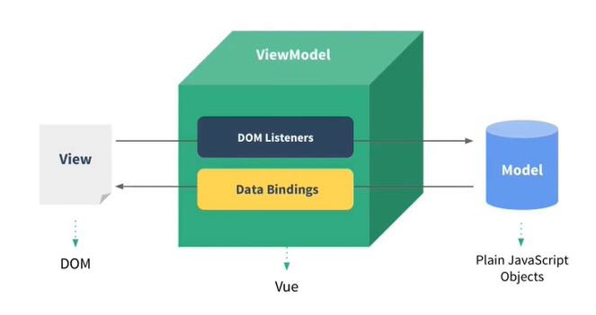

**Vue 实例将页面和数据联系起来，Vue实例起桥梁作用。**

- 观察发现:

  `data`中所有的属性，最后都出现在了 `vm` 身上。

  `vm`身上所有的属性及Vue原型上所有属性，在Vue模板中都可以直接使用。

### 6.`Object.defineProperty()`方法

`Object.defineProperty(obj, key, value)`给对象obj添加属性及属性值 `key: value` .

```js
let num = 19

let person = {
    name: "dd",
    sex: 'male',
    // age:num  //后面num变化age不会变
}

Object.defineProperty(person, 'age', {
    //value:18, 
    //enumerable:true, //控制属性是否可以枚举，默认值是false
    //writable:true, //控制属性是否可以被修改，默认值是false
    //configurable:true, //控制属性是否可以被刖除，默认值是false

    //当有人读取person的age属性时，get函数(getter)就会被调用，且返回值就是age的值
    //num变化 age也会变化
    get() {
        return num;
    },
    //当有人修改person的age属性时，set函数(setter)就会被调用，且会收到修改的具体值
    //person.age=90会调用，value == 90
    set(value) {
        console.log('有人修改了age属性，且值是', value)
        num = value
    }
});
```

### 7.Vue中的数据代理

数据代理: 通过一个对象代理对另个对象中属性的操作(读/写)。

```js
const o1 = {
    x = 10
}
const o2= {
    y = 30
}

// 通过 o2 改变 o1 数据
Object.defineProperty(o2, 'x', {
    get(){
        return o1.x
    },
    set(val){
        o1.x = val
    }
})
```

Vue 数据代理：通过 `Object.defineProperty`方法、`getter` 和 `setter` 方法实现。

- 总结

  Vue中的数据代理: **通过vm对象来代理data对象中属性的操作(读/写)。**

  Vue中数据代理的好处: 更加方便的操作data中的数据。

  基本原理:

  - Vue 将 `data` 中的数据存到 `vm` 身上的 `_data`，`vm._data === options.data`，options.data为配置中的 `data`，即两者指向同一片内存区域。
  - 通过 `Object.defineProperty()`把 `data`对象中所有属性添加到 `vm`上。
  - 为每一个添加到 `vm`上的属性，都指定个 `getter/setter`。
  - 在 `getter/setter`内部去操作(读/写) data中对应的属性。
- 图示

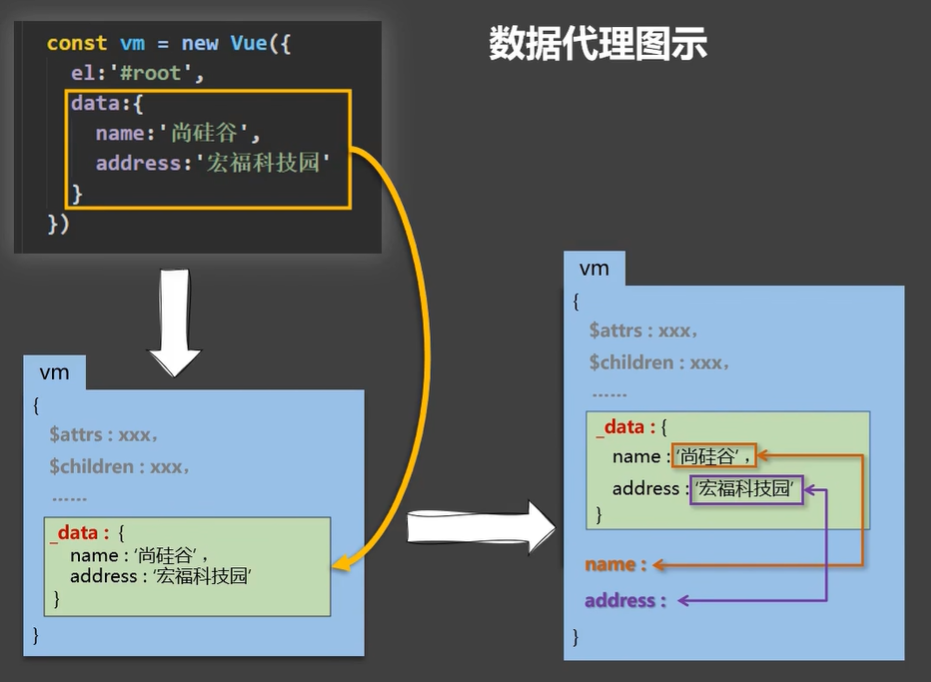

### 8.事件处理

```js
new Vue({
    el:"#root", 
    data:function(){
        return{
            name:"nnn"
        }
    },

    // 事件处理函数，写在
    methods:{
        show1(event){
            console.log(event);
        },

        show2(event, number){
            console.log(number)
            console.log(event)
        }
    }
});
```

```html
// 普通写法 v-on:
// 不传参时，浏览器给它传event事件对象
<button v-on:click="show1">btn01</button>

// 简写 @
// 传实参时，Vue中$event表示传事件对象，66是其他实参，两者顺序不要求
<button @click="show2($event, 66)">btn01</button>
```

事件的基本使用:

1. 使用 `v-on:xxx`或 `@xxx`绑定事件，其中 `xxx`是事件名;
2. 事件的回调需要配置在 `methods`对象中，最终会在 `vm`上;
3. `methods`中配置的函数，不要用简头函数! 否则 `this`就不是 `vm`了;
4. `methods`中配置的函数，都是被Vue所管理的函数，this的指向是 `vm`或组件实例对象;
5. `@click="demo"`和 `@click="demo($event)"`效果一致，`$event`是事件对象，但后者可以传参;

---

### 9.事件修饰符

Vue中的事件修饰符: `@event.事件修饰符 = 'func'`

1. `prevent`: 阻止默认事件(常用) ;

   ```html
   <!--页面不跳转-->
   <a href="http://www.baidu.com" @click.prevent="f1">dd</a>
   ```
2. `stop`: 阻止事件冒泡(常用);

   ```html
   <div @click = "f2">
      <button @click.stop = "f3">dd</button>
   </div>
   ```
3. `once`: 事件只触发一次(常用);

   ```html
   <div @click.once = "f2">ff</div>
   ```
4. `capture`: 使用事件的捕获模式，即在捕获阶段就处理事件;

   ```html
   <!--点击按钮输出-->
   <!--3 2-->
   <div @click = "f2(2)">
      <button @click = "f3(3)">dd</button>
   </div>

   <!--2 3-->
   <div @click.capture = "f2(2)">
      <button @click = "f3(3)">dd</button>
   </div>
   ```
5. `self`: 只有 `event.target`是当前操作的元素时才触发事件;

   ```html
   <!--点击div才会触发f2, 可以阻止事件冒泡--->
   <div @click.self = "f2">
      <button @click = "f3">dd</button>
   </div>
   ```
6. `passive`: 事件的默认行为立即执行，无需等待事件回调执行完毕;
7. **小技巧**

   事件修饰符可以连续写，不分先后，可以达到多个效果。

   ```html
   <div @click = "f2()">
       <a href="http://xx"@click.stop.prevent = "f3">dd</a>
   </div>
   ```

---

### 10.键盘事件

1. Vue 中常用的按键**别名**: `@键盘事件.按键别名 = 'f'`，如 `@keyup.enter = 'f'`

   ```
   回车 =>  enter  (捕获Enter键，下同)
   删除 =>  delete ( 捕获“删除”和“退格”键)
   退出 =>  esc
   空格 =>  space
   换行 =>  tab  (特殊，必须配合keydown去使用)
   上 => up
   下 => down
   左 => left
   右 => right
   ```
2. Vue 未提供别名的按键，可以使用按键原始的 key 值去绑定，但注意要转为 kebab-case (短横线命名)
3. 系统修饰键(用法特殊) : `ctrl、 alt、 shift、 meta`

   (1) 配合 `keyup`使用: 按下修饰键的同时，再按下**其他键**，随后释放其他键，事件才被触发。

   (2) 配合 `keydown`使用: 正常触发事件。
4. 也可以使用 `keyCode`去指定具体的按键(不推荐)。
5. `Vue.config.keyCodes.自定义键名 = 键码`，可以去定制按键别名
6. **小技巧**

   `ctrl、 alt、 shift、 meta` 配合其他键使用：

   ```
   @keyup.ctrl.y  ===  ctrl + y
   @keyup.shift.y  ===  shift + y
   ```

---

### 11.计算属性

```js
new Vue({
    el:"#root", 
    data:{
        firstName:"zhang",
        lastName:"san"
    },

    computed:{
        fullName:{
            //get有什么作用?当有人读取fullName时，get就 会被调用，且返回值就作为fullName的值
            //get什么时候调用? 1.初次读取fullName时。2. 所依赖的数据发生变化时, 如果没有变化那计算属性一直缓存起来。
            //Vue将get的this指向vm
            get(){
                return this.firstName + " - " + this.lastName;
            },

            //set什么时候调用?当 fullName 被修改时。
            set(val){
                this.firstName = val.split('-')[0];
                this.firstName = val.split('-')[1]
            }
        }
    }
});

// 若用methos实现，没有缓存而言，会多次调用函数
```

计算属性最后也到 `vm` 身上，可以用插值语法：

```html
<div id="root">
    name:{{fullName}}
</div>
```

**计算属性 `computed`:**

1. 定义: 要用的属性不存在，要通过**vm已有属性**计算得来。
2. 原理:底层借助了 `Objcet.defineproperty`方法提供的 `getter`和 `setter`。
3. get函数什么时候执行?
   (1) 初次读取时会执行次 。
   (2) 当依赖的数据发生改变时会被再次调用。
4. 优势: 与methods实现相比，内部有**缓存机制**(可以复用)，效率更高，调试方便。
5. 备注:

   1. **计算属性最终会出现在 `vm`上，直接读取使用即可**。
   2. 如果计算属性要被修改，那必须写 `set`函数去响应修改，且 `set`中要引起计算时依赖的数据发生变化。

计算属性简写：

```js
new Vue({
    el:"#root", 
    data:{
        firstName:"zhang",
        lastName:"san"
    },

    // 只读不改，setter可以不要
    computed:{

        //完整写法
        /*fullName:{
            get(){
                return this.firstName + " - " + this.lastName;
            },
            set(val){
                this.firstName = val.split('-')[0];
                this.firstName = val.split('-')[1]
            }
        }
        */

        // 简写 - 只读不改 -
        // fullName:function(){
        fullName(){
            return this.firstName + " - " + this.lastName;
        }
    }
});
```

### 12.侦听属性(监视属性)

**小技巧：**`@xxx="yyy"`  `yyy`可 以写些简单的 js 语句。天气案例：

```html
<div id="root">
    {{info}}
    <button @click = "isHot = !isHot">dd</button>
    <!--<button @click = "changeW">dd</button>-->
</div>

<script>
new Vue({
    el:"#root", 
    data:{
        isHot:true
    },
    computed:{
        info(){
            return isHot ? '炎热' : '凉爽' ;
        }
    },
    /*
    methods:{
        changeW(){
            this.isHot = !this.isHot;
        }
    }
    */
});
</script>
```

---

侦听属性写法，也可以侦听计算属性

```js
const vm = new Vue({
    el:"#root", 
    data:{
        isHot:true
    },
    computed:{
        info(){
            return isHot ? '炎热' : '凉爽' ;
        }
    },

    methods:{
        changeW(){
            this.isHot = !this.isHot;
        }
    },

    // 侦听属性 - 第一种写法
    watch: {
        isHot: {
            // 初始化时让handler调用一下
            immediate: true, 
            //handler什么时候调用?当isHot发生改变时。 
            //newValue：isHot新值 oldValue：旧值
            handler(newValue, oldValue) {   
                console.log(newValue, oldValue)
            }
        }
    }
});

// 侦听属性 - 第二种写法
vm.$watch("isHot",{
    //配置
    immediate: true,
    handler(newValue, oldValue) { 
        console.log(newValue, oldValue)
    }
})
```

侦听属性 `watch`:

1. 当被侦听的属性变化时，回调函数 `handler`自动调用，进行相关操作。
2. 侦听的属性**必须存在**，才能进行侦听! !不存在也不报错。
3. 侦听的两种写法:

   (1) `new Vue`时传入 `watch` 配置

   (2) 通过 `vm.$watch`侦听

---

深度侦听：

```js
new Vue({
    el: "#root",
    data: {
        isHot: true,
        num:{
            a:0,
            b:9
        }
    },
    computed: {
        info() {
            return this.isHot ? '炎热' : '凉爽';
        }
    },

    watch: {
        isHot: {
            handler(newValue, oldValue) {
                console.log(newValue, oldValue)
            }
        },

        // 侦听多级结构中某个属性的变化, 加 "" / ''
        // 如果侦听num的多个属性，那么枚举方法效率不高
        'num.a':{
            handler(newValue, oldValue) {
                console.log(newValue, oldValue)
            }
        },
        // 侦听多级结构中所有属性的变化
        num:{
            // 开启深度侦听
            immediate: true,
            deep:true,
            handler(newValue, oldValue) {
                console.log(newValue, oldValue)
            }
        },
    }
});
```

Vue 默认情况下，给程序员提供的 `watch` 是不能侦听多级结构的，但Vue可以侦听多级结构。上面 num 的属性值变化，也会引起页面数据变化，只是 `watch` 默认侦听不了。

深度侦听:

(1).Vue中的watch默认不监测对象内部值的改变(一层)。

(2).配置deep:true可以监测对象内部值改变(多层)。

备注:

(1).Vue自身可以监测对象内部值的改变，但Vue提供的watch默认不可以!

(2).使用watch时根据数据的具体结构，决定是否采用深度侦听。

---

侦听属性简写

```js
// 配置时
// 不需要其他配置时可以简写，即只有handler
watch:{
    isHot(newVal, oldVue){
        console.log(newVal, oldVal);
    }
}

// 配置后  不要写箭头函数
vm.$watch('isHot', function(newVal, oldVal){
    console.log(newVal, oldVal);
});
```

### 13.`watch` 和 `computed` 对比

《11》的小案例，`computed` 实现：

```js
new Vue({
    el:"#root", 
    data:{
        firstName:"zhang",
        lastName:"san"
    },
    computed:{
        fullName(){
            return this.firstName + " - " + this.lastName;
        }
    }
});
```

`watch` 实现：

```js
new Vue({
    el:"#root", 
    data:{
        firstName:"zhang",
        lastName:"san",
        fullName:"zhang-san"
    },
    watch:{
        firstName(newVal){
            this.fullName = newVal + '-' + this.lastName;
        },
        lastName(newVal){
            this.fullName = this.firstName + '-' + newVal;
        }
    }
});
```

需求：1s后显示全名，解决：在**监听属性**里设置定时器即可。

```js
new Vue({
    el:"#root", 
    data:{
        firstName:"zhang",
        lastName:"san",
        fullName:"zhang-san"
    },
    watch:{
        firstName(newVal){
            setTimeout(()=>{
                this.fullName = newVal + '-' + this.lastName; //this指向vm，写成普通函数this-->window
            },1000)
        },
        lastName(newVal){
            setTimeout(()=>{
                this.fullName = this.firstName + '-' + newVal; //this指向vm
            }
        }
    }
});
```

计算属性不能开启异步任务维护数据。

**`computed` 和 `watch`之间的区别:**

1. `computed`能完成的功能，`watch` 都可以完成。
2. `watch`能完成的功能，`computed`不一 定能完成，例如: **`watch`可以进行异步操作。**
3. 两者都能实现的，优先用 `computed`

**两个重要的小原则:**

1. 所被Vue管理的函数，最好写成普通函数，这样this的指向才是vm或组件实例对象。
2. 所有不被Vue所管理的函数(定时器的回调函数、ajax的回调函数、Promise的回调函数等)，最好写成简头函数，这样this的指向才是 `vm`或组件实例对象。

---

### 14.绑定class样式和内联样式

- class 样式

```html
<div id=" root">

    <!-- 1.绑定class样式--字符串写法，适用于:样式的类名不确定，需要动态指定-->
    <div class= "basic" :class="mood" @click=" changeMood" >{{name}}</div> <br/><br/>

    <!-- 2.绑定class样式--数组写法，适用于:要绑定的样式个数不确定、名字也不确定-->
    <!-- :class="['c1','c2']" 也行，但不够灵活-->
    <div class="basic" :class="classArr">{{name}}</div>
    <!-- Vue解析为class="happy sad good"-->

    <!-- 3.绑定class样式--对象写法，适用于:要绑定的样式个数确定、名字也确定, 但要动态决定用不用-->
    <!-- :class="{c1:a, c2:b}"也行，一般不这样写--->
    <div class="basic" :class="classObj">{{name}}</div>
    <!-- Vue解析为class="c1"-->
</div>

<script>
    new Vue({
        el:"#root",
        data:{
            name:"lj",
            mood:'normal',
            classArr:['happy', 'sad', 'good'],
            classObj:{
                c1:true,  
                c2:false,
                c3:true
            }
        },
        methods:{
            changeMood(){
                this.mood = 'happy'
            }
        }
    })
</script>
```

- 内联样式

```html
<div id=" root">

    <!-- 直接传对象 -->
    <div class= "basic" :style="{fontSize: size+'px'}">{{name}}</div>

    <!-- 对象 -->
    <div class= "basic" :style="styleObj1">{{name}}</div>

    <!-- 数组 -->
    <div class= "basic" :style="[styleObj1,styleObj2]">{{name}}</div>
    <div class= "basic" :style="styleArr">{{name}}</div>
</div>

<script>
    new Vue({
        el:"#root",
        data:{
            name:'oo',
            size:90,
            styleObj1:{
                // 驼峰式命名
                fontSize:'80px'
            },
            styleObj2:{
                color:red,
                backgroundColor:"#bfa"
            },
            styleArr:[
                {
                    // 驼峰式命名
                    fontSize:'80px'
                },
                {
                    color:red,
                    backgroundColor:"#bfa"
                },
            ]
        }
    });
</script>
```

---

### 15.条件渲染

条件渲染:

1. v-if

   写法:
   (1).`v-if="表达式"`
   (2).`v-else-if="表达式"`
   (3).`v-else="表达式"`

   适用于: 切换频率较低的场景。

   特点: 不展示的DOM元素直接**被移除**。

   注意: `v-if` 可以和 `v-else-if`、`v-else`起使用， 但要求结构不能被“**打断**”。
2. v-show

   写法: `v-show="表达式"`

   适用于:切换频率较高的场景。

   特点: 不展示的DOM元素**未被移除**，仅仅是使用样式隐藏掉
3. 备注: 使用 `v-if`的时，元素可能无法获取到，而使用 `v-show` 定可以获取到。

```html
<div v-show='false'>hh</div> 

<div v-if='n===1'>hh</div>
<div v-else-if='n===2'>hh1</div>
<!-- 中间不能打断-->
<div v-show='0'></div>
<div v-else>hh</div>
```

### 16.列表渲染

```html
<div id="root">
    <ul>
        <!-- 1.遍历数组 p是数组元素，index是该元素数组下标-->
        <li v-for='(p,index) in persons':key="index">{{p.name}}-{{p.age}}</li>

        <li v-for='(p,index) of persons':key="index">{{p.name}}-{{p.age}}</li>

        <!-- 2.遍历对象 key属性名，value对应属性值-->
        <li v-for='(value,k) of cars':key="k">{{key}}-{{value}}</li>

        <!-- 3.遍历字符串 char字符，index字符下标-->
        <li v-for='(char,index) of s':key="index">{{char}}-{{index}}</li>

        <!-- 4.遍历次数 num：1-10整数，index下标：0-9-->
        <li v-for='(num,index) of 10':key="index">{{char}}-{{index}}</li>

    </ul>
</div>

<script>
    new Vue({
        el:"#root",
        data:{
            persons:[
                {id:"001",name:"jj",age:90},
                {id:"002",name:"oo",age:11},
                {id:"003",name:"ii",age:20}
            ],
            cars:{

            },
            str:'ffggh'
        }
    });
</script>
```

- `v-for`指令

1. 用于展示列表数据
2. 语法: `v-for="(item, index) in xxx" :key="yyy"`  :key是键，唯一值。
3. 可遍历: 数组、对象、字符串(用的很少)、指定次数(用的很少)

- `key`的作用与原理

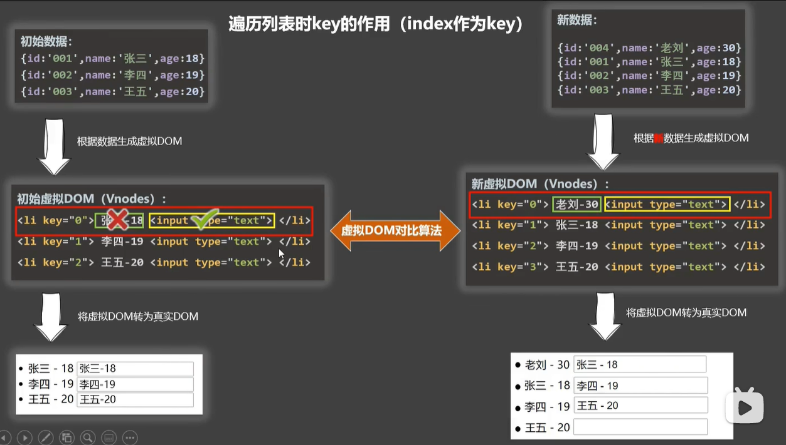

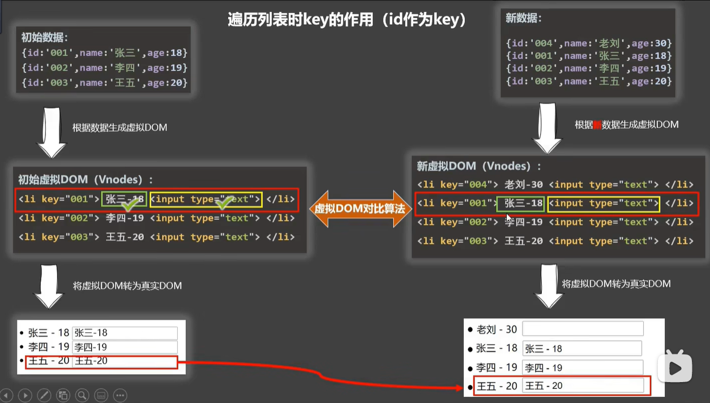

> 而试题: react、 vue中的 `key`有什么作用? (`key`的内部原理)

1. 虚拟DOM中 `key`的作用:

   `key`是虚拟DOM对象的标识，当状态中的数据发生变化时，Vue会根据【新数据】生成【新的虚拟DOM】；随后Vue进行【新虚拟DOM】与【旧虚拟DOM】的差异比较，比较规则如下:
2. 对比规则:

   1. 旧虚拟DOM中找到了与新虚拟DOM相同的key；

      ① 若虚拟DOM中内容没变，直接使用之前的真实DOM!

      ② 若虚拟DOM中内容变了，则生成新的真实DOM，随后替换掉页面中之前的真实DOM。
   2. 旧虚拟DOM中未找到与新虚拟DOM相同的key创建新的真实DOM，随后渲染到到页面。
3. 用index作为 `key`可能会引发的问题:

   1. 若对数据进行: 逆序添加、逆序删除等破坏顺序操作:

      会产生没有必要的真实DOM更新\==>界面效果没问题，但效率低。
   2. 如果结构中还包含**输入类的DOM**:

      会产生错误DOM更新 \==> 界面有问题。
4. 开发中如何选择 `key`?

   1. 最好使用每条数据的唯一标识作为 `key`，比如id、手机号、身份证号、学号等唯一值。
   2. 如果不存在对数据的逆序添加、逆序删除等破坏顺序操作，仅用于渲染列表用于展示，使用 `index`作为 `key`是没有问题的。

- 列表过滤

  搜索过滤：`watch` 实现

  ```html
  <body>
      <div id="root">
          <input type="text" v-model="keyWord"/>
          <ul>
              <li v-for="p in filter">{{p.name}}-{{p.age}}</li>
          </ul>
      </div>

      <script>
          Vue.config.productionTip = false

          new Vue({
          el:"#root",
          data:{
              keyWord:'',
              persons:[
                  {id:"001",name:"马冬梅",age:90},
                  {id:"002",name:"周冬雨",age:11},
                  {id:"003",name:"沈腾",age:20},
                  {id:"004",name:"沈腾",age:20}
              ],
              filter:[]
          },

          watch:{
              keyWord:{
                  immediate:true, //初始化
                  handler(newVal){
                      this.filter= this.persons.filter(p=> p.name.indexOf(newVal)!=-1)
                  }
              }
          }
      });
      </script>
  </body>
  ```

  `computed`实现：

  ```html
  <body>
      <div id="root">
          <input type="text" v-model="keyWord"/>
          <ol>
              <li v-for="p in filter2">{{p.name}}-{{p.age}}</li>
          </ol>
      </div>

      <script>
          Vue.config.productionTip = false

          new Vue({
          el:"#root",
          data:{
              keyWord:'',
              persons:[
                  {id:"001",name:"马冬梅",age:90},
                  {id:"002",name:"周冬雨",age:11},
                  {id:"003",name:"沈腾",age:20},
                  {id:"004",name:"沈腾",age:20}
              ]
          },
          computed:{
              filter2(){
                  return this.persons.filter(p => p.name.indexOf(this.keyWord)!==-1)
              }
          }
      });
      </script>
  </body>
  ```
- 列表排序，`computed` 实现

  ```html
  <body>
      <div id="root">
          <input type="text" v-model="keyWord" />
          <button @click="sortType=1">升序</button>
          <button @click="sortType=2">降序</button>
          <button @click="sortType=0">原序</button>
          <ol>
              <li v-for="p in filter2" :key="p.id">{{p.name}}-{{p.age}}</li>
          </ol>
      </div>

      <script>
          Vue.config.productionTip = false

          new Vue({
              el: "#root",
              data: {
                  keyWord: '',
                  sortType: 0,
                  persons: [
                      { id: "001", name: "马冬梅", age: 90 },
                      { id: "002", name: "周冬雨", age: 11 },
                      { id: "003", name: "沈腾", age: 20 },
                      { id: "004", name: "沈qiao", age: 50 }
                  ],
              },

              computed: {
                  filter2() {
                      const arr = this.persons.filter(p => p.name.indexOf(this.keyWord) !== -1)

                      // 排序
                      if (this.sortType) {
                          arr.sort((p1, p2) => {
                              return this.sortType === 1 ? p1.age - p2.age : p2.age - p1.age;
                          })
                      }
                      return arr;
                  }
              }
          });
      </script>
  </body>
  ```

  **总结**：`computed` 里面用到的数据发生变化，都会重新计算属性。

### 17.Vue监测数据的愿理_对象

一个问题：

```html
<body>
    <div id="root">
        <button @click="update">
            更新数据
        </button>
        <ol>
            <li v-for="p in filter2" :key="p.id">{{p.name}}-{{p.age}}</li>
        </ol>
    </div>

    <script>
        Vue.config.productionTip = false

        new Vue({
            el: "#root",
            data: {
                persons: [
                    { id: "001", name: "马冬梅", age: 90 },
                    { id: "002", name: "周冬雨", age: 11 },
                ]
            },

            methos:{
                update(){
                    //this.persons[0].name = "ma"  // Vue能监测到，会自动更新
                    this.persons[0] = { id: "001", name: "周雨", age: 19 }  // Vue监测不到，为什么？
                }
            }
        });
    </script>
</body>
```

模拟一个数据监测：

```js
let data={
    name:'kk',
    addr:"gz"
}

//创建一个监视的实例对象，用于监视data中属性的变化
const obs = new Observer(data);

//准备一个vm实例对象
let vm={}
vm._data = data = obs

function Observer(obj){
    //汇总对象中所有的属性形成一个 数组
    const keys = Object.keys(obj)
    //遍历
    keys.forEach((k)=>{
        Object.defineProperty(this,k,{
            get(){
                return obj[k]
            },
            set(val){
                obj[k]=val
            }
        });
    });
}
```

上面例子，直接通过 `data`修改数据不会监测到，要通过 `vm._data` 修改数据才能监测到，本例只监测到一层数据。Vue 数据监测更加完善，可以监测多级数据，为每个属性**递归**设置 `gettter`和 `setter`。

> **小结**

Vue靠 `gettter`、`setter`和 `Object.defineProperty`方法来实现数据监测。

### 18.Vue.set(target, key, value)方法

该方法用于，在配置完 Vue 实例（new Vue时）后，给 `target` 追加响应式数据 `key:value` ，若不用该方法添加，则不是响应式数据，即该数据没有设置setter和getter，Vue 监测不到，数据改变也就不会更新。

```html
<body>
    <div id="root">
        <ol>
            <li v-for="p in persons">{{p.name}}-{{p.age}}-{{p.sex}}</li>
        </ol>
    </div>

    <script>
        Vue.config.productionTip = false
        const vm = new Vue({
            el:"#root",
            data:{
                persons:[
                    {id:"001",name:"马冬梅",age:90},
                    {id:"002",name:"周冬雨",age:11},
                    {id:"003",name:"沈腾",age:20},
                    {id:"004",name:"沈腾",age:20}
                ]
            }
        });
        Vue.set(vm.persons[0],'sex',"男")  // 添加响应式数据
        vm.$set(vm.persons[1],'sex',"女")

        vm._data.persons[2].sex = "男"

        // 在控制台修改vm._data.persons[2].sex页面数据不会更新

    </script>
</body>
```

`Vue.set(target, key, value)` 和 `vm.$set(target, key, value)`方法作用一样。

`vm._data.persons === vm.persons  // true` 。

**但是该方法也有局限，**`target` 对象不能是Vue实例 `vm`或者
Vue实例的根数据对象 `data / vm._data`。

### 19.Vue监测数据的愿理_数组

- 修改数组**本身**的数组方法：

  `push` 末尾添加一个元素

  `pop` 末尾删除一个元素

  `shift` 删除第一个元素

  `unshift` 插入第一个元素

  `splice(index, num, e1, e2, ...)` 指定位置index删除num个元素，再插入元素e1,e2,…

  `sort` 排序

  `reverse` 反转数组

**Vue不会通过索引监测数组每个元素，直接用索引来操作数组元素不会被Vue监测到，**如 `vm.arr[0] = 0`。用以上数组方法修改被监测数组的数据则会被 Vue 监测到，并更新页面数据，**原理是**，Vue 将 Array.prototype 上的这些方法进行包装，增加了数据监测功能。

也可以用 `Vue.set(vm.arr, index, val) / vm.$set(vm.arr, index, val)` 方法**修改**，用得不多。

**另外，**数组调用上面方法增加一个对象元素，该对象的属性也会被侦听(监测)，即也会给这些属性或更深层次的对象属性添加 `setter / getter`。数组不会为 `arr[index]`设置 `setter / getter`。

```js
vm.arr.push({name:"jj",age:8}); 
// name,age 都会设置setter / getter

vm.arr[1].name = "lr"  // 会发生页面数据更新
// vm.arr[1] 是个对象，不是直接操作元素
```

### 20.Vue监测数据大总结

**Vue监视数据的原理:**

1. Vue 会监视 `data`中所有层次的数据。
2. 如何监测对象中的数据?

   通过 `setter`实现监视，且要在 `new Vue` 时就传入要监测的数据。

   (1).对象中**后追加**的属性，Vue 默认**不做**响应式处理

   (2).如需给后添加的属性做响应式，请使用如下**API**:

   `Vue.set(target, propertyName/index, value)`   /

   `vm. $set(target, propertyName/ index, value)`
3. 如何监测数组中的数据?

   通过包裹数组更新元素的方法实现，本质就是做了两件事:

   (1).调用原生对应的方法对数组进行更新。

   (2).重新解析模板，进而更新页面。
4. 在Vue修改数组中的某个元素定要用如 下方法:

   (1).使用这些API:`push()、pop()、 shift()、 unshift()、 splice()、 sort()、 reverse()`

   (2).`Vue.set() / vm.$set()`，**特别注意:** `Vue.set() 和vm.\$set()` 不能给 `vm`或 `vm`的根数据对象 `vm._data`添加属性! !

**数据劫持：**

Vue 中将 `data` 所有属性全部遍历，变成 `setter/getter` 形式。修改data中的数据，马上会被 setter 劫持到，发生劫持后**，正常修改数据，并重新解析模板。**

**数据劫持和数据代理都离不开 `Object.defineProperty()`方法。**

### 21.收集表单数据

收集表单数据:

- 若: `<input type="text" />`，则 `v-model`收集的是 `value`值，**用户输入**的就是 `value`值。
- 若: `<input type="radio"/> `则 `v-model`收集的是 `value`值，且要给标签配置 `value`值。
- 若: `<input type="checkbox"/>`

  1. 没有配置 `input`的 `value`属性，那么收集的就是 `checked` (勾选or未勾选，是布尔值)
  2. 配置 `input`的 `value`属性:

     (1)`v-model`的初始值是**非数组**，那么收集的就是 `checked`(勾选or未勾选，是布尔值)

     (2)`v-model`的初始值是**数组**，那么收集的的就是 `value`组成的**数组**
- 备注: `v-model`的 三个**修饰符**: `v-model.lazy = "var"`

  `lazy`: 失去焦点再收集数据

  `number`: 输入字符串转为有效的数字

  `trim`: 输入首尾空格过滤

```html
<body>
    <div id="app">
        <form @submit.prevent="submitUserInfo" action="http://www.baidu.com">
            账号:<input type="text" v-model="user.account" /><br><br>
            密码:<input type="password" v-model="user.password" /><br><br>
            年龄:<input type="number" v-model.number="user.age" /><br><br>
            性别:
            男<input type="radio" v-model="user.sex" name="sex" value="男" />
            女<input type="radio" v-model="user.sex" name="sex" value="女" />

            <br><br>爱好:
            打球<input type="checkbox" v-model="user.hobby" value="打球">
            睡觉<input type="checkbox" v-model="user.hobby" value="睡觉">
            游戏<input type="checkbox" v-model="user.hobby" value="游戏">
            <br><br> 选择城市:
            <select v-model="user.city">
                <option value="全部">全部</option>
                <option value="上海">上海</option>
                <option value="广州">广州</option>
                <option value="北京">北京</option>
                <option value="深圳">深圳</option>
            </select>
            <br><br>
            其他:<br>
            <textarea cols="30" rows="10" v-model.lazy="user.other"></textarea>
            <br><br>
            <input type="checkbox" name="" v-model="user.accept" />接受并遵守<a href="">《用户协议》</a>
            <br><br>
            <button type="submit" :disabled="!user.accept">提交</button>
        </form>
    </div>
    <script>
        Vue.config.productionTip = false
        new Vue({
            el: "#app",
            data: {
                user: {
                    account: "",
                    password: "",
                    age: '',
                    sex: "男",
                    hobby: [],
                    city: "",
                    other: '',
                    accept: false
                }
            },
            methods: {
                submitUserInfo() {
                    console.log(JSON.stringify(this.user))
                }
            },
        })
    </script>
</body>
```

### 22.过滤器

展示格式化后的时间：下载第三方库[dayjs](https://cdn.bootcdn.net/ajax/libs/dayjs/1.11.0/dayjs.min.js) ，用法：

```js
let time = Date.now()  //时间戳

dayjs(time)
    .startOf('month')
    .add(1, 'day')
    .set('year', 2019)
    .format('YYYY-MM-DD HH:mm:ss')
```

可以用计算属性和方法实现，下面用**过滤器**实现：

```html
<body>
    <div id="root">
        时间戳：{{time}} <br /><br>

        <!-- 过滤器 -->
        格式化：{{time | format}} <br><br>

        <!-- 过滤器串联：format处理time，slice处理format的返回值 -->
        取年份：{{time | format | slice}} <br><br>

        <!-- 过滤器传实参 -->
        换格式：{{time | format2("YYYY-MM-DD")}} <br><br>
        <!-- v-bind使用过滤器 -->
        <input type="text":value="time | format">
    </div>
    <script>
        Vue.config.productionTip = false

        // 全局过滤器
        Vue.filter("filter",(val, str='')=>{
            return val
        })
        new Vue({
            el: "#root",
            data: {
                time: 1648563980000
            },

            // 局部过滤器，别的vm不能使用
            // 过滤器是个函数
            filters: {
                // 调用时不传实参，value接收time
                format(value) {
                    return dayjs(value).format('YYYY年MM月DD HH:mm:ss')
                },
                slice(value) {
                    return value.slice(0, 4)
                },

                // 调用时传实参，value接收time，str接收传入的实参
                format2(value, str) {
                    return dayjs(value).format(str)
                }
            }
        })
    </script>
</body>
```

过滤器: 对要显示的数据进行特定格式化后再把**最终结果**显示(**适用于些简单逻辑的处理**)。

语法:

1.注册过滤器: 全局：`Vue.filter(name , callback)`或局部：`new Vue({filters:{}}) `

2.使用过滤器: `{{value | 过滤器名}}` 或 `v-bind:属性="value | 过滤器名"`，过滤器会将 `value`作为实参传给后面的过滤器

备注:

1. 过滤器也可以接收额外参数、多个过滤器也可以串联
2. **并没有改变原本的数据**，是产生新的对应的数据

### 23.内置指令

我们学过的指令:

`v-bind` : 单向绑定解析表达式，`data -> 页面`，可简写为 `:xxx`

`v-model` : 双向数据绑定

`v-for` : 遍历数组/对象/字符串/次数

`v-on` : 绑定事件监听，可简写为@

`v-if` : 条件渲染(动态控制节点是否存在)

`v-else` : 条件渲染(动态控制节点是否存在)

`v-show` : 条件渲染(动态控制节点是否展示)

其他指令：

`v-text`指令:

1. 作用: 向其所在的节点中渲染文本内容。
2. 与插值语法的区别: `v-text`会替换掉节点中的内容，{{xx}}则不会。`v-text`不会解析内容里面的标签结构。

```html
<div>{{name}}yyyyy</div>    显示  name+yyyyy
<div v-text="name">yyyyy</div>  显示 name
```

`v-html`指令：

1. 作用:向指定节点中渲染包含htm1结构的内容。
2. 与插值语法的区别:
   (1).v-html会替换掉节点中所有的内容，{{xx}}则不会。
   (2).v-html可以识别htm1结构。
3. 严重注意: v-html有安全性问题! ! ! !
   (1).在网站上动态渲染任意HTML是非常危险的，容易导致XSS攻击。
   (2).定要作**可信的内容**上使用v-html，永不要用在用户提交的内容上!

cookie：

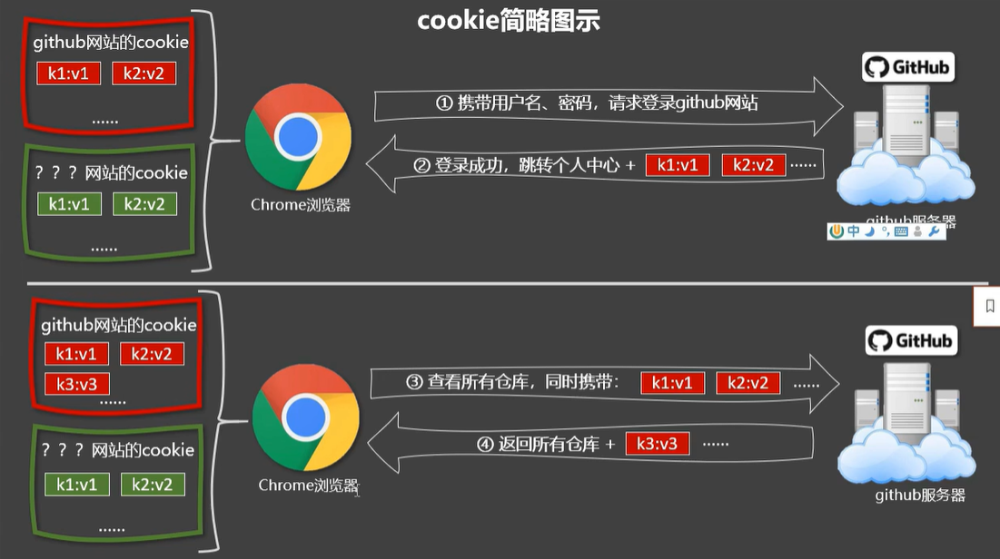

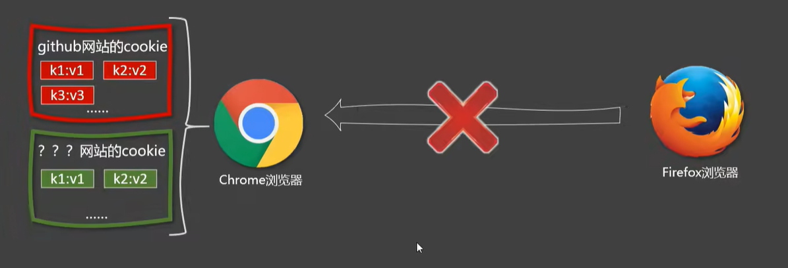

`v-cloak`指令：

0. v-cloak指令没有值。
1. 本质是个特殊属性p Vue实例创建完毕并接管容器后，**会删掉v-cloak属性**。
2. 使用css配合v-cloak可以解决网速慢时页面展示出{{xx}}的问题。

```html
<style>
    [v-cloak]{
        display:none;
    }
</style>
<h1 v-cloak>{{title}}</h1>

<!-- Vue 接管容器前，css会把带v-cloak属性的元素隐藏，以使不会显示{{name}}, Vue接管容器后，会把v-cloak属性删除，css就不会再隐藏该元素 -->
```

`v-once`指令：

0. v-once没有值。
1. `v-once`所在节点在**初次动态渲染后，就视为静态内容**了。
2. 以后数据的改变不会引起 `v-once`所在结构的更新，**可以用于优化性能**。

```html
<h1 v-once>{{n}} </h1>
<h1>{{n}} </h1>
<button @click="n++">n++</button>
```

`v-pre`指令：

0. v-pre指令没有值。
1. 跳过其所在节点的编译过程。
2. 可利用它跳过: **没有使用指令语法、没有使用插值语法的节点，会加快编译**。
3. 即加了v-pre的节点，Vue不会去分析编译，直接拿来用。

```html
<h1 v-pre>{{name}}</h1>  <!-- 显示{{name}} -->
```

### 24.自定义指令

需求1: 定义一个v-big指令， 和v-text功能 类似，但会把绑定 的数值放大10倍。

需求2: 定义一个v-fbind指令，和v-bind功能类似，但可以让其所绑定的input元素默认**获取焦点**。

```html
    <div id="root">
        <h2 v-text="n"></h2>
        <h2 v-big="n"></h2>
        <input type="text" v-fbind="n" ><br>
        <button @click="n++">n++</button>
    </div>
    <script>
        Vue.config.productionTip = false
        new Vue({
            el:"#root",
            data:{
                n:2
            },
            // 自定义指令
            directives:{
                //需求1
                //big函数何时会被调用?
                //1.指令与元素成功绑定时(一上来)。2.指令所在的模板被重新解析时(也就是data里面有数据被修改)。
                // 函数式定义指令
                big(element, banding){
                    // element为绑定该指令的元素，banding为绑定对象,里面包含绑定信息
                    // banding.value为绑定的值
                    element.innerText = banding.value * 10;
                },
//------------------------------------------------------------------------------------
                // 需求2 , 函数式指令不满足该需求
                // 对象式
                fbind:{
                    // 调用时刻：指令与元素成功绑定时(一上来)
                    bind(element, banding){
                        element.value = banding.value;
                    },
                    // 指令所在元素被插入页面时
                    inserted(element, banding){
                        element.focus()
                    },
                    //指令所在的模板被重新解析时
                    update(element, banding){
                        element.value = banding.value;
                    }
                }
            }
        })
    </script>
</body>
```

**踩坑：**

1. 指令名有多个单词，要这样定义：

```js
'big-number'(){}
'big-number':{}
//不能这样
bigNumber:{}  //error
```

2. 定义指令时的this指向window。
3. directives里面的指令都是局部的，其他vm访问不了。

```js
// 和过滤器一样这样定义全局指令 , 对象式
Vue.directive("fbind",{
    // 调用时刻：指令与元素成功绑定时(一上来)   
    bind(element, banding){  
        element.innerText = banding.value;
    },  
    // 指令所在元素被插入页面时   
    inserted(element, banding){ 
        element.focus()  
    },  
    //指令所在的模板被重新解析时  
    update(element, banding){   
        element.innerText = banding.value;
    }
}
})

// 函数式
Vue.directive("fbind",(element, banding)=>{  
        element.innerText = banding.value;
    }
})
```

**总结：**

1. 定义语法:

   (1).局部指令:

   ```js
   new Vue({
       directives :{指令名:配置对象}
   })

   new Vue({
       directives :{指令名(){}}
   })
   ```

   (2).全局指令:

   ```js
   Vue.directive(指令名, 配置对象)
   Vue.directive(指令名, 回调函数)
   ```
2. 配置对象中常用的3个回调:

   (1).bind:指令与元素成功绑定时调用。

   (2).inserted:指令所在元素被插入页面时调用。

   (3).update:指令所在模板结构被重新解析时调用。
3. 备注:
   (1)指令定义时不加v- ，但使用时要加v- ;
   (2)指令名如果是多个单词，要使用kebab-case命名方式，不要用camelCase命名。

### 25.生命周期

```js
const vm = new Vue({
    el:'#root',
    data:{
        // 元素透明度
        opacity:1
    },
    //Vue完成模板的解析并把初始的真实的DOM元素放入页面后(挂载完毕)调用mounted，只调用一次
    mounted(){
        this  //->vm
        setInterval(()=>{
            this.opacity -= 0.01
            this.opacity<=0 && this.opacity=1
        },100)
    }
})
```

人的一生(人的生命周期) :

呱呱坠地了===> 检查身体各项指标。

学会说话了

学会走路了

vm的一生(**vm的生命周期**) :

????了\===>调用????函数。

挂载完毕了===>调用mounted函数。

????了===>调用????函数。

**生命周期:**

1. 又名:生命周期回调函数、生命周期函数、生命周期**钩子**（特殊时刻Vue将对应的生命周期函数钩出来执行）。
2. 是什么:Vue在关键时刻帮我们调用的些特殊名称的**函数**。
3. **生命周期函数的名字不可更改**，但函数的具体内容是程序员根据需求编写的。
4. 生命周期函数中的**this指向是vm或组件实例对象**。

### 26.生命周期_挂载流程

小技巧：在某行代码加 `debugger;` 代码会停下执行，叫断点。

整个 el 是个模板：

```html
<!--整个div是个模板template-->
<div id="root">
    {{y}}
    {{u}}
</div>
```

Vue生命周期_挂载(mount)流程：


render 渲染，patch 新旧虚拟DOM对比。

Vue 会将虚拟DOM存一份在 `vm.$el`，用于与数据变化生成新的虚拟DOM比较。

**钩子函数的this都指向vm。**

### 27.生命周期_更新流程

Vue生命周期_更新流程：

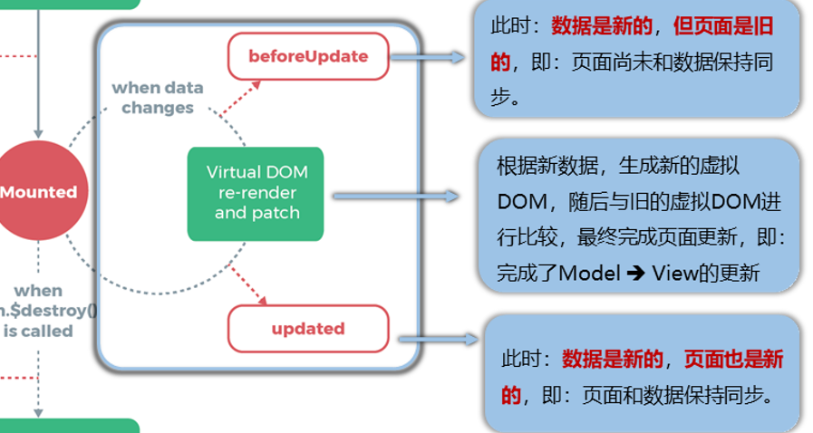

Model  `->`  View ：MVVM模型中的Model `->` View。

### 28.生命周期_销毁流程

Vue生命周期_销毁流程：当调用 `vm.$destroy()`启动销毁流程。**在大多数场景中你不应该调用这个方法。最好使用 `v-if` 和 `v-for` 指令以数据驱动的方式控制子组件的生命周期。**

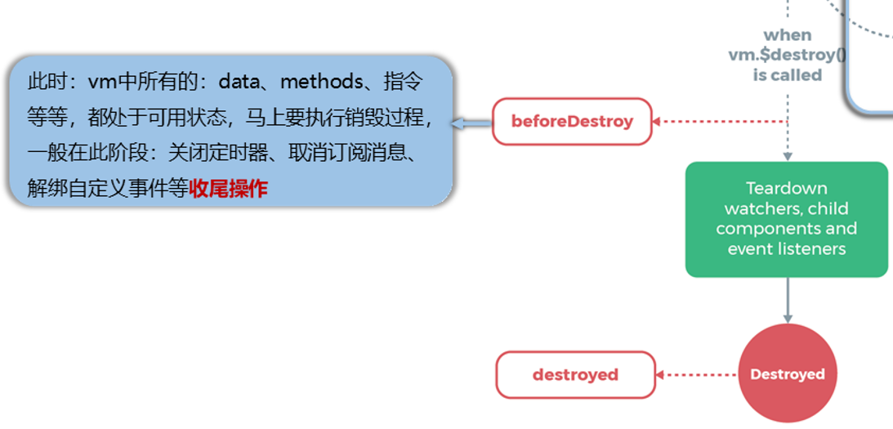

teardown 移除。

完全销毁一个实例。清理它与其它实例（子组件）的连接，解绑它的全部指令及事件（自定义事件）监听器。

在beforeDestroy和destroyed两个钩子里操作数据不会触发页面更新。

### 29.生命周期_总结

- vm的生命周期:

  将要创建===> 调用beforeCreate函数。

  创建完毕===> 调用created函数。

  将要挂载===> 调用beforeMount函数。

  **(重要)挂载完毕\=\==>调用mounted函数。\=\=\=> [重要的钩子]**

  将要更新===> 调用beforeUpdate函数。

  更新完毕===> 调用updated函数。

  **(重要)将要销毁\==\=>调用beforeDestroy函数。 =\==\==> [重要的钩子]**

  销毁完毕===>调用destroyed函数。
- 常用的生命周期钩子:

  1. mounted:发送ajax请求、启动定时器、绑定自定义事件、订阅消息等[初始化操作]。
  2. beforeDestroy:清除定时器、解绑自定义事件、取消订阂消息等[收尾工作]。
- 关于销毁Vue实例

  1. 销毁后借助Vue开发者上具看不到任何信息。
  2. 销毁后自定义事件会失效，但原生DOM事件依然有效。
  3. 股 不会再beforeDestroy操作数据，因为即便操作数据，也不会再触发更新流程了。

<h3>Vue组件化编程</h3>

### 30.对组件的理解

- 模块与组件、模块化与组件化

  - 模块

    理解: 向外提供特定功能的js程序，一般就是一个js文件。

    为什么: js文件很多很复杂。

    作用: 复用js，简化js的编写，提高js运行效率。
  - 组件

    理解: 用来实现局部(特定)功能效果的代码集合(html/css/js/image.....)。

    为什么：一个界面的功能很复杂。

    作用: 复用编码，简化项目编码，提高运行效率。
  - 模块化
    当应用中的js都以**模块**来编写的，那这个应用就是一个模块化的应用。
  - 组件化
    当应用中的功能都是**多组件**的方式来编写的，那这个应用就是一个组件化的应用。
- 传统方式编写应用

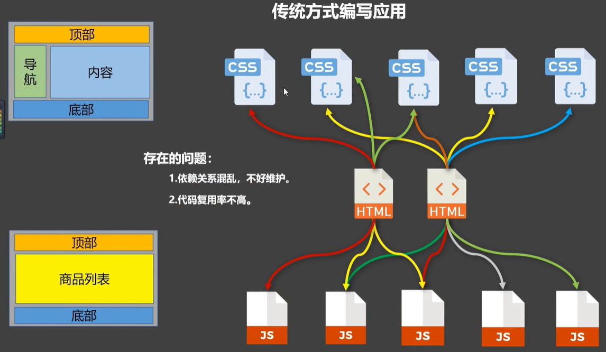

- 使用组件方式编写应用

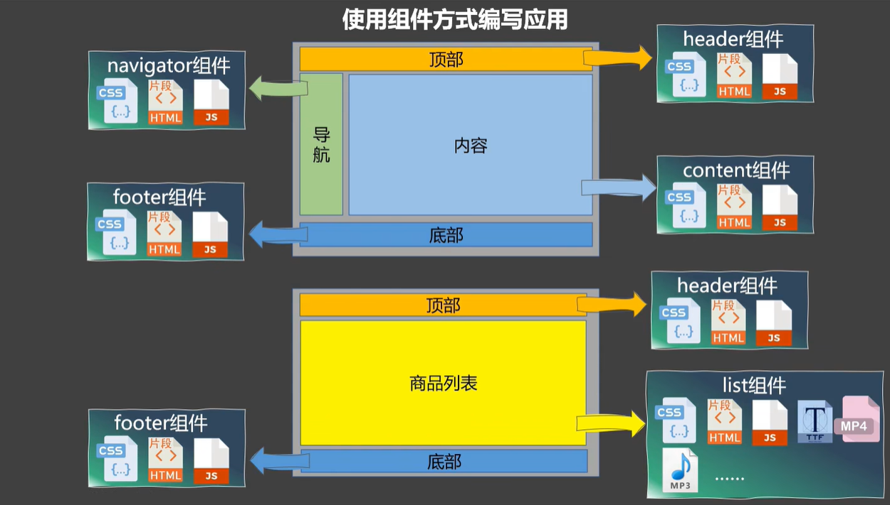

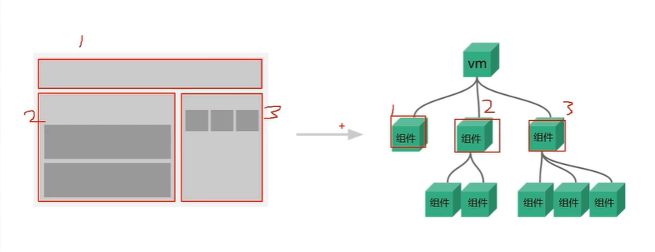

- **组件的定义**

  实现应用中**局部**功能**代码**（css、html、js…）和**资源**（image、mp3…）的**集合**。

### 31.非单文件组件

非单文件组件 : 一个文件 (.html) 中包含有n个组件。

单文件组件∶一个文件 (.vue) 中**只**包含有1个组件。项目开发**常用**这个方式，便于维护。

- **非单文件组件**创建使用：

  `new Vue`时的配置项**几乎**都能在组件配置对象里使用。**非单文件组件**创建使用：

```html
<body>
    <div id="root">
        <h1>{{msg}}</h1>
        <h2>{{name}}</h2>
        <hr />
        <!-- 第三步 编写组件标签-->
        <school></school>
        <!-- 第三步 编写组件标签-->
        <student></student>

        <ha></ha>
    </div>
</body>
<script>
    Vue.config.productionTip = false
    // 第一步 创建school组件
    const school = Vue.extend({
        // el:'#root',// 组件定义时，一定不要写el配置项，因为最终所有的组件都要被一个vm管理，由vm决定服务于哪个容器。
        data() {    // data一定是函数式,如果使用对象式，data是引用变量，当该组件放到其他页面时，两个页面的data指向同一片内存。
            return {
                name: '学校',
                age: 90
            }
        },
        template: `
            <div>
                {{name}}<br>
                {{age}}
                <hr>
            </div>
            `
    })
    // 第一步 创建student组件
    const stu = Vue.extend({
        data() {
            return {
                name: '学生',
                age: 7
            }
        },
        // 组件结构
        template: `
        <div>
        {{name}}<br>
        {{age}}
        </div>
        `
    })

    // 创建vm
    new Vue({
        el: '#root',
        data: {
            msg: "组件",
            name: "组件的用法"
        },
        // 第二步 注册组件(局部注册)，其他vm不能用
        components: {
            // 组件名(key): 已创建的组件(value)
            school,  //对象简写形式，变量名作为组件名
            student: stu,  //普通写法
        }
    })

    const ha = Vue.extend({
        data() {
            return {
                name: '学生',
                age: 7
            }
        },
        // 组件结构
        template: `
        <div>
        {{name}}<br>
        {{age}}
        </div>
        `
    })
    // 注册全局组件 Vue.component(组件名,已创建的组件)
    Vue.component("ha",ha); // 不同的vm也能使用
</script>
```

- template 配置

  这里写**组件文件结构**，必须要有一个**根元素**包住所有代码，并且这个根元素**不能是template**，想保留换行格式要用**模板字符串**写法。Vue会将template文件结构插入组件标签里面。
- Vue中使用组件的三大步骤:

  一、定义组件(创建组件)

  二、注册组件

  三、使用组件(写组件标签)
- 如何定义一个组件?

  使用 `Vue.extend(options)`创建，其中 `options`和 `new Vue(options)`时传入的那个 `options`几乎一样，但也有点区别；区别如下:

  1. `el`不要写，为什么?

     最终所有的组件都要经过一个 `vm`的管理，由 `vm`中的 `el`决定服务哪个容器。
  2. `data`必须写成函数，为什么?

     **避免组件被复用时，数据存在引用关系。**组件复用不会引起数据互相影响。
  3. 备注: 使用 `template`可以配置组件结构。
- 如何注册组件?

  1.局部注册:`new Vue的时候传入components选项`

  2.全局注册:`Vue.component('组件名',组件)`
  英
- 编写组件标签:

  \<school>\</ school>

> 组件的几个注意点

1. 关于组件名:

   - 一个单词组成:

     第一种写法(首字母小写):`school`

     第二种写法(首字母大写):`School`
   - 多个单词组成:

     第一种写法(kebab-case命名): `'my-school'`

     第二种写法(Camelcase命名): `MySchool`(需要Vue脚手架支持)
   - 备注:

     (1).组件名尽可能回避HTML中已有的元素名称，例如:h2、H2都不行。

     (2).可以使用 `name`配置项指定组件在**开发者工具**中呈现的名字。
2. 关于组件标签

   第一种写法: \<school></ school>

   第二种写法: \<school/>

   备注: 不用使用脚手架时，\<school/>会导致后续组件不能渲染。
3. 一个简写方式:

   `const school = Vue.extend(options)`可简写为: `const school = options`  还是会调用 `Vue.extend()`

- 组件嵌套

  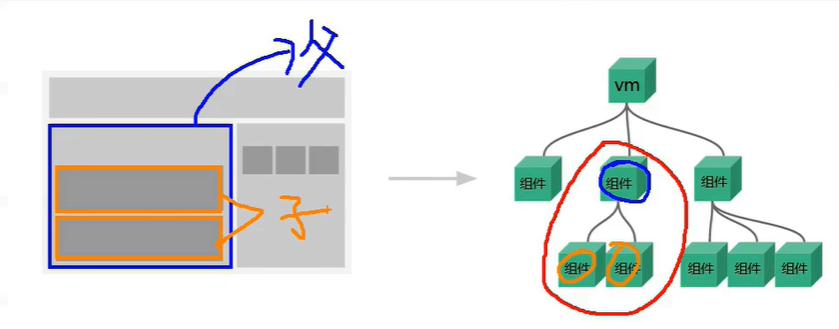

  ```html
  <body>
      <div id="root">
          <school></school>
      </div>
  </body>
  <script>
      Vue.config.productionTip = false
      // 组件创建在组件注册之前
      const student = Vue.extend({
          data() {
              return {
                  name: '学生',
                  age: 7
              }
          },
          template: `
              <div>
                  {{name}}<br>
                  {{age}}
              </div>
          `
      })

      const school = Vue.extend({
          data() {
              return {
                  name: '学校',
                  age: 90
              }
          },

          // 注册给谁，就在谁的template里面写组件标签
          template: `
              <div>
                  {{name}}<br>
                  {{age}} 
                  <hr>
                  <student></student>
              </div>
              `,
          components: {
              // 注册嵌套组件
              student
          }
      })
      new Vue({
          el: '#root',
          components: {
              school
          }
      })
  </script>
  ```

  **Tip：标注化开发通常定义一个叫 `app`的组件，用于管理所有组件，而 `vm`只需管理 `app`即可。**`app`可谓一人之下万人之上。

  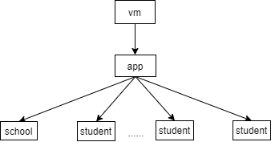

  ```html
  <body>
      <div id="root"></div>
  </body>
  <script>
      // 定义c1、c2、c3...组件
      // ...
      // 定义app组件
      const app = Vue.extend({
          components: {
              // 管理组件，其中嵌套子组件已经在父组件注册，不用在app注册
              c1,
              c2,
              c3,
              //...
          }
      })
      new Vue({
          el: 'root',

          //容器下面不用再插入<app></app>，这样容器代码干干净净
          template: '<app></app>',

          // 注册app
          components: { app }
      })
  </script>
  ```

### 32.VueComponent构造函数

关于VueComponent:

1. school**组件本质**是一个名为 `VueComponent`的构造函数，且不是程序员定义的，是 `Vue.extend`生成的。

   ```js
   const vc = Vue.extend({});
   vc /*
   ƒ VueComponent (options) {
           this._init(options);
         }
   */
   ```
2. 我们只需要写\<school/>或\<school>\</school>，**Vue解析时**会帮我们创建school组件的实例对象，

   即Vue帮我们执行的: `new VueComponent(options)`.
3. **特别注意:每次调用 `Vue.extend`，返回的都是一个全新的 `VueComponent`!!!!**

   ```js
   const h1 = Vue.extend({});
   const h2 = Vue.extend({});
   h1 === h2  // false
   ```
4. 关于this指向:

   (1).组件配置中:

   `data`函数、`methods`中的函数、`watch`中的函数、`computed`中的函数它们的 `this`均是【** VueComponent实例对象 `vc`**】

   (2).new Vue()配置中:

   `data`函数、`methods`中的函数、`watch`中的函数、`computed`中的函数它们的 `this`均是【**Vue实例对象 `vm`**】。

   ```html
   <body>
       <div id="root">
           <vc></vc> <!-- 这里会 new VueComponent ，即new一个vc实例-->
       </div>
   </body>
   <script>
       // vc是一个VueComponent构造函数
       const vc = {
           data() {
               return {name: 'vc'}
           },
           template: `
               <div>
                   <button @click='showThis'>点击</button>
               </div>
               `,
           methods: {
               showThis() {
                   alert(this.name)
                   /*输出vc*/
               }
           },
       }
       new Vue({
           el: '#root',
           data:{
               name:'vm'
           },
           components: {vc}
       })
   </script>
   ```
5. `VueComponent`的实例对象，以后**简称** `vc`（也可称之为:组件实例对象）。

   Vue的实例对象，以后简称 `vm`。

- **Vue实例与组件实例**

  vc  =/=  vm

  1. 因为组件是可复用的 Vue 实例，所以它们与 `new Vue` 接收相同的选项，例如 `data`、`computed`、`watch`、`methods` 以及生命周期钩子等。**仅有的例外是像 `el` 这样根实例特有的选项。**
  2. **组件的 `data` 必须是一个函数**。因此每个实例可以维护一份被**返回对象的独立的拷贝**。（数据引用相互独立，不会相互影响）。
- 一个重要的内置关系

  1. 一个重要的内置关系: `VueComponent.prototype.__proto__ === Vue.prototype`
  2. 为什么要有这个关系: **让组件实例对象(`vc`)可以访问到Vue原型上的属性、方法。**

  ```html
  <body>
      <div id="root"></div>
      <script>
          Vue.config.productionTip = false
          //返回VueComponent
          const vc = Vue.extend({  
              data() {
                  return {
                      m: 0
                  }
              }
          })
          const vm = new Vue({
              el: '#root',
              data: {
                  msg: 'ii'
              }
          })
          console.log(vm.__proto__ === vc.prototype.__proto__)  //true
      </script>
  </body>
  ```

  图示：

  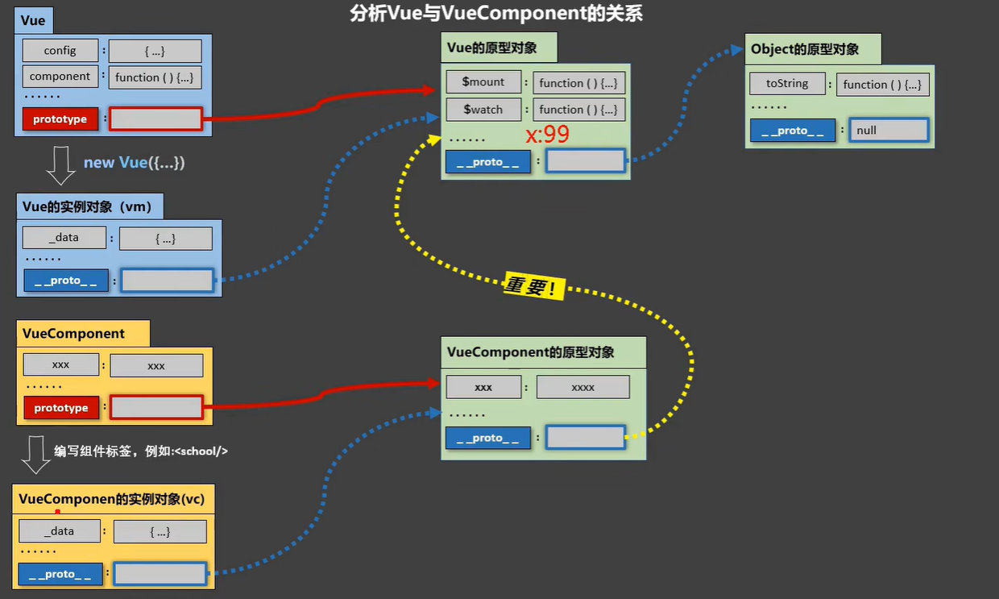

  内部代码：`VueComponent.prototype.__proto__ = Vue.prototype`

### 33.单文件组件（.vue）

单文件组件的文件**后缀**为 `.vue`，命名和前面组件命名方式一样。

```apl
// 一个单词
school.vue
School.vue (开发习惯用)

// 多个单词
my-school.vue
MySchool.vue (开发习惯用)
```

VSCode安装 **Vutur** 插件，便于代码提示和高亮。

**文件结构：**

```vue
<template>
    <!-- 组件的结构 html-->
    <!-- 只含一个根元素，包住里面所有代码 -->
</template>

<script>
    //组件交互相关的代码(数据、方法等等)js
</script>

<style>
    /*组件的样式css*/
</style>
```

**具体代码：**

School.vue 组件

```vue
<template>
  <!-- 组件结构 -->
  <div class="demo">
    <h1>学校：{{ name }}</h1>
    <h1>校龄：{{ age }}</h1>
    <button @click="showName()">showName</button>
  </div>
</template>

<script>
  // 要将组件数据方法等暴露出去，ES6模块化，方便后面引入
  //export default Vue.extend({})
  // 直接暴露组件的配置对象
  export default {
    //给组件起名字，尽量和文件名一样
    name: "School",
    data() {
      return {
        name: "门头沟学院",
        age: 97,
      };
    },
    methods: {
      showName() {
        alert(this.name);
      },
    },
  };
</script>

<style>
  .demo {
    background-color: #bfa;
    color: #000;
  }
</style>
```

Student.vue组件

```vue
<template>
  <div class="demo">
    <h1>学生：{{ name }}</h1>
    <h1>年龄：{{ age }}</h1>
    <button @click="showName()">showName</button>
  </div>
</template>
<script>
  export default {
    name: "Student",
    data() {
      return {
        name: "李大白",
        age: 97,
      };
    },
    methods: {
      showName() {
        alert(this.name);
      },
    },
  };
</script>
<style>
  .demo {
    background-color: #bfa;
    color: #000;
  }
</style>
```

……

**定义App组件管理其他组件App.vue**

```vue
<!-- 编译后template会删掉，不影响页面结构 -->
<template>
  <!-- 根元素，包住里面所有代码 -->
  <div>
    <!-- 组件 -->
    <School></School>
    <Student></Student>
  </div>
</template>
<script>
  //引入组件
  import School from "./School.vue";
  import Student from "./Student.vue";
  export default {
    //App管理所有组件
    components: {
      School,
      Student
    }
  };
</script>
<style></style>
```

创建入口文件main.js，**用来创建vm，管理App组件**

```js
import App from "./App.vue";
new Vue({
  el: "root",
  template: "<App></App>",
  components: { App },
});
```

创建index.html文件，用来展示组件

```html
<!DOCTYPE html>
<html lang="en">
  <head>
  </head>
  <body>
    <!-- 准备一个容器 -->
    <div id="root"></div>

    <!-- 在main.js之前引入，在root之后引入 -->
    <script src="../vue/vue.js"></script>

    <!-- 引入入口文件 -->
    <script src="./main.js"></script>
  </body>
</html>
```

### 34.Vue脚手架的使用

- 说明

  Vue  Command  line  interface 命令行接口工具Vue CLI

  Vue脚手架是Vue官方提供的**标准化开发工具** (开发平台)。

  最新的版本是4.x，[文档](https://cli.vuejs.org/zh/)。

  用Vue CLI创建项目，会自动配置好webpack相关配置。
- 具体**使用步骤**

  第一步(仅第一次执行):全局安装 `@vue/cli`

  ```bash
  npm i -g @vue/cli
  ```

  第二步:**切换到你要创建项目的目录**，然后使用命令创建项目

  ```bash
  vue create vue_test(项目名，自定义)
  ```

  第三步:启动项目，cd 进入 vue_test 目录，执行下面命令启动项目，

  ```bash
  npm run serve
  ```

  运行端口：

  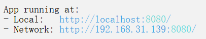

  备注:

  1. 如出现下载缓慢请配置npm淘宝镜像:

     ```bash
     npm config set registry https://registry.npm.taobao.org
     ```
  2. Vue脚手架隐藏了所有webpack相关的配置，若想查看具体的webpakc配置，请执 `vue inspect > output.js`
- 模板项目的结构

  ```
  ├── node_modules
  ├── public 
  │   ├── favicon.ico   : 页签图标 
  │   └── index.html    : 主页面 
  ├── src 
  │   ├── assets        : 存放静态资源 
  │   │   └── logo.png 
  │   │── component     : 存放组件 
  │   │   └── HelloWorld.vue 
  │   │── App.vue       : 汇总所有组件 
  │   └── main.js       : 入口文件 
  ├── .gitignore        : git 版本管制文件忽略的配置 
  ├── babel.config.js   : babel 的配置文件 
  ├── package.json      : 应用包配置文件 
  ├── README.md         : 应用描述文件 
  └── package-lock.json : 包版本控制文件 
  ```
- render 函数

  ```js
  // main.js
  import Vue from 'vue'
  import App from "./App.vue";
  new Vue({
    el: "#app",
    render:h =>h(App)
  });
  ```

  用之前的方法注册App组件：

  ```js
  // main.js
  import Vue from 'vue'
  import App from "./App.vue";
  new Vue({
    el: "#app",
    template:`<App></App>`,
    components:{App}
  });
  ```

  上面写法会**报错且页面没有渲染出来**：

  **vue.runtime.esm.js**?c320:619 [Vue warn]: You are using the **runtime-only build of Vue** where the **template compiler is not available.** **Either pre-compile the templates into render functions, or use the compiler-included build.**

  vue.runtime.esm.js?c320:619 [Vue 警告]：您正在使用仅运行时构建的 Vue，其中**模板编译器不可用**。要么将模板预编译为**渲染函数**，要么使用**包含编译器**的构建。

  **错误原因：**import导入的Vue是不完整的(vue/dist/vue.untime.esm.js)，缺失了模板编译器。

  **解决办法：**

  1. 用渲染函数render

     ```js
     // main.js
     import Vue from 'vue'
     import App from "./App.vue";
     new Vue({
       el: "#app",
       //render:h =>h(App),
     });
     ```

     render详解：

     ```js
     // main.js
     import Vue from 'vue'
     import App from "./App.vue";
     new Vue({
         el: "#app",
         // 接收一个创建元素函数
         render(createElement){
             // 返回一个元素<h1>你好啊</h1>
             return createElement('h1',"你好啊")
         }
         // render将该元素渲染到#app里

         // 再精简
         render: c => c('h1','你好啊'),

         // 参数为App，则会找到App配置里面的name作为标签名创建一个元素，将组件App放入容器中
         render:c => c(App)
     });
     ```

     > 为啥要这样？
     >

     平常用的**Vue = 核心功能 + 模板解析器**，其中模板解析器占Vue**三分之一**体积。Webpack打包时可以将vue编译成js文件等浏览器认识的文件，所以留着模板编译器没什么用了。

     vue包下面的vue/dist下的文件带有runtime的js文件都是vue.js删了模板编译器后的，体积都比完整的Vue小很多。

     > 那么组件文件下的template标签如何解析？
     >

     Vue找了个库 `vue-template-compiler` 专门解析，在package.json 依赖配置里。

     2. 引入完整的Vue，包含模板编译器

        ```js
        // main.js
        import Vue from 'vue/dist/vue.js'
        import App from "./App.vue";
        new Vue({
           el: "#app",
           template:`<App></App>`,
           components:{App}
        });  
        ```
- 关于不同版本的Vue:

  1. vue.js 与vue.runtime.xxx.js的区别:

     (1).vue.js是完整版的Vue，包含:核心功能+模板解析器。里面也有render函数哦。

     (2).vue.runtime.xxx.js是运行版的Vue，只包含:核心功能;没有模板解析器。
  2. 因为vue.runtime.xxx.js没有模板解析器，所以不能使用template配置项，需要使用render函数接收到的createElement函数去指定具体内容。

### 35.修改默认配置

- 说明

  默认配置被脚手架隐藏起来了。

  项目下运行：`vue inspect > output.js` 查看webpack配置。

  Vue CLI 官网 vue.config.js 给出的配置才能改。
- 修改配置

  在项目根目录下创建 vue.config.js 文件，要用commonJS模块化去暴露配置。

  ```js
  // vue.config.js
  module.exports = {
    pages: {
      index: {
        // 修改入口文件
        entry: 'src/main.js',
    },

  }
  ```

### 36.ref 属性

```vue
<template>
  <div>
    <h1 v-text='msg' ref='title'></h1>
    <School ref='sch' id='sch'></School>
    <button @click="showDOM">ddd</button>
  </div>
</template>

<script>
  import School from "./components/School.vue";
  export default {
    name: "App",
    data(){
        return {msg:'你好啊'}
    },
    components: {
      School
    },
    methods:{
      showDOM(){
        console.log(this.$refs.title) //真实DOM
        console.log(this.$refs.sch) //School组件实例对象（vc）
        console.log(document.getElementById('sch')) //真实DOM
      }
    }
  };
</script>
```

**ref 属性：**

1. 被用来给**元素或子组件注册引用信息（id的替代者)**
2. 应用在 html 标签上获取的是真实DOM元素，**应用在组件标签上是组件实例对象(vc)**
3. 使用方式:

   **打标识:**

   `<h1 ref="xxx">...</h1>`或 `<School ref="xxx"></School>`

   **获取:**

   `this.$refs.xxx`

### 37.props 配置项

props配置项用于接收**组件标签上的属性值**。

Student组件：

```vue
<template>
  <div>
    <h1>{{msg}}</h1>
    <h1>名字：{{name}}</h1>
    <h1>性别：{{sex}}</h1>
    <h1>年龄：{{age+2}}</h1>
  </div>
</template>
<script>
  export default {
    name: "Student",
    data(){
        return {msg:'你好啊'}
    },
    // 1.简单声明接收
    // props:['name','age','sex'] 

    // 2.接收数据时限制类型
    /*
    props:{
        name:String,
        age:Number,
        sex:String
    }
    */

    // 3.接收的同时对数据进行类型限制+默认值的指定+必要性的限制
    props:{
        name:{
            type:String,  //name的类型是字符串
            required:true  //name是必要的
        },
        age:{
            type:Number,
            default:99 //默认值
        },
        sex:{
            type:String,
            required:true
        }
        //default和required不能同时出现
    }
  };
</script>
```

App组件：

```vue
<template>
  <div>
    <!-- :->v-bind, 加:表示''里面的内容作为表达式处理，而不是把'18'当成一个字符串 -->
    <School name="张三" sex='男':age='90'></School>
    <School name="李四" sex='女':age='20'></School>
  </div>
</template>

<script>
  import School from "./components/School.vue";
  export default {
    name: "App",
    components: {School}
  };
</script>
```

**Tip:** Vue遇到指令才会把引号里面的内容当表达式来解析，如

```vue
<School :name="name" sex='sex':age='90'></School>
data(){
	return{
		name:'张三',
		sex:'男',
	}
}

<!-- School 接收数据 -->
props:[
	'name','sex','age'
]
name  //张三
sex   //sex  (没解析出来)
age   //90 (number)
```

> **配置项props：**

**功能:让组件接收外部传过来的数据**

(1).传递数据:`<Demo name="xxx"/>`

(2).接收数据:

第一种方式（只接收):`props: ['name']`

第二种方式（限制类型):`props:{name: String}`

第三种方式(限制类型、限制必要性、指定默认值):

```js
props:{
    name:{
        type:String, //类型
        required:true,//必要性
        default:'老王' //默认值
    }
}
```

**备注:** props是**只读**的，Vue底层会监测你对props的修改，如果进行了修改，就会发出警告。**props接收的数据都会出现在vc身上**，若业务需求确实需要修改，那么请**复制 props 的内容到data中**一份，展示data中的数据即可，然后去修改data中的数据。

```vue
<template>
    <div>
        <h1>{{myName}}</h1>
        <button @click="myName+='被修改了'">gg</button>
    </div>

</template>
<script>
    export default{
        data(){
            return {
                myName:this.name  // props的name会出现在vc身上
            }
        },
        props:{
            name:{
                type:String,
                default:'gg'
            }
        }
    }
</script>
```

**Tip：props接收引用类型数据，是接收其内存地址，改变里面的元素或属性值，不算做对数据的修改。**如Vue能监测到 `obj={}`，不能监测到 `obj.name=''`

### 38.mixin混入

mixin用于复用代码。

```js
// mixin.js模块，将公用的代码暴露，然后在组件引入
export const mixin1={
    // 属性和组件配置一样
    data(){
        return {
            x:0,
            name:'gg'
        }
    },
    methos:{
        showName(){
            console.log(this.name)
        }
    }
}

export const mixin2={
    mounted:{
        console.log('mounted')
    },
    //...
}
```

混入原则：组件里有的，mixin不会修改，组件里没有的，mixin会加入。

```vue
<!-- 组件 -->
<template>
    <div>
        <h1>{{name}}</h1>
        <button @click="showName">gg</button>
        <!-- 点击会输出kk -->
    </div>

</template>
<script>
    // 引入mixin.js，解构赋值
    import {mixin1,mixin2} from './mixin1.js'
    export default{
        data(){
            return {
                name:'kk'
            }
        },
        // 混入配置【数组】
        mixins:[mixin1,mixin2]
    }
</script>
```

在main.js配置全局混合，所有vm和vc都会混合改代码。

```js
// main.js
import Vue from 'vue'
import App from "./App.vue"
import {mixin1,mixin2} from './mixin'
// 全局混合
Vue.mixin(mixin1)
Vue.mixin(mixin2)

new Vue({
  el: "#app",
  render:h=>h(App)
});
```

**mixin(混入):**

**功能:** 可以把说个组件共用的配置提取成一个混入对象使用方式:

第一步定义混合，例如:

```js
{
    data(){...},
    methods:{....}
}
```

第二步使用混入，例如:

(1).全局混入:`Vue.mixin(xxx)`

(2).局部混入:`mixins:[xxx, xxxx]`

**备注：**如果有属性方法冲突，xixin则不会混入这些相同的属性方法，而钩子函数两者都要混合。

### 39.插件

定义插件：必须有install方法，由Vue调用

```js
// plugins.js
export default {
    install(Vue,x,y,z){
         // install里面写
        console.log(x,y,z)
        //全局过滤器
        Vue.filter('mySlice',function(value){
            return value.slice(0,4)
        })

        //定义全局指令
        Vue.directive('fbind',{
            //指令与元素成功绑定时（一上来）
            bind(element,binding){
                element.value = binding.value
            },
            //指令所在元素被插入页面时
            inserted(element,binding){
                element.focus()
            },
            //指令所在的模板被重新解析时
            update(element,binding){
                element.value = binding.value
            }
        })

        //定义混入
        Vue.mixin({
            data() {
                return {
                    x:100,
                    y:200
                }
            },
        })

        //给Vue原型上添加一个方法（vm和vc就都能用了）
        Vue.prototype.hello = ()=>{alert('你好啊')}
    }
}
```

引入插件

```js
//引入Vue
import Vue from 'vue'
//引入App
import App from './App.vue'
//引入插件
import plugins from './plugins'
//关闭Vue的生产提示
Vue.config.productionTip = false

//应用（使用）插件
Vue.use(plugins,1,2,3)
//创建vm
new Vue({
    el:'#app',
    render: h => h(App)
})
```

至此，vm和vc都可以使用插件里的内容。

> **插件**

功能：用于增强Vue

本质: 包含install方法的一个对象，install的第一个参数是Vue，第二个以后的参数是插件使用者传递的数据。

定义插件:

```js
const plugin = {
    install = function (Vue,options){
        // 1.添加全局过滤器
        Vue.filter(....)
        // 2．添加全局指令
        Vue.directive(....)
        // 3.配置全局混入(合)
        Vue.mixin(....)
        // 4.添加实例方法
        Vue.prototype.$myMethod = function (){...}
        Vue.prototype.$myProperty = xxx;

    }
}
// 向外暴露
export plugin
```

使用插件:`Vue.use(plugin,a,b...)`

### 39.scpoed 属性和 lang 属性

- scoped属性

  作用: 让样式在局部生效，防止冲突。

  写法: `<style scoped>`

```vue
<template>
    <div class='demo'><h1>{{name}}</h1></div>
</template>
<script>
    export default{
        data(){
            return {name:'kk'}
        }
    }
</script>

<!-- 加了scoped里面的样式只对本组件的template里面的结构有效 -->
<style scoped>
    .demo{background-color:skyblue}
</style>
```

原理：加了scoped，Vue会自动生成一个属性，再通过属性选择器选择样式。

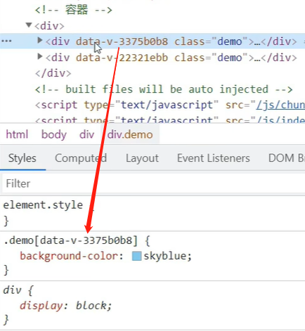

** 注意：**在App组件里加scoped，其样式不会对里面的子组件有影响。

- lang 属性

```vue
<!-- 组件样式可以为less，默认css -->
<style lang='less'>
    .demo{background-color:skyblue}
</style>
```

要安装less-loader，注意兼容性。

### 40.Todo-list案例

- 组件化编码流程:

  (1).拆分静态组件:组件要按照功能点拆分，命名不要与html元素冲突。

  (2).实现动态组件:考虑好数据的存放位置，数据是一个组件在用，还是一些组件在用:

  1).一个组件在用:放在组件自身即可

  2).一些组件在用:放在他们共同的父组件上(状态提升)。

  (3).实现交互:从绑定事件开始。
- `props`适用于:

  (1).父组件 ==> 子组件 通信(传数据)

  (2).子组件 ==> 父组件 通信(要求父先给子一个函数)
- 使用 `v-model`时要切记: `v-model`绑定的值不能是 `props`传过来的值**，因为 `props`是不可以修改的!**`props`传过来的若是对象类型的值，修改对象中的属性时Vue不会报错，**但不推荐这样做。**

### 41.webStorage

1. 存储内容大小一般支持5MB左右（不同浏览器可能还不一样）
2. 浏览器端通过 Window.sessionStorage 和 Window.localStorage 属性来实现本地存储机制。
3. 相关API：

   1. ``xxxxxStorage.setItem('key', 'value');``

      该方法接受一个键和值作为参数，会把键值对添加到存储中，如果键名存在，则更新其对应的值。
   2. ``xxxxxStorage.getItem('person');``

      该方法接受一个键名作为参数，返回键名对应的值。
   3. ``xxxxxStorage.removeItem('key');``

      该方法接受一个键名作为参数，并把该键名从存储中删除。
   4. `` xxxxxStorage.clear()``

      该方法会清空存储中的所有数据。
4. 备注：

   1. SessionStorage存储的内容会随着浏览器窗口关闭而消失。
   2. LocalStorage存储的内容，需要手动清除才会消失。
   3. ``xxxxxStorage.getItem(xxx)``如果xxx对应的value获取不到，那么getItem的返回值是null。
   4. ``JSON.parse(null)``的结果依然是null。

### 42.组件的自定义事件

App.vue

```vue
<template>
	<div class="app">
		<h1>{{msg}}，学生姓名是:{{studentName}}</h1>

		<!-- 通过父组件给子组件传递函数类型的props实现：子给父传递数据 -->
		<School :getSchoolName="getSchoolName"/>

		<!-- 通过父组件给子组件绑定一个自定义事件实现：子给父传递数据（第一种写法，使用@或v-on） -->
		<!-- <Student @atguigu="getStudentName" @demo="m1"/> -->

		<!-- 通过父组件给子组件绑定一个自定义事件实现：子给父传递数据（第二种写法，使用ref） -->
		<Student ref="student" @click.native="show"/>
	</div>
</template>
<script>
	import Student from './components/Student'
	import School from './components/School'
	export default {
		name:'App',
		components:{School,Student},
		data() {
			return {
				msg:'你好啊！',
				studentName:''
			}
		},
		methods: {
			getSchoolName(name){
				console.log('App收到了学校名：',name)
			},
			getStudentName(name,...params){
				console.log('App收到了学生名：',name,params)
				this.studentName = name
			},
			m1(){
				console.log('demo事件被触发了！')
			},
			show(){
				alert(123)
			}
		},
		mounted() {
			this.$refs.student.$on('atguigu',this.getStudentName) //绑定自定义事件
			// this.$refs.student.$once('atguigu',this.getStudentName) //绑定自定义事件（一次性）
			// 直接传回调
			this.$refs.student.$on('atguigu',
				// function(name,...params){
				// 	console.log('App收到了学生名：',name,params)
				// 	this.studentName = name     // Error ：this-> Student组件，not App组件，解决：写成箭头函数
				(name,...params)=>{
					console.log('App收到了学生名：',name,params)
					this.studentName = name
			}) 
		},
	}
</script>

<style scoped>
	.app{
		background-color: gray;
		padding: 5px;
	}
</style>

```

Student.vue

```vue
<template>
	<div class="student">
		<h2>学生姓名：{{name}}</h2>
		<h2>学生性别：{{sex}}</h2>
		<h2>当前求和为：{{number}}</h2>
		<button @click="add">点我number++</button>
		<button @click="sendStudentlName">把学生名给App</button>
		<button @click="unbind">解绑atguigu事件</button>
		<button @click="death">销毁当前Student组件的实例(vc)</button>
	</div>
</template>

<script>
	export default {
		name:'Student',
		data() {
			return {
				name:'张三',
				sex:'男',
				number:0
			}
		},
		methods: {
			add(){
				console.log('add回调被调用了')
				this.number++
			},
			sendStudentlName(){
				//触发Student组件实例身上的atguigu事件
				this.$emit('atguigu',this.name,666,888,900)
				// this.$emit('demo')
				// this.$emit('click')
			},
			unbind(){
				this.$off('atguigu') //解绑一个自定义事件
				// this.$off(['atguigu','demo']) //解绑多个自定义事件
				// this.$off() //解绑所有的自定义事件
			},
			death(){
				this.$destroy() //销毁了当前Student组件的实例，销毁后所有Student实例的自定义事件全都不奏效，原生事件还在。
			}
		},
	}
</script>
<style lang="less" scoped>
	.student{
		background-color: pink;
		padding: 5px;
		margin-top: 30px;
	}
</style>
```

School.vue

```vue
<template>
	<div class="school">
		<h2>学校名称：{{name}}</h2>
		<h2>学校地址：{{address}}</h2>
		<button @click="sendSchoolName">把学校名给App</button>
	</div>
</template>

<script>
	export default {
		name:'School',
		props:['getSchoolName'],
		data() {
			return {
				name:'尚硅谷',
				address:'北京',
			}
		},
		methods: {
			sendSchoolName(){
				this.getSchoolName(this.name)
			}
		},
	}
</script>

<style scoped>
	.school{
		background-color: skyblue;
		padding: 5px;
	}
</style>
```

1. 一种组件间通信的方式，适用于：`<strong style="color:red">`子组件 ===> 父组件`</strong>`
2. 使用场景：A是父组件，B是子组件，B想给A传数据，那么就要在A中给B绑定自定义事件（`<span style="color:red">`事件的回调在A中）。
3. 绑定自定义事件：

   1. 第一种方式，在**父组件**中：``<Demo @atguigu="test"/>``  或 ``<Demo v-on:atguigu="test"/>``，在子组件标签中绑定，再由该组件里面触发。
   2. 第二种方式，在父组件中：

      ```js
      <Demo ref="demo"/>
      ......
      mounted(){
         this.$refs.xxx.$on('atguigu',this.test)
      }
      ```
   3. 若想让自定义事件只能触发一次，可以使用 ``once``修饰符，或 ``$once``方法。
4. 触发自定义事件（在该组件内部）：``this.$emit('atguigu',数据)``
5. 解绑自定义事件（在该组件内部）：``this.$off('atguigu')``
6. 组件上也可以绑定原生DOM事件，需要使用 ``native``修饰符。`<Demo @click.native="test"/>`
7. 注意：通过 ``this.$refs.xxx.$on('atguigu',回调)``绑定自定义事件时，回调`<span style="color:red">`要么配置在methods中，`<span style="color:red">`要么用箭头函数，否则this指向会出问题！

### 43.全局事件总线（GlobalEventBus）

1. 一种**组件间通信**的方式，适用于`<span style="color:red">`任意组件间通信。
2. 安装全局事件总线：在vm

   ```js
   new Vue({
   	......
   	beforeCreate() {
   		Vue.prototype.$bus = this //安装全局事件总线，$bus就是当前应用的vm,为了能调用$on,$off等API
   	},
       ......
   }) 
   ```
3. 使用事件总线：

   1. 接收数据：A组件想接收数据，则在A组件中给$bus绑定自定义事件，事件的`<span style="color:red">`回调留在A组件自身。

      ```js
      // 组件A
      methods(){
        demo(data){......}
      }
      //......
      mounted() {
        this.$bus.$on('xxxx',this.demo)
      }
      // 或者
      mounted() {
        this.$bus.$on('xxxx',(data)=>{
            // 要用箭头函数，this相关
        })
      }
      ```
   2. B提供数据：``this.$bus.$emit('xxxx',数据)   this -> B``

      ```js
      //组件B  触发下面
      this.$bus.$emit('xxxx',data);
      ```
4. 最好在组件的beforeDestroy钩子中，用$off去解绑`<span style="color:red">`当前组件所用到的事件。

   ```js
   mounted() {
     this.$bus.$on('xxxx',(data)=>{
         // 要用箭头函数，this相关
     })
   },
   beforeDestroy(){
       this.$bus.$off("xxxx")
   }
   ```

### 44. 消息订阅与发布（pubsub）

1. 一种组件间通信的方式，适用于`<span style="color:red">`任意组件间通信。
2. 使用步骤：

   1. 安装pubsub：``npm i pubsub-js``
   2. 引入: ``import pubsub from 'pubsub-js'``
   3. 接收数据：A组件想接收数据，则在A组件中订阅消息，订阅的`<span style="color:red">`回调留在A组件自身。

      ```js
      methods(){
        demo(data){......}
      }
      ......
      mounted() {
        this.pid = pubsub.subscribe('xxx',this.demo) //订阅消息
      }
      ```
   4. 提供数据：``pubsub.publish('xxx',数据)``
   5. 最好在beforeDestroy钩子中，用 ``pubSub.unsubscribe(pid)``去`<span style="color:red">`取消订阅。
3. 备注：用到pubsub都要先引入改包。

### 45.nextTick

1. 语法：``this.$nextTick(callback)``
2. 作用：**在下一次 DOM 更新结束后执行其指定的回调。**本次更新还没来得及改，要等下次。
3. 什么时候用：当改变数据后，要基于**更新后的新DOM**进行某些操作时，要在nextTick所指定的回调函数中执行。

### 46.Vue封装的过度与动画

```vue
<template>
	<div>
		<button @click="isShow = !isShow">显示/隐藏</button>
        <!-- name 一定要有 -->
		<transition-group name="hello" appear>
			<h1 v-show="!isShow" key="1">你好啊！</h1>
			<h1 v-show="isShow" key="2">尚硅谷！</h1>
		</transition-group>
	</div>
</template>

<script>
	export default {
		name:'Test',
		data() {
			return {
				isShow:true
			}
		},
	}
</script>

<style scoped>
	h1{
		background-color: orange;
	}
    /* 根据name起名 */
	/* 进入的起点、离开的终点 */
	.hello-enter,.hello-leave-to{
		transform: translateX(-100%);
	}
	.hello-enter-active,.hello-leave-active{
		transition: 0.5s linear;
	}
	/* 进入的终点、离开的起点 */
	.hello-enter-to,.hello-leave{
		transform: translateX(0);
	}

</style>
```

1. 作用：在插入、更新或移除 DOM元素时，在合适的时候给元素添加样式类名。
2. 图示：

   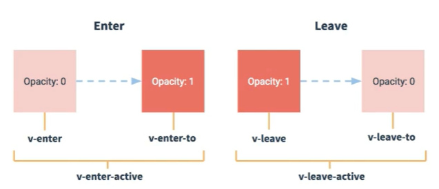
3. 写法：

   1. 准备好样式：

      - 元素进入的样式：
        1. v-enter：进入的起点
        2. v-enter-active：进入过程中
        3. v-enter-to：进入的终点
      - 元素离开的样式：
        1. v-leave：离开的起点
        2. v-leave-active：离开过程中
        3. v-leave-to：离开的终点
   2. 使用 ``<transition>``包裹要过度的元素，并配置name属性：

      ```vue
      <transition name="hello">
      	<h1 v-show="isShow">你好啊！</h1>
      </transition>
      ```
   3. 备注：若有多个元素需要过度，则需要使用：``<transition-group>``，且每个元素都要指定 ``key``值。
4. 可以使用第三方动画库

   [Animate.css | 动画库](https://animate.style/)

   [Animate.css - 简书](https://www.jianshu.com/p/86b7b64707d7)

### 47.vue脚手架配置代理

- 方法一

在vue.config.js中添加如下配置：

```js
devServer:{
  proxy:"http://localhost:5000"
}
```

说明：

1. 优点：配置简单，请求资源时直接发给前端（8080）即可。
2. 缺点：**不能配置多个代理**，不能灵活的控制请求是否走代理。
3. 工作方式：若按照上述配置代理，**当请求了前端不存在的资源时，那么该请求会转发给服务器 （优先匹配前端资源，项目中的public目录下的资源）**

- 方法二

编写vue.config.js配置具体代理规则：

```js
// 配置的代理服务器端口和发出请求的端口一样
module.exports = {
	devServer: {
      proxy: {
      '/api1': {// 匹配所有以 '/api1'开头的请求路径，前缀
        target: 'http://localhost:5000',// 代理目标的基础路径
        changeOrigin: true,
        pathRewrite: {'^/api1': ''}  // 将前缀改为''空字符串
      },
      '/api2': {// 匹配所有以 '/api2'开头的请求路径
        target: 'http://localhost:5001',// 代理目标的基础路径
        changeOrigin: true,
        pathRewrite: {'^/api2': ''}
      }
    }
  }
}
/*
   changeOrigin设置为true时，服务器收到的请求头中的host为：localhost:5000
   changeOrigin设置为false时，服务器收到的请求头中的host为：localhost:8080
   changeOrigin默认值为true
*/
```

说明：

1. 优点：可以配置多个代理，且可以灵活的控制请求是否走代理。
2. 缺点：**配置略微繁琐，请求资源时必须加前缀。**

App.vue

```vue
<template>
	<div>
		<button @click="getStudents">获取学生信息</button>
		<button @click="getCars">获取汽车信息</button>
	</div>
</template>

<script>
	import axios from 'axios'
	export default {
		name:'App',
		methods: {
			getStudents(){

				// 对于配置代理方式一，单个代理
				// axios.get('http://localhost:8080/students').then(
				// 	response => {
				// 		console.log('请求成功了',response.data)
				// 	},
				// 	error => {
				// 		console.log('请求失败了',error.message)
				// 	}
				// )

				// 对于配置代理方式二，单个代理，带前缀
				axios.get('http://localhost:8080/stu/students').then(
					response => {
						console.log('请求成功了',response.data)
					},
					error => {
						console.log('请求失败了',error.message) 
					}
				)

				axios.get('http://localhost:8080/sch/school').then(
					response => {
						console.log('请求成功了',response.data)
					},
					error => {
						console.log('请求失败了',error.message)
					}
				)
			},
			getCars(){
				axios.get('http://localhost:8080/demo/cars').then(
					response => {
						console.log('请求成功了',response.data)
					},
					error => {
						console.log('请求失败了',error.message)
					}
				)
			}
		},
	}
</script>
```

服务器server1.js

```js
const express = require('express')
const app = express()

app.use((request,response,next)=>{
	console.log('有人请求服务器1了');
	// console.log('请求来自于',request.get('Host'));
	// console.log('请求的地址',request.url);
	next()
})

app.get('/students',(request,response)=>{
	const students = [
		{id:'001',name:'tom',age:18},
		{id:'002',name:'jerry',age:19},
		{id:'003',name:'tony',age:120},
	]
	response.send(students)
})

app.get("/school", (request, response) => {
  const school = [
    { id: "001", name: "北京大学", age: 18 },
    { id: "002", name: "清华大学", age: 19 },
    { id: "003", name: "中国农业大学", age: 120 },
  ];
  response.send(school);
});

app.listen(5000,(err)=>{
	if(!err) console.log('服务器1启动成功了,请求学生信息地址为：http://localhost:5000/students');
})
```

服务器server2.js

```js
const express = require('express')
const app = express()

app.use((request,response,next)=>{
	console.log('有人请求服务器2了');
	next()
})

app.get('/cars',(request,response)=>{
	const cars = [
		{id:'001',name:'奔驰',price:199},
		{id:'002',name:'马自达',price:109},
		{id:'003',name:'捷达',price:120},
	]
	response.send(cars)
})

app.listen(5001,(err)=>{
	if(!err) console.log('服务器2启动成功了,请求汽车信息地址为：http://localhost:5001/cars');
})
```

在 vue.config.js 配置代理服务器

```js
const { defineConfig } = require("@vue/cli-service");
module.exports = defineConfig({
  transpileDependencies: true,
  lintOnSave: false,
  // 开启代理服务器（方式一）
  //  devServer: {
  //   proxy: 'http://localhost:5000'
  // }, 
  // 开启代理服务器（方式二）
  devServer: {
    proxy: {
      "/stu": {
        target: "http://localhost:5000",
        pathRewrite: { "^/stu": "" },
        // ws: true, //用于支持websocket
        // changeOrigin: true //用于控制请求头中的host值
      },
      "/sch": {
        target: "http://localhost:5000",
        pathRewrite: { "^/sch": "" },
      },
      "/demo": {
        target: "http://localhost:5001",

        // 将路径前缀/demo修改为空，或者在服务器设置前缀/demo/... => 完整路径：http://localhost:5001/demo/... 服务器中没有/demo前缀，故设置为空
        pathRewrite: { "^/demo": "" },
        // ws: true, //用于支持websocket
        // changeOrigin: true //用于控制请求头中的host值
      },
    },
  },
});
```

原理图：

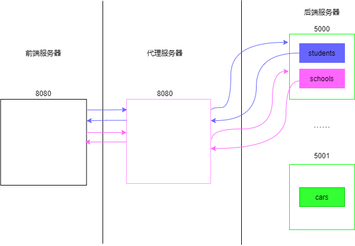

**代理服务器与后端服务器交互不涉及跨域。**

后端的 Nginx 也能开启代理服务器。

### 48.vue-resource 了解即可，axios 用的多

vue-resource 是对 xhr 的封装，语法和 axios 一样。

安装：

```bash
npm i vue-resource
```

引入：

```js
// main.js
import vueRes from 'vue-resource'

// 使用插件
Vue.use(vueRes);

// 此时, 所有 vm 和 vc 身上都多了个 $http 属性
```

直接用 this.$http 替代 axios 的位置就可以：

```js
//axios.get(`https://api.github.com/search/users?q=${this.keyWord}`).then(

// this -> vm/vc
this.$http.get(`https://api.github.com/search/users?q=${this.keyWord}`).then(
  response => {
    console.log('请求成功了')
    //请求成功后更新List的数据
    this.$bus.$emit('updateListData',{isLoading:false,errMsg:'',users:response.data.items})
  },
  error => {
    //请求后更新List的数据
    this.$bus.$emit('updateListData',{isLoading:false,errMsg:error.message,users:[]})
  }
)
```

### 49.slot 插槽

1. 作用：让**父组件可以向子组件指定位置插入html结构**，也是一种组件间通信的方式，适用于 `<strong style="color:red">`父组件 ===> 子组件`</strong>` 。
2. 分类：默认插槽、具名插槽、作用域插槽
3. 使用方式：

   1. 默认插槽：

      ```vue
      父组件中：父组件可以将自身数据放入插槽内容带给子组件
              <Category>
                 <div>html结构1</div>
              </Category>
      子组件中：
              <template>
                  <div>
                     <!-- 定义插槽，挖坑给父组件填 -->
                     <slot>插槽默认内容...</slot>
                  </div>
              </template>
      ```
   2. 具名插槽：v-slot只能用在template标签

      ```vue
      父组件中：
              <Category>
                  <template slot="center">
                    <div>html结构1</div>
                  </template>

                  <!-- v-slot只能用在template标签 -->
                  <template v-slot:footer>
                     <div>html结构2</div>
                  </template>
              </Category>
      子组件中：
              <template>
                  <div>
                     <!-- 定义插槽 -->
                     <slot name="center">插槽默认内容...</slot>
                     <slot name="footer">插槽默认内容...</slot>
                  </div>
              </template>
      ```
   3. 作用域插槽：用于生成不同结构的插槽，**数据在子组件**

      1. 理解：`<span style="color:red">`数据在子组件的自身，但根据数据生成的结构需要子组件的使用者(父组件)来决定。（games数据在Category组件中，但使用数据所**遍历出来的结构**由App组件决定）
      2. 具体编码：插槽结构必须用 template 包裹

         ```vue
         父组件中：
         		<Category>
                      <!-- scopeData是对象：把子组件传进数据封装为对象，可以用解构赋值 scope='{games}'-->
         			<template scope="scopeData">
         				<!-- 生成的是ul列表 -->
         				<ul>
         					<li v-for="g in scopeData.games" :key="g">{{g}}</li>
         				</ul>
         			</template>
         		</Category>

         		<Category>
                      <!-- 新的API：slot-scope，用法和scope一样 -->
         			<template slot-scope="scopeData">
         				<!-- 生成的是h4标题 -->
         				<h4 v-for="g in scopeData.games" :key="g">{{g}}</h4>
         			</template>
         		</Category>
         子组件中：
                 <template>
                     <div>
                         <!-- 给父组件传games --->
                         <slot :games="games"></slot>
                     </div>
                 </template>

                 <script>
                     export default {
                         name:'Category',
                         props:['title'],
                         //数据在子组件自身
                         data() {
                             return {
                                 games:['红色警戒','穿越火线','劲舞团','超级玛丽']
                             }
                         },
                     }
                 </script>
         ```
4. 备注：

   **Vue 将插槽内容解析之后再插入子组件。**

### 50.vuex

> vuex  是什么

1. 概念：专门在 Vue 中实现集中式状态（**也就是数据**）管理的一个 Vue 插件，对 vue 应用中多个组件的共享状态进行集中式的管理（读/写），**也是一种组件间通信的方式，且适用于任意组件间通信。**
2. Github 地址:  https://github.com/vuejs/vuex

> 什么时候使用  Vuex

1. 多个组件依赖于同一状态
2. 来自不同组件的行为需要变更同一状态

原理图：

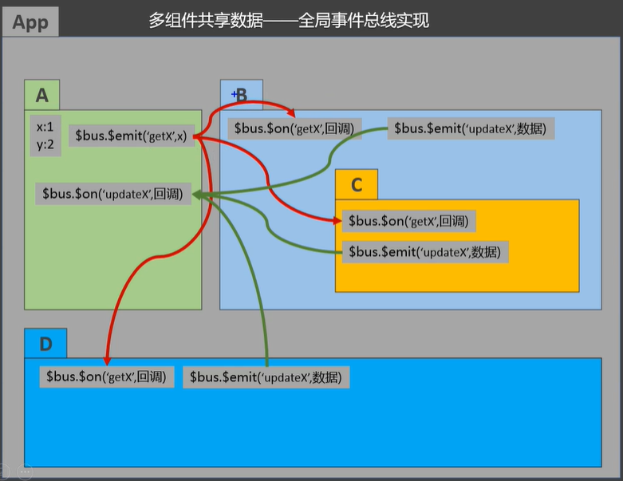

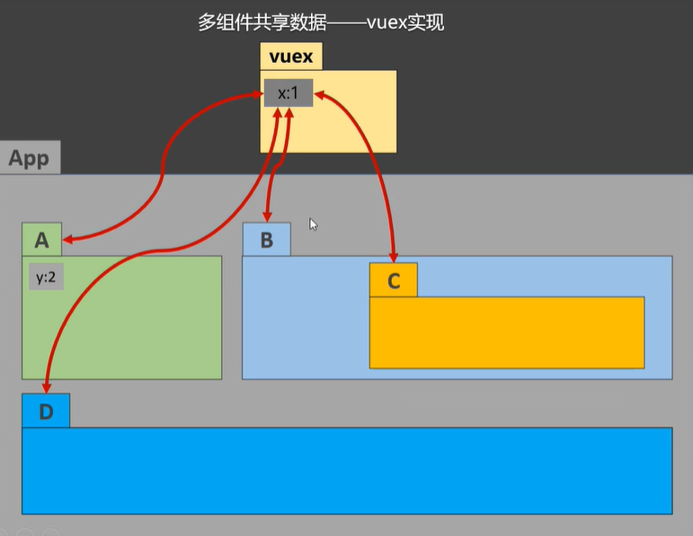

> vuex工作原理


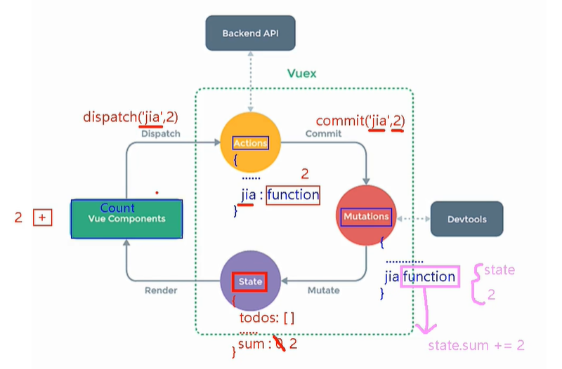

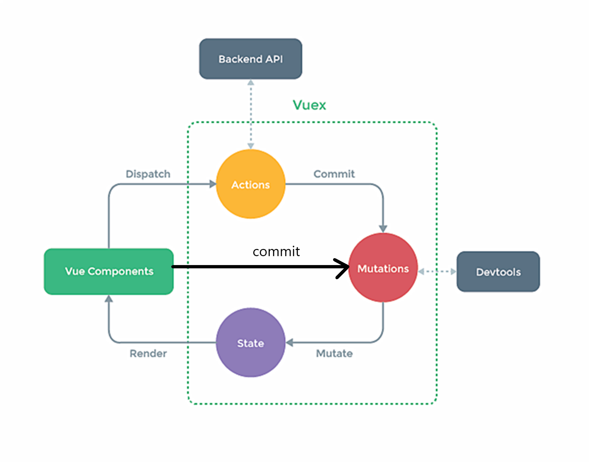

> 搭建vuex环境

1. 安装 `npm i vuex@3` ，`Vue3 <-> vuex4、Vue2 <-> vuex3`
2. 创建文件：``src/store/index.js``

   ```js
   //该文件用于创建Vuex中最为核心的store

   //引入Vue核心库
   import Vue from 'vue'
   //引入Vuex
   import Vuex from 'vuex'
   //应用Vuex插件, 必须创建store前调用Vue.use
   Vue.use(Vuex)

   //准备actions对象——响应组件中用户的动作
   const actions = {}
   //准备mutations对象——修改state中的数据
   const mutations = {}
   //准备state对象——保存具体的数据
   const state = {}

   //创建并暴露store
   export default new Vuex.Store({
   	actions,
   	mutations,
   	state
   })
   ```
3. 在 ``main.js``中创建vm时传入 ``store``配置项

   ```js
   //......
   //引入store, 如果不传具体js文件名，默认index.js
   import store from './store'
   //......

   //创建vm
   new Vue({
   	el:'#app',
   	render: h => h(App),
   	store
   })
   ```

```
此时所有 vm/vc 身上多了个
```

`$store` 属性。

4. 备注：

   1. Vue-CLI环境下import的js执行顺序

   ```js
   import m1 from './m1'
   console.log(100)
   let a = 10
   import m2 from './m2'
   ```

   2. 实际上Vue将import的文件提升到最顶层

   ```js
   import m1 from './m1'
   import m2 from './m2'
   console.log(100)
   let a = 10
   ```

   3. 因此要在 /store/index.js 创建store前要调用Vue.use，两者不能分开两个文件写。
   4. 业务逻辑在actions写，如果没有业务逻辑，直接跳过actions。
   5. 若没有网络请求或其他业务逻辑，组件中也可以越过actions，即不写 ``dispatch``，直接编写 ``commit``
   6. store 的 state 里面的数据也会设置setter和getter

> getters的使用

1. 概念：当 state 中的数据需要经过加工后再使用时，可以使用getters加工。
2. 在 ``store.js``中追加 ``getters`` 配置

   ```js
   ......

   const getters = {
   	bigSum(state){
   		return state.sum * 10 -9 +100/4
   	}
   }

   //创建并暴露store
   export default new Vuex.Store({
   	......
   	getters
   })
   ```
3. 组件中读取数据：``$store.getters.bigSum``
4. tip: state 像 vm/vc 的data，getters 像其 computed，逻辑复杂推荐用 getters

> 四个map方法的使用

0. 引入

   ```js
   import {mapState,mapGetters,mapActions,mapMutations} from 'vuex'
   ```
1. `<strong>`mapState方法：`</strong>`用于帮助我们映射 ``state``中的数据为 `vm/vc` 的计算属性

   ```js
   computed: {
       // 借助mapState生成计算属性：he、xuexiao、kecheng（对象写法）, 会按照属性名'sum','school','subject'去state找数据并返回给he、xuexiao、kecheng
        ...mapState({he:'sum',xuexiao:'school',kecheng:'subject'}),

       // 借助mapState生成计算属性：sum、school、subject（数组写法），会按照属性名'sum','school','subject'去state找数据并返回给sum、school、subject
       ...mapState(['sum','school','subject']), 
       // 
   },
   ```
2. `<strong>`mapGetters方法：`</strong>`和map用于帮助我们映射 ``getters``中的数据为计算属性

   ```js
   computed: {
       //借助mapGetters生成计算属性：bigSum（对象写法）
       ...mapGetters({bigSum:'bigSum'}),

       //借助mapGetters生成计算属性：bigSum（数组写法）
       ...mapGetters(['bigSum'])
   },
   ```
3. `<strong>`mapActions方法：`</strong>`用于帮助我们生成**与 ``actions``对话**的方法，即：**包含 ``$store.dispatch(xxx)``的函数**

   ```js
   // 用下面方法时需要直接传参
   // @click='jiaOdd(n)'
   methods:{
       //靠mapActions生成：incrementOdd、incrementWait（对象形式）
       ...mapActions({incrementOdd:'jiaOdd',incrementWait:'jiaWait'})

       //靠mapActions生成：incrementOdd、incrementWait（数组形式）
       ...mapActions(['jiaOdd','jiaWait'])
   }
   ```
4. `<strong>`mapMutations方法：`</strong>`用于帮助我们生成**与 ``mutations``对话**的方法，即：**包含 ``$store.commit(xxx)``的函数**

   ```js
   methods:{
       //靠mapActions生成：increment、decrement（对象形式）
       ...mapMutations({increment:'JIA',decrement:'JIAN'}),

       //靠mapMutations生成：JIA、JIAN（对象形式）
       ...mapMutations(['JIA','JIAN']),
   }
   ```
5. 备注：mapActions与mapMutations使用时，若需要传递参数需要：**在模板中绑定事件时传递好参数，否则参数是事件对象。**

> 模块化+命名空间

1. 目的：让代码更好维护，让多种数据分类更加明确。
2. 修改 ``store.js``

   ```javascript
   // 这里可以拆分成一个模块再引入
   const countAbout = {
     namespaced:true,//开启命名空间
     state:{x:1},
     mutations: { ... },
     actions: { ... },
     getters: {
       bigSum(state){
          return state.sum * 10
       }
     }
   }

   // 这里可以拆分成一个模块再引入          
   const personAbout = {
     namespaced:true,//开启命名空间
     state:{ ... },
     mutations: { ... },
     actions: { ... }
   }

   const store = new Vuex.Store({
     modules: {
       countAbout,
       personAbout
     }
   })
   ```
3. 开启命名空间后，组件中读取state数据：

   ```js
   //方式一：自己直接读取
   this.$store.state.personAbout.list
   //方式二：借助mapState读取：
   ...mapState('countAbout',['sum','school','subject']),
   ```
4. 开启命名空间后，组件中读取getters数据：

   ```js
   //方式一：自己直接读取
   this.$store.getters['personAbout/firstPersonName']
   //方式二：借助mapGetters读取：
   ...mapGetters('countAbout',['bigSum'])
   ```
5. 开启命名空间后，组件中调用dispatch

   ```js
   //方式一：自己直接dispatch
   this.$store.dispatch('personAbout/addPersonWang',person)
   //方式二：借助mapActions：
   ...mapActions('countAbout',{incrementOdd:'jiaOdd',incrementWait:'jiaWait'})
   ```
6. 开启命名空间后，组件中调用commit

   ```js
   //方式一：自己直接commit
   this.$store.commit('personAbout/ADD_PERSON',person)
   //方式二：借助mapMutations：
   ...mapMutations('countAbout',{increment:'JIA',decrement:'JIAN'}),
   ```

### 51.vue-router

> 路由概念

路由：route，路由器：router，一个**路由器**管理多个**路由**。

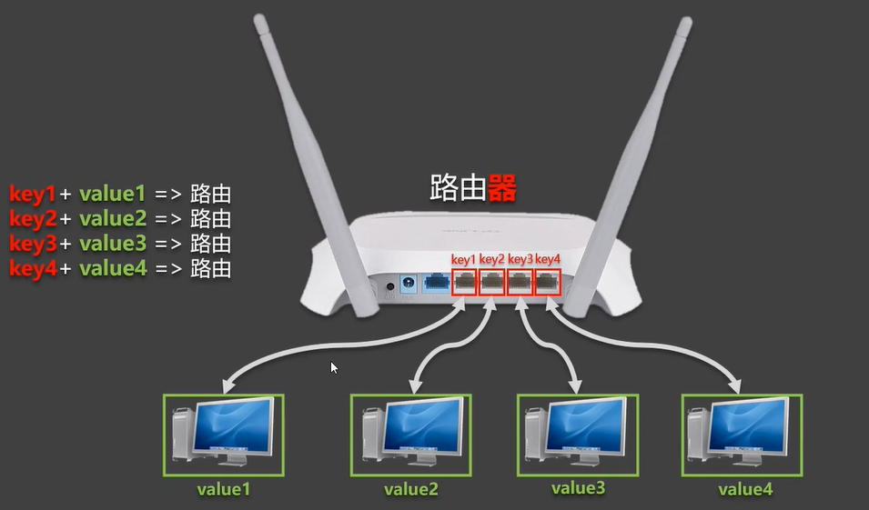

路由就是一组 key-value 的对应关系。多个路由，需要经过路由器的管理。

> 路由的理解

一个路由就是一组映射关系(key - value)。key为路径, value可能是function或component。

- 后端路由:

  1)理解: value是function，用于处理客户端提交的请求。

  2)工作过程: 服务器接收到一个请求时，根据请求路径找到匹配的函数来处
  理请求，返回响应数据。
- 前端路由:

  1)理解:value是component，用于展示页面内容。

  2)工作过程:当浏览器的路径改变时，对应的组件就会显示。

> SPA (single page web application）应用

整个应用只有一个完整的页面。

点击页面中的导航链接不会刷新页面，只会做页面的局部更新。

数据需要通过ajax请求获取。

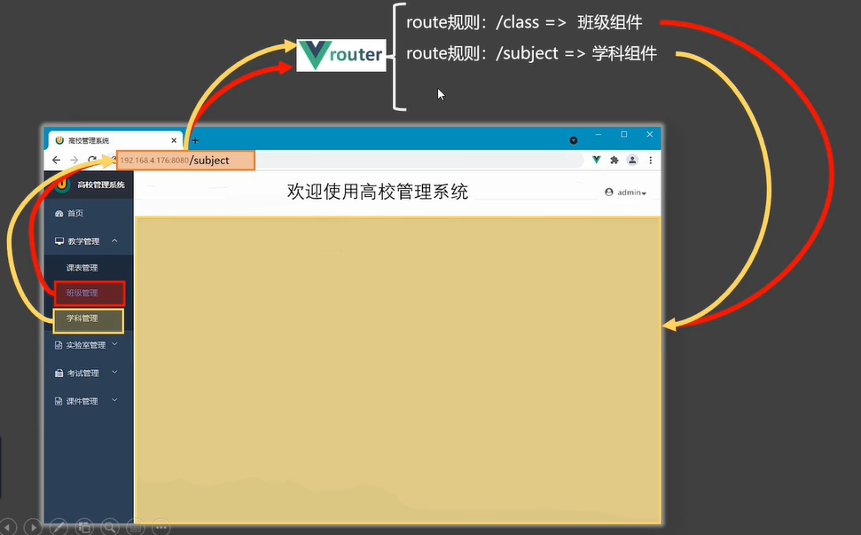

vue-router 时刻监测浏览器网址的变化，会忽略基础地址，将相应组件展示。

vue-router  的理解：vue 的一个插件库（需要安装插件），专门用来实现SPA应用。

> vue-router基本使用

1. 安装vue-router，命令：``npm i vue-router``    ， `Vue3 <-> vue-router4,Vue2 <-> vue-router3`
2. 应用插件：``Vue.use(VueRouter)``
3. 编写router配置项:

   ```js
   //引入VueRouter
   import VueRouter from 'vue-router'
   //引入Luyou 组件
   import About from '../components/About'
   import Home from '../components/Home'

   //创建router实例对象，去管理一组一组的路由规则
   const router = new VueRouter({
   	routes:[
   		{
   			path:'/about',
   			component:About
   		},
   		{
   			path:'/home',
   			component:Home
   		}
   	]
   })

   //暴露router
   export default router
   ```
4. 实现切换（active-class可配置高亮样式）

   ```vue
   <router-link active-class="active" to="/about">About</router-link>
   ```
5. 指定展示位置

   ```vue
   <!-- 一个组件里写一个 -->
   <router-view></router-view>
   ```

> 几个注意点

1. 路由组件通常存放在 ``pages``文件夹，一般组件通常存放在 ``components``文件夹。
2. 通过切换，“隐藏”了的路由组件，默认是被销毁掉的(通过钩子证明)，需要的时候再去挂载。
3. 每个组件都有自己的 ``$route``属性，里面存储着自己的路由信息。`a.$route !== b.$route`
4. **整个应用只有一个router**，可以通过组件的 ``$router``属性获取到。`a.router === b.router`

> 路由的query参数

1. 传递参数

   ```vue
   <!-- 跳转并携带query参数，to的字符串写法 -->
   <!-- 和Ajax请求的参数一样 -->
   <router-link :to="/home/message/detail?id=666&title=你好">跳转</router-link>

   <!-- 跳转并携带query参数，to的对象写法 -->
   <router-link 
   	:to="{
   		path:'/home/message/detail',
   		query:{
   		   id:666,
               title:'你好'
   		}
   	}"
   >跳转</router-link>
   ```
2. 接收参数：从 `this.$route.query`取数据

   ```js
   $route.query.id
   $route.query.title
   ```

> 命名路由

1. 作用：可以简化路由的跳转。**路径过长才有优势。**
2. 如何使用

   1. 给路由命名：

      ```js
      {
      	path:'/demo',
      	component:Demo,
      	children:[
      		{
      			path:'test',
      			component:Test,
      			children:[
      				{
                            name:'hello', //给路由命名
      					path:'welcome',
      					component:Hello,
      				}
      			]
      		}
      	]
      }
      ```
   2. 简化跳转：

      ```vue
      <!--简化前，需要写完整的路径 -->
      <router-link to="/demo/test/welcome">跳转</router-link>

      <!--简化后，直接通过名字跳转, 要加冒号否则按上面写法处理 -->
      <router-link :to="{name:'hello'}">跳转</router-link>

      <!--简化写法配合传递参数 -->
      <router-link 
      	:to="{
      		name:'hello',
      		query:{
      		   id:666,
                  title:'你好'
      		}
      	}"
      >跳转</router-link>
      ```

> 路由的params参数

1. 配置路由，声明接收params参数

   ```js
   {
   	path:'/home',
   	component:Home,
   	children:[
   		{
   			path:'news',
   			component:News
   		},
   		{
   			component:Message,
   			children:[
   				{
   					name:'xiangqing',
   					path:'detail/:id/:title', //使用占位符声明接收params参数 :var
   					component:Detail
   				}
   			]
   		}
   	]
   }
   ```
2. 传递参数

   ```vue
   <!-- 跳转并携带params参数，to的字符串写法 -->
   <router-link :to="/home/message/detail/666/你好">跳转</router-link>

   <!-- 可以用模板字符串插入变量 -->
   <router-link :to="`/home/message/detail/${m.id}/${m.title}`">跳转</router-link>

   <!-- 跳转并携带params参数，to的对象写法 -->
   <router-link 
   	:to="{
   		name:'xiangqing',
   		params:{
   		   id:666,
               title:'你好'
   		}
   	}"
   >跳转</router-link>
   ```

**特别注意!：**路由携带 params 参数时，若使用 to 的对象写法，则不能使用 path 配置项，必须使用 name 配置！

3. 接收参数：

```js
$route.params.id
$route.params.title
```

> 路由的props配置

作用：让路由组件更方便的收到参数

配置：路由器里面配置

```js
// router/index.js
{
	name:'xiangqing',
	path:'detail/:id',
	component:Detail,

	//第一种写法：props值为对象，该对象中所有的key-value的组合最终都会通过props传给Detail组件
	// props:{a:900, b:'oo'}

	//第二种写法：props值为布尔值，布尔值为true，则把路由收到的所有params参数通过props传给Detail组件
	// props:true

	//第三种写法：props值为函数，该函数返回的对象中每一组key-value都会通过props传给Detail组件, 每个路由组件都有$route属性
	props(route){
		return {
			id:route.query.id,
			title:route.query.title
		}
	}
    // 解构赋值写法
    props({query:{id,title},params:{id,title}}){
		return {id,title}
	}
}
```

接收：在路由组件里接收

```js
// Detail.vue
export default {
    name:'Detail',
  
    // 第一种
    props:['a','b']  // a==900 b=='oo'
  
    // 第二种
    // 假设
    /*
    <router-link 
	:to="{
		name:'xiangqing',
		params:{
		   id:666,
            title:'你好'
		}
	}"
>跳转</router-link>
    */
    props:['id','title']
  
    // 第三种
    props:['id','title']
  
}
```

> ``<router-link>``的replace属性

1. 作用：控制路由跳转时操作浏览器历史记录的模式
2. 浏览器的历史记录有两种写入方式：分别为 ``push``和 ``replace``**，``push``是追加历史记录，``replace``是替换当前记录(栈顶)。**路由跳转时候默认为 ``push``
3. 如何开启 ``replace``模式：``<router-link replace>News</router-link>``

> 编程式路由导航

1. 作用：**不借助 ``<router-link> ``实现路由跳转**，让路由跳转更加灵活
2. 具体编码：

   ```js
   //$router的两个API
   //跳转到指定路由组件，在route-link要用:to='{}'实现
   this.$router.push({
   	name:'xiangqing',
   	params:{
   		id:xxx,
   		title:xxx
   	}
   })

   this.$router.replace({
   	name:'xiangqing',
   	params:{
   		id:xxx,
   		title:xxx
   	}
   })
   this.$router.forward() //前进，相当于浏览器的 ->
   this.$router.back() //后退，相当于浏览器的 <-
   this.$router.go() //可前进也可后退,负整数后退，正整数前进
   ```

> 缓存路由组件

1. 作用：让不展示的路由组件保持挂载，不被销毁。
2. 具体编码：**include里面写组件名**，不是路由名，在展示区包一层keep-alive

   ```vue
   <!-- include里面写组件名 -->
   <keep-alive include="News"> 
       <router-view></router-view>
   </keep-alive>

   <!-- 缓存多个 -->
   :include="['News' ,'Message']"

   <!-- 缓存全部 -->
   不写include
   ```

> 两个新的生命周期钩子

1. 作用：**路由组件所独有的两个钩子**，用于捕获路由组件的激活状态。
2. 具体名字：上面nextTick也是钩子

   1. ``activated``路由组件被激活时触发。组件被展示
   2. ``deactivated``路由组件失活时触发。组件被“隐藏”
3. 应用场景：

   对于普通组件，定时器放在 `mounted`钩子开启，定时器在 `beforeDestroy`钩子关闭。

   对于路由组件，定时器放在 `activated`钩子开启，定时器在 `deactivated` 钩子关闭。

> 路由守卫

1. 作用：对路由进行权限控制
2. 分类：全局守卫、独享守卫、组件内守卫
3. 全局守卫:对所有路由鉴权

   ```js
   //全局前置守卫：初始化时执行、每次路由切换前执行
   router.beforeEach((to,from,next)=>{
   	console.log('beforeEach',to,from)
   	if(to.meta.isAuth){ //判断当前路由是否需要进行权限控制
   		if(localStorage.getItem('school') === 'atguigu'){ //权限控制的具体规则
   			next() //放行
   		}else{
   			alert('暂无权限查看')
   			// next({name:'guanyu'})
   		}
   	}else{
   		next() //放行
   	}
   })

   //全局后置守卫：初始化时执行、每次路由切换后执行
   router.afterEach((to,from)=>{
   	console.log('afterEach',to,from)
   	if(to.meta.title){ 
   		document.title = to.meta.title //应用场景：修改网页的title
   	}else{
   		document.title = 'vue_test'
   	}
   })
   ```

> 独享守卫:对单个路由鉴权，只有前置独享路由，但可以配合全局后置守卫使用

```js
beforeEnter(to,from,next){
	console.log('beforeEnter',to,from)
	if(to.meta.isAuth){ //判断当前路由是否需要进行权限控制
		if(localStorage.getItem('school') === 'atguigu'){
			next()
		}else{
			alert('暂无权限查看')
			// next({name:'guanyu'})
		}
	}else{
		next()
	}
}
```

> 组件内守卫：和全局路由的前后守卫是两码事

```js
//进入守卫：通过路由规则，进入该组件时被调用
beforeRouteEnter (to, from, next) {
  
},
//离开守卫：通过路由规则，离开该组件时被调用
beforeRouteLeave (to, from, next) {
  
}
```

**注意：**组件内守卫通过路由规则进入离开组件才能触发。

区别：

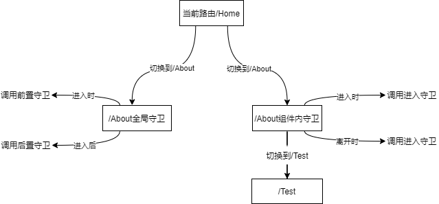

切换一次，全局守卫可能触发两次，而组件内守卫则触发一次。

> 路由器的两种工作模式

1. 对于一个url来说，什么是hash值？—— #及其后面的内容就是hash值。
2. hash值不会包含在 HTTP 请求中，即：hash值不会带给服务器。
3. hash模式：
   1. 地址中永远带着#号，不美观 。
   2. 若以后将地址通过第三方手机app分享，若app校验严格，则地址会被标记为不合法。
   3. 兼容性较好。
4. history模式：
   1. 地址干净，美观 。
   2. 兼容性和hash模式相比略差。
   3. 应用部署上线时需要后端人员支持，解决刷新页面服务端404的问题。

### 52.Vue UI组件库

移动端常用UI组件库

1. [Vant](https://youzan.github.io/vant)
2. [Cube UI](https://didi.github.io/cube-ui)
3. [Mint UI](http://mint-ui.github.io)

PC端常用UI组件库

1. [Element UI](https://element.eleme.cn)
2. [IView UI](https://www.iviewui.com)

### 小技巧

- Alt + 点击多行  =>  多行编辑
