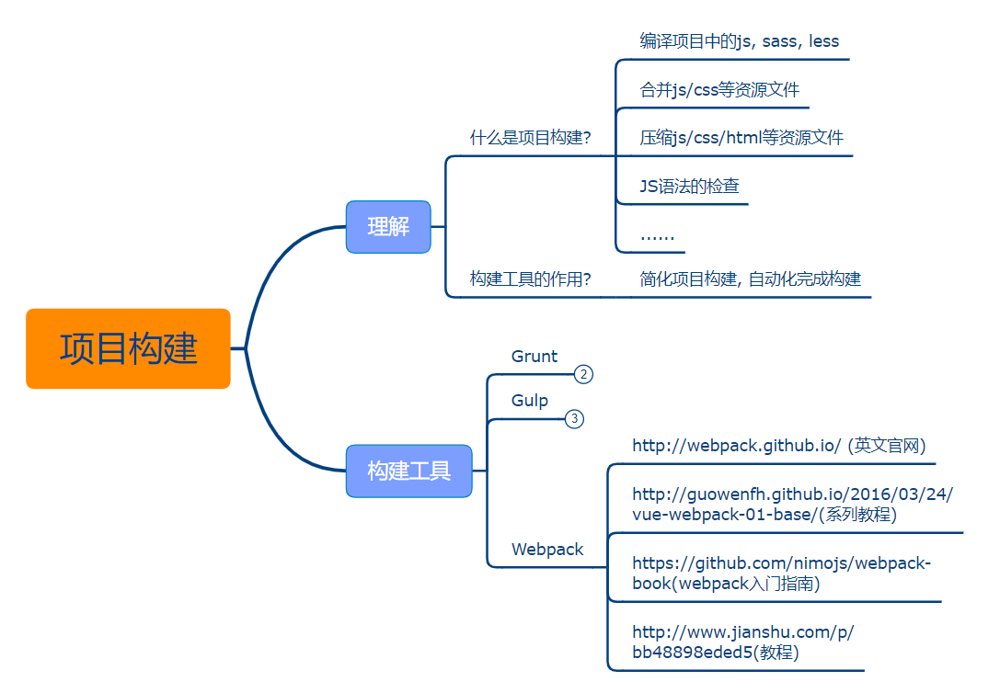

::: tip

webpack简介

webpack是一个 **模块打包工具**，支持所有的打包语法，比如 `ES Module`、`CommonJS`、`CMD`、`AMD`。初期的webpack是用来模块打包js的，发展到现在，已经可以打包很多种文件类型，比如 `css`、`img` 。

优化打包速度最有效的方法就是保持 `nodejs` 和 `webpack` 为最新版本。

:::

[Webpack中文文档](https://webpack.docschina.org/)

### 1.项目构建

- 项目构建



- Webpack是什么

  Webpack是一种**前端资源构建工具**，一个静态模块打包器(module bundler)。

  在 Webpack 看来，前端的所有资源文件(js/json/css/img/less/...)都会作为模块处理。

  它将根据模块的依赖关系进行静态分析，打包生成对应的静态资源(bundle)。

  webpack是一个模块化打包工具，将不同的资源和文件，进行打包，合并在一个文件里。
- Webpack 作用

  1）重新加载编译，**将浏览器不认识的语法编译成浏览器认识的语法**。less编译成css、ES6语法转换成ES5。

  2）减少io请求。发送请求，会发挥一个html到浏览器，这是，打开控制台会发现html页面通过scrip，link等标签引用的静态，浏览器会再次发出请求去获取这些资源。如何webpack打包，将所有的静态资源都合并好了，减少了io请求。

### 2.Webpack五个核心概念

- Entry

  入口(Entry)指示 Webpack以哪个文件为入口起点开始打包,分析构建内部依赖图。
- Output

  输出(Output)指示 Webpack打包后的资源 bundles输出到哪里去,以及如何命名。
- Loader（翻译官）

  Loader 让 Webpack能够去处理那些非JavaScript文件(如css、less等，Webpack自身只理解JavaScript)
- Plugins

  插件(Plugins)可以用于执行范围更广的任务。插件的范围包括，从打包优化和压缩，一直到重新定义环境中的变量等。
- Mode

  模式(Mode)指示 Webpack使用相应模式的配置。


  | 选项 | 描述 | 特点 |
  | :-: | :-: | :-: |
  | development(开发环境) | 会将process.env.NODE_ENV的值设为development。<br/>启用NamedChunksPlugin和 NamedModulesPlugin。 | 能让代码本地调试运行的环境 |
  | production(生产环境) | 会将process.env.NODE_ENV的值设为production。<br/>启用FlagDependencyUsagePlugin,<br/>FlaglncludedChunksPlugin,<br/>ModuleConcatenationPlugin,NoEmitOnErrorsPlugin<br/>OccurrenceOrderPlugin, SideEffectsFlagPlugin和<br/>UglifyJsPlugin | 能让代码优化上线运行的环境 |

### 3.Webpack初体验

```bash
# 初始化项目
npm init -y

# 安装webpack webpack-cli, -g全局安装
npm i webpack webpack-cli -g

# 添加webpack webpack-cli到项目依赖，-D
# webpack-cli工具用于在命令行中运行webpack
npm i webpack webpack-cli -D
```

1.在项目根目录下新建文件夹：`src`，用于存放源代码；`build`，webpack打包后输出的地方。

2.在 `src` 下新建 `index.js` 文件作为 webpack 入口文件。

3.运行指令：

- 开发环境:

  `webpack ./src/index.js -o ./build/built.js --mode=development`

  webpack会以. /src/index.js为入口文件开始打包，打包后输出到 ./build/built.js
  整体打包环境，是开发环境。
- 生产环境:

  `webpack ./src/index.js -o ./bui1d/built.js --mode=production`

  webpack会以 ./src/index.js 为入口文件开始打包，打包后输出到 ./build/built.js
  整体打包环境，是生产环境。

```js
//index.js
import './index.css';  //打包出错
import data from './data.json';  //打包没有出错
console.log(data) ;
function add(x, y) {   //打包没有出错
	return x + y;
}
console.log(add(1, 2));
```

4.总结

```

```

**webpack能处理js/json资源，不能处理css / ./img等其他资源。**

```

```

**生产环境和开发环境将ES6模块化编译成浏览器能识别的模块化。**

```

```

**生产环境比开发环境多一个压缩js代码。**

### 4.打包样式资源

> 用 loader 来处理样式资源。

**webpack 核心配置**：

```js
// webpack.config.js 与 src 在同一级目录

/*
webpack.config.js webpack的配置文件
	作用:指示webpack干哪些活(当你运行webpack指令时，会加载里面的配置)
	所有构建工具都是基于Nodejs平台运行的, 该环境下模块化默认采用commonjs, 即webpack.config.js要按照commonjs规范来写。而src下的代码按照ES6语法写。
*/

// resolve用来拼接绝对路径的方法
const {resolve} = require('path');

module.exports = {
    // webpack配置
    // 1.入口起点
    entry: './src/index.js',
  
    // 2.输出
    output:{
        //输出文件名
        filename: 'built.js',
  
        //输出路径, 一般是绝对路径
        //__dirname nodejs的变量，代表当前文件的目录绝对路径
        path: resolve(__ dirname, 'build')  //path = __ dirname / build
    },
  
    // 3.loader的配置
    module: {
        rules:[
        	//详细loader配置
            //不同文件必须配置不同loader处理
      
            //css loader
            {
                //匹配哪些文件，正则表达式
                test: /\.css$/,  //以.css结尾
          
                //使用哪些loader进行处理
			   use:[
                   // use数组中loader执行顺序:从右到左，从下到上 依次执行
                   //创建style标签，将js中的样式资源(import './index.css';)插入进行，添加到head中生效
				'style-loader',
             
				//将css文件变成commonjs模块加载js中，里面内容是样式字符串
				'css-loader'
                ]
            },
            //less loader
            {
                test: /\.less$/ ,
                use:[
                    // use数组中loader执行顺序:从右到左，从下到上 依次执行
                    'style-loader',
                    'css-loader',

                    //将less文件编译成css文件
                    //需要下载less-loader和less
                    'less-loader'
                ]
            }
        ]
    },
  
    // 4.plugins的配置
    plugins:[
    	// 详细plugins的配置
    ],
  
    // 5.模式
    mode: 'development' ,
    // mode: 'production'  
}
```

下载配置里的包并添加依赖：

````bash
> npm i style-loader css-loader less-loader -D
````

index.js 打包

```bash
# 直接运行
> webpack
```

````js
//index.js
import './index.css';  //打包没有错
import './index.less';  //打包没有错
import data from './data.json';  //打包没有出错
console.log(data) ;
function add(x, y) {   //打包没有出错
	return x + y;
}
console.log(add(1, 2));
````

- **loader 配置总结**

  1）npm下载 loader 包；

  2）使用 loader (配置loader)；

  3）**注意：**loader不需要引入。

### 5.打包html资源

> 用  plugin (插件) 处理 html 资源

plugins ：1.下载插件包	2.引入插件包   3.使用（配置插件）

下载 html-webpack-plugin ：

```bash
> npm i html-webpack-plugin -D
```

引用和配置插件：

```js
//webpack.config.js
const { resolve } = require('path');

//引入插件
const HWPlugin = require( 'html-webpack-plugin') ;

/*
loader: 1.下载  2.使用(配置loader)
plugins:1.下载  2.引入  3.使用
*/
module.exports = {
    entry: './src/index.js',
    output: {
        filename: 'built.js',
        path: resolve(__dirname, 'build')
    },
    module: {
        rules: [
            //配置loader
        ]
    },
  
    //plugins的配置
    plugins: [
        // 详细plugins的配置
        /*
           html-webpack-plugin
           	 功能: 默认会创建一个空的HTML，自动引入打包输出的所有资源(JS/CSS)
           	 需求: 需要有结构的HTML文件, 传参给HtmlWebpackPlugin()
        */
        new HWPlugin({
            //复制 './src/index.html' 文件到input.path下，并自动引入打包输出的所有资源(JS/CSS)
            template: './src/index.html'
        })// HtmlWebpackPlugin是构造函数，直接new
    ],

    //模式
    mode: 'development',
    // mode: 'production'  
}
```

### 6.打包图片资源

webpack5.0之后打包图片**不需要**配置 `url-loader` ！

```js
//webpack.config.js
const { resolve } = require('path');

const HWPlugin = require('html-webpack-plugin');

module.exports = {
    entry: './src/index.js',
    output: {
        filename: 'built.js',
        path: resolve(__dirname, 'build')
    },
    module: {
        rules: [
            {
                test: /\.less$/,
                //要使用多个loader处理用use
                use: ['style-loader','css-loader','less-loader']

            },
            // webpack5之前，处理url图片
            {
            	 //问题：默认处理不了htm1中./img图片
                 test:/\.(jpg|png|gif)$/,
                 //使用一个loader
                 //要下载两个包 url-loader file-loader
                 loader:'url-loader',
                 options:{
                     //图片大小小于8kb，就会被base64处理
                     //优点:减少请求数量(减轻服务器压力)
                     //缺点:图片体积会更大, 文件请求速度更慢
                     //所以对小图片处理
                     limit:8*1024,
               
                     //问题:因为url-loader默认使用es6模块化解析，而html - loader引入图片是commonjs
                     //解析时会出问题: [object Module]
                     //解决:关闭url-loader的es6模块化， 使用commonjs解析
                     esModule: false,
               
                     //给图片进行重命名
                     //[hash: 10]取图片的hash的前10位
                     //[ext]取文件原来扩展名
                     name :'[hash:10].[ext]'
                 }

            },
      
            //处理html的./img标签图, webpack5.0前后都要加
            {
                test: /\.html$/,
                //处理html文件的./img图片(负责引入./img，从而能被url-loader进行处理)
                loader: 'html-loader'
            }
        ]
    },

    plugins: [
        new HWPlugin({
            template: './src/index.html'
        })
    ],

    mode: 'development',
}
```

### 7.打包其他资源

其他资源：不需要优化、压缩等处理程序，原封不动输出就行，比如，字体图标资源等。

```html
<!--index.html-->
<span class="iconfont icon-icon-test"></span>
<span class="iconfont icon-icon-test2"></span>
<span class="iconfont icon-icon-test3"></ span>
<span class="iconfont icon-icon-test1"></span>
```

```js
//index.js
//引入 iconfont 样式文件
import "./iconfont/iconfont.css"
```

```js
//webpack.config.js
const { resolve } = require('path');

const HWPlugin = require('html-webpack-plugin');

module.exports = {
    entry: './src/index.js',
    output: {
        filename: 'built.js',
        path: resolve(__dirname, 'build')
    },
    module: {
        rules: [
            {
                test: /\.css$/,
                //要使用多个loader处理用use
                use: ['style-loader', 'css-loader']
            },

            //webpack5.0之前，webpack5不用添加
            //打包其他资源(除了html/js/css资源以外的资源)
            {
                //排除css/js/html资源
                exclude: /\.(css | js | html)$/,
                loader: 'file-loader'
            }
        ]
    },

    plugins: [
        new HWPlugin({
            template: './src/index.html'
        })
    ],

    mode: 'development',
}
```

### 8.devServer

自动编译打包代码。

```bash
# 下载包
npm i webpack-dev-server -D
```

```js
/*
开发环境配置:能让代码运行
*/
//webpack.config.js
const { resolve } = require('path');

const HWPlugin = require('html-webpack-plugin');

module.exports = {
    entry: './src/index.js',
    output: {
        filename: 'built.js',
        path: resolve(__dirname, 'build')
    },
    module: {
        rules: [
      
        ]
    },

    plugins: [
        new HWPlugin({
            template: './src/index.html'
        })
    ],

    mode: 'development',
  
    //开发服务器devServer: 用来自动化(自动编译，自动打开浏览器，自动刷新浏览器~~)
    //特点:只会在内存中编译打包，不会有任何输出到源代码
  
    // webpack5之前
    //启动devServer指令为: 全局：webpack-dev-server，本地：npx webpack-dev-server，要下载这个包并添加依赖
    devServer: {
        contentBase: resolve(__dirname, ' build'),
        //启动gzip压缩
        compress: true,
        //端口号
        port: 3000
    },
  
    //webpack5.7  启动：npx webpack serve
    devServer: {
        //这行不用配置
        //contentBase: resolve(__dirname, 'build'),
  
        static: {
            directory: resolve(__dirname, 'build'),
        },
        //启动gzip压缩
        compress: true,
        //端口号
        port: 8888,
        //自动打开浏览器
        open:true
    }
}
```

**注意注意！webpack5**单独修改 `index.html` 文件是不会更新页面的，修改其他文件时才可以。

**解决办法：**

```js
//方法一：在devServer添加
devServer:{
    watchFiles:['./src/index.html']
}

//方法二：在entry添加
entry:["./src/index.js","./src/index.html"],
```

### 9.开发环境基本配置

把前面的配置糅合到一起。

```js
const { resolve } = require('path');
const HWPlugin = require("html-webpack-plugin");
module.exports = {
    entry: './src/index.js',
    output: {
        filename: 'js/built.js',
        path: resolve(__dirname, 'build'),
    },

    // 3.loader的配置
    module: {
        rules: [
            //处理css
            {
                test: /\.css$/,
                use: ['style-loader', 'css-loader']
            }, 
            //处理less
            {
                test: /\.less$/,
                use: ['style-loader', 'css-loader', 'less-loader']
            },
            //处理样式中的图片
            {
                test:/\.(jpg | png | gif)$/,
                loader:"url-loader",
                options:{
                    limit:8*1024,
                    esModule: false,
                    name :'[hash:10].[ext]',
                    //输出路径
                    outputPath:'./imgs'
                }
            },
            //处理html中的图片
            {
                test: /\.html$/,
                loader: 'html-loader',
                //输出路径
                options:{
                    name:'[hash:10].[ext]',
                    //输出路径
                    outputPath:'./imgs'
                }
            },
            //处理其他资源
            {
                exclude: /\.(css | js | html | png | jpg | gif)$/,
                loader: 'file-loader',
                options:{
                    name:'[hash:10].[ext]',
                    //输出路径
                    outputPath:'media'
                }
            }
        ]
    },

    // plugins的配置
    plugins: [
        // 处理html
        new HWPlugin({
            template: './src/index.html'
        })
    ],

    mode: 'development',

    //自动编译 webpack5之前 npx webpack-dev-server
    devServer: {
        contentBase: resolve(__dirname, ' build'),
        compress: true,
        port: 3000,
        open:true
    },
  
    //webpack5.7  npx webpack serve
    devServer: {
        static: {
            directory: resolve(__dirname, 'build'),
        },
        compress: true,
        port: 3000,
        open:true
    }
}
```

### 10.提取css成单独文件

要下载插件 mini-css-extract-plugin 将css从js提取出来。

```bash
# 安装mini-css-extract-plugin
npm i mini-css-extract-plugin -D
```

配置

```js
const { resolve } = require('path');
const HWPlugin = require("html-webpack-plugin");

//引入插件mini-css-extract-plugin
const MCEPlugin = require("mini-css-extract-plugin");

module.exports = {
    entry: './src/js/index.js',
    output: {
        filename: 'js/built.js',
        path: resolve(__dirname, 'build'),
    },

    // 3.loader的配置
    module: {
        rules: [
            //处理css
            {
                test: /\.css$/,
                use: [
                    //创建style标签，将样式放入
                    //'style-loader', 

                    //这个loader取代style-loader。 作用:提取js中的css成单独文件
                    MCEPlugin.loader,

                    //将css文件整合到js文件中
                    'css-loader'
                ]
            }
        ]
    },

    // plugins的配置
    plugins: [
        // 处理html, 自动引入js/css文件
        new HWPlugin({
            template: './src/index.html'
        }),

        //提取css
        new MCEPlugin({
            ////对输出的css文件进行重命名
            filename:"css/built.css"
        })
    ],

    mode: 'development',
}
```

上面css文件会被link标签引入，不会出现闪屏现象。js文件体积也会变小。

### 11.css兼容性处理及css压缩

- css兼容性处理

```js
const { resolve } = require('path');
const HWPlugin = require("html-webpack-plugin");

//引入插件mini-css-extract-plugin
const MCEPlugin = require("mini-css-extract-plugin");

//设置node环境变量
process.env.NODE_ENV = 'development';

module.exports = {
    entry: './src/js/index.js',
    output: {
        filename: 'js/built.js',
        path: resolve(__dirname, 'build'),
    },

    // 3.loader的配置
    module: {
        rules: [
            //处理css
            {
                test: /\.css$/,
                use: [
                    MCEPlugin.loader,

                    //'style-loader',
                    //将css文件整合到js文件中
                    'css-loader',

                    /*
                    CSS兼容性处理: postcss --> postcss-loader postcss-preset-env
                    postcss-preset-env帮postcss找到package.json中browserslist里面的配置，
                    通过配置加载指定的css兼容性样式,
                    package.json增加以下字段，GitHub上有完整的。
             
                      "browserslist": {
                        //开发环境-->设置node环境变量:
process. env.NODE_ ENV = 'development',就按照开发环境浏览器去兼容
                        "development": [
                          "last 1 chrome version",
                          "last 1 firefox version",
                          "last 1 safari version"
                        ],
                        //生产环境: 默认是生产环境兼容，和mode参数无关
                        "production": [
                          ">0.2%",
                          "not dead",
                          "not op_ mini all"
                        ]
                      }
                
                    */
                    //使用loader的默认配置
                    // 'postcss-loader',
                    //修改postcss-loader的配置
                    {
                        loader: 'postcss-loader',
                        options: {
                            // //旧版写法
                            // ident: 'postcss',
                            // plugins: () => {
                            //     // postcss的插件
                            //     require('postcss-preset-env')()
                            // }
                      
                      
                            //新版写法 还要安装 postcss包
                            postcssOptions: {
                                plugins: [
                                    [
                                        'postcss-preset-env',
                                        {
                                            // 其他选项
                                        },
                                    ],
                                ],
                            }
                        }
                    }
                ]
            }
        ]
    },

    // plugins的配置
    plugins: [
        // 处理html
        new HWPlugin({
            template: './src/index.html'
        }),

        //提取css
        new MCEPlugin({
            ////对输出的css文件进行重命名
            filename: "css/built.css"
        })
    ],

    mode: 'development',
}
```

下载包：

```bash
# 下载postcss-loader postcss-preset-env
npm i postcss-loader postcss-preset-env postcss -D
```

在package.json配置browserslist：

```json
//package.json
{
  "name": "webpack",
  "version": "1.0.0",
  "description": "webpack study",
  "main": "index.js",
  "scripts": {
    "test": "echo \"Error: no test specified\" && exit 1"
  },
  "keywords": [],
  "author": "Aavin",
  "license": "ISC",
  "devDependencies": {
    "css-loader": "^6.7.1",
    "file-loader": "^6.2.0",
    "html-loader": "^3.1.0",
    "html-webpack-plugin": "^5.5.0",
    "less": "^4.1.2",
    "less-loader": "^10.2.0",
    "mini-css-extract-plugin": "^2.6.0",
    "postcss-loader": "^6.2.1",
    "postcss-preset-env": "^7.4.3",
    "style-loader": "^3.3.1",
    "url-loader": "^4.1.1",
    "webpack": "5.70",
    "webpack-cli": "^4.9.2",
    "webpack-dev-server": "^4.7.4"
  },
  "browserslist": {
    "development": [
      "last 1 chrome version",
      "last 1 firefox version",
      "last 1 safari version"
    ],
    "production": [
      ">0.2%",
      "not dead",
      "not op_ mini all"
    ]
  }
}
```

- 压缩css

用 optimize-css-assets -webpack- plugin 插件压缩：

```bash
npm i optimize-css-assets-webpack-plugin -D
```

```js
//...

//引入optimize-css-assets-webpack-plugin
const OptimizeCssAssetsWebpackPlugin = require("optimize-css-assets-webpack-plugin");

module.exports = {
  
	//...
  
    // plugins的配置
    plugins: [
        // 处理html
        new HWPlugin({
            template: './src/index.html'
        }),

        //提取css
        new MCEPlugin({
            filename: "css/built.css"
        }),
  
        //压缩css
        new OptimizeCssAssetsWebpackPlugin()
    ],

    mode: 'development',
}
```

### 12.js语法检查及兼容性处理

- js语法检查

安装包：

```bash
npm i eslint-config-airbnb-base eslint-plugin-import eslint eslint-loader -D
```

在 webpack.config.js 配置：

```js
const { resolve } = require('path');
const HWPlugin = require("html-webpack-plugin");
module.exports = {
    entry: './src/js/index.js',
    output: {
        filename: 'js/built.js',
        path: resolve(__dirname, 'build'),
    },
    module: {
        rules: [
            /*
                语法检查：eslint-loader  依赖 eslint 包
                注意：只检查自己写的源代码，第三方的库是不用检查的
                设置检查规则:
                    1.package.json中eslintConfig中设置~
                    //添加字段
                    "eslintConfig" :{
                        "extends":"airbnb-base"  //继承
                    }
                    2.一般用 airbnb 规则 --> eslint-config-airbnb-base eslint-plugin-import eslint
            */
           {
               test:/\.js$/,
               exclude:/node_modules/,  //否则有很多错误
               loader:'eslint-loader',
               options:{
                   // 自动修复eslint的错误
                   fix: true
               }
           }
        ]
    },
    plugins: [
        // 处理html
        new HWPlugin({
            template: './src/index.html'
        }),
    ],
    mode: 'development',
}
```

在 package.json 配置：

```json
//添加字段
"eslintConfig" :{
    "extends":"airbnb-base"  //继承
}
```

- js兼容性处理

```js
module: {
    rules:[
        /*js 兼容性处理: babel-loader @babel/core @babel/preset-env
        1.基本js兼容性处理--> @babel/preset-env
        	问题：只能转换基本语法，如promise不能转换

        2.全部js兼容性处理--> @babel/polyfill ，直接在js文件 import "@babel/polyfill"
        	问题：我只要解决部分兼容性问题，但是将所有兼容性代码全部引入，体积太大了~

        3.需要做兼容性处理的就做:按需加载-->core-js库，要安装, 要把第2种方案去掉
        */
  
        {
            //方案1和方案3结合
            loader: 'babel-loader',
            options: {
                //预设:指示babel做怎么样的兼容性处理
                presets:[
                    '@babe1/preset-env',
                    {
                        //按需加载
                        useBuiltIns: 'usage',
                        //指定core-js版本
                        corejs:{
                            version: 3
                        },
                        //指定兼容性做到哪个版本浏览器
                        targets:{
                            chrome: '60',
                            firefox: '60',
                            ie: '9',
                            safari: '10',
                            edge:'17'
                        }
                    }   
                ]
            }
        }
    ]
}
```

### 13.压缩html和js

```js
//生产环境下会自动压缩js代码, 内部插件实现，不需要引入
mode:'production'
```

```js
//webpack.config.js
//...
const HWPlugin = require("html-webpack-plugin");

module.exports = {
    //...
    plugins: [
        // 处理html
        new HWPlugin({
            template: './src/index.html',
      
            //压缩html，html-webpack-plugin插件
            minify:{
                // 移除空格
                collapseWhitespace: true,
                //移除注释
                removeComments:true
            }
        }),
    ],
  
    //...
}
```

### 14.生产环境基本配置

```js

const { path } = require("path");

//提取css文件插件
const MiniCssExtractPlugin = require('mini-css-extract-plugin');

//js压缩插件
const OptimizeCssAssetsWebpackPlugin = require('optimize-css-assets-webpack-plugin');

const HWPlugin = require('html-webpack-plugin');

//定义nodejs环境变量:决定使用browserslist的哪个环境, 默认是production
//process.env.NODE_ENV='development'
//process.env.NODE_ENV='production'

//复用CSSloader
const commonCssLoader = [
    //提取css
    MiniCssExtractPlugin.loader,

    'css-loader',

    //css兼容性处理,
    /*
    还需要在package . json中定义browserslist
    "browserslist": {
        "development": [
            "last 10 chrome version",
            "last 10 firefox version",
            "last 10 safari version"
        ],
        "production": [
            ">0.01%",
            "not dead",
            "not op_mini all"
        ]
    }
    */
    {
        loader: 'postcss-loader',
        options: {
            // //旧版写法
            // ident: 'postcss',
            // plugins: () => {
            //     // postcss的插件
            //     require('postcss-preset-env')()
            // }
            //新版写法
            postcssOptions: {
                plugins: [
                    [
                        'postcss-preset-env',
                        {
                            // 其他选项
                        },
                    ],
                ],
            }
        }
    }
];


module.exports = {
    entry: './src/js/index.js',
    output: {
        filename: 'js/built.js',
        path: path(__dirname, 'build')
    },
    module: {
        rules: [

            //css
            {
                test: /\.css$/,
                use: [...commonCssLoader]
            },

            //less
            {
                test: /\.less$/,
                use: [...commonCssLoader, 'less-loader']
            },

            /*
                正常来讲，一个文件只能被- -个loader处理。
                当一个文件要被多个loader处理，那么一定要指定loader执行的先后顺序:
                先执行eslint 在执行babel
                加上 enforce:'pre'

            */

            {
                //还要在package. json中eslintConfig
                /**添加字段
                "eslintConfig" :{
                    "extends":"airbnb-base"  //继承
                }*/
                test: /\.js$/,
                //优先执行
                enforce: 'pre',
                exclude: /node_modules/,
                loader: 'eslint-loader',
                options: {
                    fix: true
                }
            },
            {
                test: /\.js$/,
                exclude: /node_modules/,
                loader: 'babel-loader',
                options: {
                    //预设:指示babel做怎么样的兼容性处理
                    presets: [
                        '@babe1/preset-env',
                        {
                            //按需加载
                            useBuiltIns: 'usage',
                            //指定core-js版本
                            corejs: {
                                version: 3
                            },
                            //指定兼容性做到哪个版本浏览器
                            targets: {
                                chrome: '60',
                                firefox: '60',
                                ie: '9',
                                safari: '10',
                                edge: '17'
                            }
                        }
                    ]
                }
            },

            // webpack5之前，处理url图片
            {
                test: /\.(jpg|png|gif)$/,
                loader: 'url-loader',
                options: {
                    limit: 8 * 1024,
                    esModule: false,
                    name: '[hash:10].[ext]'
                } 
            },
            {
                test: /\.html$/,
                loader: 'html-loader'
            },
            //处理其他资源
            {
                exclude: /\.(css | js | html | png | jpg | gif)$/,
                loader: 'file-loader',
                options: {
                    name: '[hash:10].[ext]',
                    //输出路径
                    outputPath: 'media'
                }
            }
        ]
    },
    plugins: [
        new MiniCssExtractPlugin({
            filename: 'css/built.css'
        }),
        new OptimizeCssAssetsWebpackPlugin(),
        new HWPlugin({
            template: './src/index.html',
            //压缩html，html-webpack-plugin插件
            minify: {
                // 移除空格
                collapseWhitespace: true,
                //移除注释
                removeComments: true
            }
        })
    ],
    mode: "production"
}
```

### 15.Webpack性能优化

- 开发环境性能优化

  优化打包构建速度
  优化代码调试
- 生产环境性能优化

  优化打包构建速度
  优化代码运行的性能

### 16.HMR

HMR: hot module replacement 热模块替换/模块热替换

作用: 一个模块发生变化，只会重新打包这一-个模块(而不是打包所有模块)，极大提升构建速度。

在devServer开启：

```js
devServer: {
    // 启动：npx webpack serve
    static: {
        directory: resolve(__dirname, 'build'),
    },  
    // //启动gzip压缩
    compress: true,
    // //端口号
    port: 8888,
    // //自动打开浏览器
    open:true,
	//开启HMR功能
    //当修改了Webpack配置， 新配置要想生效，必须重启webpack服务
    hot:true,
  
    //html热更新
    //watchFiles:['./src/index.html']
}
```

1. 样式文件: 可以使用HMR功能，因为style-loader内部实现了。
2. js文件: 默认不能使用HMR功能，**解决：**需要修改js代码，添加支持HMR功能的代码。

**注意:** HMR功能对js的处理，**只能处理非入口js文件的其他文件**。

```js
//index.js
import print from './print.js';

if(module.hot){
    //一旦module.hot 为true,说明开启了HMR功能。 --> 让:HMR功能代码生效   
  
    module.hot.accept("./print.js", ()=>{
        //方法会监听print.js 文件的变化，三旦发生变化，其他默认不会重新打包构建。
        //会执行后面的回调函数
        ptint();
    });
}
```

3. html文件: 默认不能使用HMR功能，**开启HMR功能的同时会导致问题**: html文件不能热更新了。**解决webpack开启HMR功能后html文件不能热更新**的问题:

```js
//方法1.在入口增加
entry:['./src/index.js','./src/index.html']

//方法2.在devServer添加
devServer:{
    watchFiles:['./src/index.html']
}

//但没有解决HMR功能，html不用做HMR功能
```

### 17.source-map

一种提供源代码到构建后代码映射技术( 如果构建后代码出错了，通过映射可以追踪源代码错误)。

在 webpack.config.js 添加字段，重新打包会生成 built.js.map 文件。

```js
module.exports = {
    devtool:'source-map'
}

// devtool值：[inline- | hidden- | eval- ][ nosources- ][cheap- [module- ]]source-map  []表示可选
/*
source-map:外部
	错误代码准确信息和源代码的错误位置

inline-source-map：内联
	只生成一个内联source-map
	错误代码准确信息和源代码的错误位置

hidden-source-map：外部
	错误代码错误原因，但是没有错误位置
	不能追踪源代码错误，只能提示到构建后代码的错误位置

eval-source-map：
	每一个文件都生成对应的source-map, 都在eval
	不能追踪源代码错误，只能提示到构建后代码的错误位置
	每一个文件都生成对应的source-map,都在eval

nosources-source-map:外部
	错误代码准确信息，但是没有任何源代码信息

cheap-source-map:外部
	错误代码准确信息和源代码的错误位置
	只能精确到行，不能精确到列

cheap-module-source-map:外部
	错误代码准确信息和源代码的错误位置
	只能精确到行，不能精确到列
	module会将loader的source-map加入

内联和外部的区别: 1.外部生成了.map文件，内联没有 2.内联构建速度更快

hidden-source-map和nosources-source-map都是为了隐藏源代码，防止调试查看源代码

需求：
	开发环境:速度快，调试更友好
	速度快(eval>inline>cheap>...)
		eval-cheap-source-map
		eval-source-map
	调试更友好
		source-map
		cheap-module-source-map
		cheap-source-map
	折中 --> eval-source-map / eval-cheap-module-source -map


生产环境:源代码要不要隐藏?调试要不要更友好
内联会让代码体积变大，所以在生产环境不用内联
      nosources-source-map 全部隐藏
      hidden-source-map 只隐藏源代码，会提示构建后代码错误信息
  

最终方案 --> source-map(调试友好) / cheap-module-souce-map
*/
```

### 18.oneOf

- 使用oneOf 根据文件类型加载对应的loader，只要能匹配一个即可退出，
- 对于同一类型文件，比如处理js，如果需要多个loader，可以单独抽离js处理，确保 oneOf 里面一个文件类型对应一个loader，
- 可以配置 enforce: 'pre'，指定优先执行。

```js
    module: {
        rules: [
            //抽离处理js的loader
            {
                test: /\.js$/,
                //优先执行 
                enforce: 'pre',
                exclude: /node_modules/,
                loader: 'eslint-loader',
                options: {  
                    fix: true  
                }  
            },
            {
                // 只要能匹配一个即可退出
                // 以下loader只会匹配一个
                // 注意:不能有两个配置处理同一种类型文件
                oneOf: [
                    {
                        test: /\.css$/,
                        use: [...commonCssLoader]
                    },
                    {
                        test: /\.less$/,
                        use: [...commonCssLoader, 'less-loader']
                    },
                    {
                        test: /\.js$/,
                        exclude: /node_modules/,
                        loader: 'babel-loader',
                        options: {
                            presets: [
                                '@babe1/preset-env',
                                {
                                    useBuiltIns: 'usage',
                                    corejs: {
                                        version: 3
                                    },
                                    targets: {
                                        chrome: '60',
                                        firefox: '60',
                                        ie: '9',
                                        safari: '10',
                                        edge: '17'
                                    }
                                }
                            ]
                        }
                    },
                    {
                        test: /\.(jpg|png|gif)$/,
                        loader: 'url-loader',
                        options: {
                            limit: 8 * 1024,
                            esModule: false,
                            name: '[hash:10].[ext]'
                        }

                    },
                    {
                        test: /\.html$/,
                        loader: 'html-loader'
                    },
                    {
                        exclude: /\.(css | js | html | png | jpg | gif)$/,
                        loader: 'file-loader',
                        options: {
                            name: '[hash:10].[ext]',
                            //输出路径
                            outputPath: 'media'
                        }
                    }
                ]
            }
        ]
    },
```

### 19.缓存
