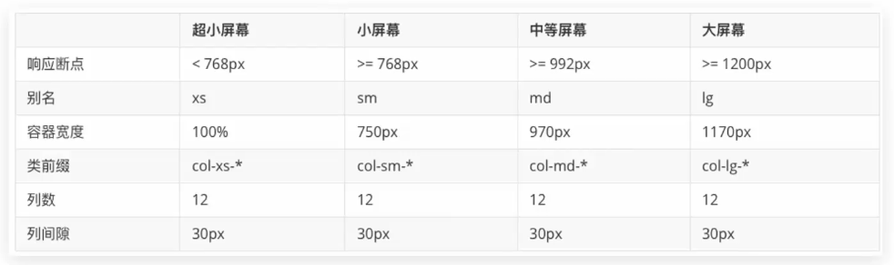
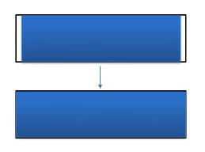

<Boxx/>

### 1.环境搭建

下载

```html
<!DOCTYPE html>
<html lang="en">
<head>
    <meta charset="UTF-8">
    <meta http-equiv="X-UA-Compatible" content="IE=edge">
    <meta name="viewport" content="width=device-width, initial-scale=1.0">
    <title>Document</title>
    <!-- 最新版本的 Bootstrap 核心 CSS 文件 -->
<link rel="stylesheet" href="demo\css\bootstrap.min.css">
</head>
<body>
    <div></div>
    <!--jq要在bs前面引用-->
    <script src="demo\js\jquery.min.js"></script>
    <script src="demo\js\bootstrap.min.js"></script>
</body>
</html>
```

CDN

```html
<!doctype html>
<html lang="zh-CN">
  <head>
    <meta charset="utf-8">
    <meta http-equiv="X-UA-Compatible" content="IE=edge">
    <meta name="viewport" content="width=device-width, initial-scale=1">
    <!-- 上述3个meta标签*必须*放在最前面，任何其他内容都*必须*跟随其后！ -->
    <title>Bootstrap 101 Template</title>

    <!-- Bootstrap -->
    <link rel="stylesheet" href="https://stackpath.bootstrapcdn.com/bootstrap/3.4.1/css/bootstrap.min.css" integrity="sha384-HSMxcRTRxnN+Bdg0JdbxYKrThecOKuH5zCYotlSAcp1+c8xmyTe9GYg1l9a69psu" crossorigin="anonymous">
  </head>
  <body>
    <h1>你好，世界！</h1>

    <!-- jQuery (Bootstrap 的所有 JavaScript 插件都依赖 jQuery，所以必须放在前边) -->
    <script src="https://fastly.jsdelivr.net/npm/jquery@1.12.4/dist/jquery.min.js" integrity="sha384-nvAa0+6Qg9clwYCGGPpDQLVpLNn0fRaROjHqs13t4Ggj3Ez50XnGQqc/r8MhnRDZ" crossorigin="anonymous"></script>
    <!-- 加载 Bootstrap 的所有 JavaScript 插件。你也可以根据需要只加载单个插件。 -->
    <script src="https://stackpath.bootstrapcdn.com/bootstrap/3.4.1/js/bootstrap.min.js" integrity="sha384-aJ21OjlMXNL5UyIl/XNwTMqvzeRMZH2w8c5cRVpzpU8Y5bApTppSuUkhZXN0VxHd" crossorigin="anonymous"></script>
  </body>
</html>
```

### 2.容器

- 流体容器  .container

  `width:100%;`
- 固定容器  .container-fluid

```html
<!--
阈值                          width
>=1200px      (lg 大屏pc)		1170px
992px – 1200px(md 中屏pc)		970px
768px – 992px (sm  平板)		750px
<768px        (移动手机)	   auto
-->

<div class = "container">固定容器</div>

<div class = "container-fluid">流体容器</div>
```

#### 3.栅格系统

- 原理

  bootstrap3默认把网页宽度分成12等份。

  

  图中类名的  *  表示几等份，如col-sm-3 三等份。
- 流体容器&固定容器公共样式

```css
margin-right: auto;
margin-left: auto;
padding-left: 15px;
padding-right: 15px;
```

```less
.container-fixed(@gutter: @grid-gutter-width) {
  margin-right: auto;
  margin-left: auto;
  padding-left:  floor((@gutter / 2));
  padding-right: ceil((@gutter / 2));
  &:extend(.clearfix all); //清除浮动 
}
```

- 固定容器特定样式

  顺序不可变

```less
.container {
    //容器的公共样式
  .container-fixed();
    //固定容器的宽度样式
  @media (min-width: @screen-sm-min) {
    width: @container-sm;
  }
  @media (min-width: @screen-md-min) {
    width: @container-md;
  }
  @media (min-width: @screen-lg-min) {
    width: @container-lg;
  }
}
```

#### 4.行列

.container是 Bootstrap中专门提供的类名，所有应用该类名的盒子，默认已被指定宽度且居中。

.container-fluid也是Bootstrap中专门提供的类名，所有应用该类名的盒子，宽度均为100%。

分别使用**.row类名和.col类名定义栅格布局的行和列**。

.container类自带间距15px ；.row类自带间距-15px ，为的是抵消container的间距

```html
<div class='container'>
	<div class='row'></div>
</div>
```



#### 5.全局样式

- 手册用法

  BootStrap预定义了大量类用来美化页面， 掌握手册的查找方法是学习全局样式的重点。
  Bootstrap网站首页 => Bootstrap3中文文档 => **全局css样式** => 按**分类导航**查找目标类。

  

#### 6.表格

-

#### 7.组件

- 组件
  BootStrap提供的常 见功能,包含了HTML结构和CSS样式。
- 使用方法

  引入BootStrap样式

  复制结构,修改内容

#### 8.字体图标

- Glyphicons字体图标的使用步骤

  HTML页面引入BootStrap样式文件

  空标签调用对应类名

  glyphicon

  图标类

#### 9.插件

- 插件的使用步骤

  引入BootStrap样式

  引入js文件 : jQueryjs + BootStrap.min.js

  复制HTML结构，并适当调整结构或内容

# 暂时不学
